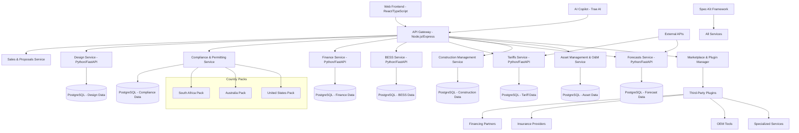

# NextGen Fusion Commercial Solar Platform - Comprehensive Project Plan

## 1. Executive Summary

The NextGen Fusion Commercial Solar Platform is a modular, AI-enhanced, all-in-one solar lifecycle system designed to serve EPCs, engineering firms, designers, and installers by unifying everything from sales and design to permitting, finance, construction, and O&M. Built with Trae AI and GitHub Spec-Kit, this comprehensive ecosystem aims to become the world's preferred, bankable solar platform by combining a powerful compliance and simulation core with add-on plug-ins for proposals, engineering, finance, procurement, construction, and asset management.

### Platform Vision:
To position itself as a **billion-dollar, globally trusted solar operating system** that creates a sticky marketplace driving recurring revenue, shortens project timelines, ensures regulatory compliance, and enables financing confidence across the entire solar project lifecycle.

### Core Platform Capabilities:
- **Complete Solar Lifecycle Management**: Sales, design, permitting, finance, construction, and O&M
- **3D BIM Modeling**: Powerful 3D photovoltaic system design and visualization
- **AI-Enhanced Workflows**: Optimized for accuracy, speed, and usability across all modules
- **Marketplace Ecosystem**: Third-party plug-ins for financing, insurance, OEM tools, and specialized services
- **Country-Specific Localization**: Starting with South Africa, Australia, and the US
- **BESS Optimization**: Advanced battery energy storage system optimization with MILP
- **Financial Modeling**: Monte Carlo analysis, PPA/lease/loan models with regional incentives
- **Compliance Management**: Multi-country regulatory compliance with automated permitting
- **Tariff Intelligence**: Real-time tariff data ingestion and optimization
- **Bankability Reports**: Automated permit and lender documentation generation
- **Asset Management**: Long-term O&M and performance monitoring capabilities

## 2. Technical Architecture Overview

### 2.1 System Architecture

### 2.2 Core Services & Modules

| Service | Purpose | Technology Stack |
|---------|---------|------------------|
| **Web Frontend** | User interface with 3D BIM modeling | React 18, TypeScript, Three.js, Tailwind CSS |
| **API Gateway** | Request routing, authentication, marketplace | Node.js, Express, JWT |
| **Sales & Proposals** | Lead management, proposal generation, CRM | Python, FastAPI, Document generation |
| **Design Service** | 3D modeling, component libraries, system sizing | Python, FastAPI, CAD libraries |
| **Compliance & Permitting** | Multi-country regulatory compliance, automated permitting | Python, FastAPI, Rule engines |
| **Finance Service** | Financial modeling, Monte Carlo, PPA/lease/loan | Python, FastAPI, NumPy, SciPy |
| **BESS Service** | Battery optimization with MILP, energy management | Python, FastAPI, OR-Tools |
| **Tariffs Service** | Tariff data management and ETL | Python, FastAPI, Pandas |
| **Forecasts Service** | Day-ahead price forecasting, weather data | Python, FastAPI, ML libraries |
| **Construction Management** | Project tracking, scheduling, quality control | Python, FastAPI, Project management tools |
| **Asset Management & O&M** | Performance monitoring, maintenance scheduling | Python, FastAPI, IoT integration |
| **Marketplace & Plugin Manager** | Third-party integrations, revenue sharing | Python, FastAPI, Plugin architecture |
| **Country Packs** | Localized rules, regulations, incentives (ZA/AU/US) | Python, FastAPI, Country-specific modules |

## 3. Implementation Phases

### Phase 1: Foundation & Core Infrastructure (Weeks 1-6)

**Deliverables:**
- Monorepo setup with Trae AI Spec-Kit integration
- Marketplace-ready architecture with plugin framework
- Basic web frontend with authentication and role-based access
- API Gateway with routing and third-party integration capabilities
- PostgreSQL database setup with multi-tenancy support
- Docker containerization and Kubernetes deployment
- CI/CD pipeline setup with automated testing
- Plugin SDK and developer documentation

**Key Milestones:**
- Week 1-2: Repository structure, development environment, and marketplace architecture
- Week 3-4: Authentication system, RBAC, and plugin framework
- Week 5: API Gateway with third-party integration capabilities
- Week 6: Database schema, multi-tenancy, and initial deployment

### Phase 2: Sales & Design Services (Weeks 7-12)

**Deliverables:**
- Sales CRM and lead management system
- Proposal generation with automated pricing
- 3D BIM modeling interface with collaboration features
- Component libraries implementation with OEM integrations
- Step-by-step design wizards with AI assistance
- Photovoltaic system sizing algorithms
- Design service API endpoints with version control

**Key Milestones:**
- Week 7-8: Sales CRM and proposal generation system
- Week 9-10: 3D modeling framework with collaboration features
- Week 11: Component library database with OEM partnerships
- Week 12: AI-enhanced design wizards and system validation

### Phase 3: Financial & Compliance Services (Weeks 13-18)

**Deliverables:**
- Monte Carlo financial modeling with sensitivity analysis
- PPA/Operating Lease/Loan calculators with third-party financing integration
- Multi-country compliance rules (US, AU, ZA) with automated updates
- Permit template generators with jurisdiction-specific forms
- Regional incentive calculations with real-time policy updates
- Bankability reports for lenders and investors
- Third-party financing marketplace integration

**Key Milestones:**
- Week 13-14: Advanced financial modeling with third-party integrations
- Week 15-16: Compliance rule framework with country packs
- Week 17: Automated permitting and regulatory updates
- Week 18: Bankability reports and financing marketplace

### Phase 4: BESS Optimization & Tariff Intelligence (Weeks 19-24)

**Deliverables:**
- BESS MILP optimization engine with real-time dispatch
- 8760-hour optimization with SOC chaining and grid services
- Tariff ETL pipelines for US/AU/ZA with automated updates
- Day-ahead price forecasting with machine learning
- Demand charge optimization and peak shaving strategies
- Grid services revenue optimization
- Energy trading marketplace integration

**Key Milestones:**
- Week 19-20: Advanced BESS optimization with grid services
- Week 21-22: Tariff intelligence with real-time updates
- Week 23: ML-powered forecasting and optimization
- Week 24: Energy trading and grid services integration

### Phase 5: Construction & Asset Management (Weeks 25-30)

**Deliverables:**
- Construction project management with scheduling and tracking
- Quality control and inspection workflows
- Asset management and O&M platform
- Performance monitoring with IoT integration
- Predictive maintenance algorithms
- Mobile apps for field teams
- Integration with construction and monitoring hardware

**Key Milestones:**
- Week 25-26: Construction management platform
- Week 27-28: Asset management and O&M systems
- Week 29: IoT integration and performance monitoring
- Week 30: Mobile applications and field team tools

### Phase 6: Marketplace & Global Expansion (Weeks 31-36)

**Deliverables:**
- Third-party marketplace with revenue sharing
- Plugin certification and quality assurance
- Global expansion framework for new countries
- Advanced AI features and machine learning models
- Enterprise features and white-label solutions
- Comprehensive test suite and documentation
- Production deployment with global CDN
- Performance monitoring and analytics

**Key Milestones:**
- Week 31-32: Marketplace launch with initial partners
- Week 33-34: Global expansion framework and new country packs
- Week 35: Enterprise features and white-label solutions
- Week 36: Production launch and performance optimization

## 4. Technology Stack & Dependencies

### 4.1 Frontend Technologies
- **React 18** with TypeScript for type safety
- **Three.js** for 3D BIM modeling capabilities
- **Tailwind CSS** for responsive design
- **Vite** for fast development and building
- **React Query** for state management and caching

### 4.2 Backend Technologies
- **Python 3.11+** with FastAPI for microservices
- **Node.js 18+** with Express for API Gateway
- **PostgreSQL 15+** for primary data storage
- **Redis** for caching and session management
- **OR-Tools** for BESS optimization

### 4.3 Infrastructure & DevOps
- **Docker** for containerization
- **Kubernetes** for orchestration
- **Terraform** for infrastructure as code
- **GitHub Actions** for CI/CD
- **Prometheus & Grafana** for monitoring

### 4.4 External Dependencies
- **OpenEI URDB API** for US tariff data
- **AER/DNSP APIs** for Australian tariff data
- **Eskom/NERSA APIs** for South African tariff data
- **Weather APIs** for solar irradiance forecasting
- **Trae AI SDK** for AI-enhanced development

## 5. Development Workflow with Trae AI & Spec-Kit

### 5.1 Spec-Driven Development Process
1. **Specification Creation**: Use GitHub Spec-Kit to define feature specifications
2. **AI-Assisted Implementation**: Leverage Trae AI for code generation and optimization
3. **Automated Testing**: Generate tests from specifications
4. **Continuous Integration**: Automated validation against specs
5. **Documentation Generation**: Auto-generate API docs from specs

### 5.2 Development Standards
- **TypeScript** for all frontend code
- **Python type hints** for all backend code
- **Conventional Commits** for semantic versioning
- **OpenAPI 3.0** specifications for all APIs
- **JSON Schema** for data validation

### 5.3 Code Quality Gates
- **ESLint/Prettier** for frontend code formatting
- **Black/isort** for Python code formatting
- **mypy** for Python type checking
- **pytest** for Python testing
- **Jest/Testing Library** for frontend testing

## 6. Testing & Quality Assurance Strategy

### 6.1 Testing Pyramid

**Unit Tests (70%)**
- Individual function and component testing
- Mock external dependencies
- Target: >90% code coverage

**Integration Tests (20%)**
- Service-to-service communication
- Database integration
- API contract testing

**End-to-End Tests (10%)**
- Complete user workflows
- Cross-browser testing
- Performance testing

### 6.2 Quality Metrics
- **Code Coverage**: Minimum 85% for all services
- **Performance**: API response times <200ms (95th percentile)
- **Reliability**: 99.9% uptime SLA
- **Security**: Regular vulnerability scanning

### 6.3 Testing Tools
- **pytest** for Python unit/integration tests
- **Jest** for JavaScript/TypeScript testing
- **Playwright** for end-to-end testing
- **k6** for load testing
- **SonarQube** for code quality analysis

## 7. Deployment & Infrastructure Requirements

### 7.1 Production Environment

**Kubernetes Cluster Requirements:**
- **Nodes**: 3+ worker nodes (4 CPU, 16GB RAM each)
- **Storage**: 500GB+ persistent storage
- **Network**: Load balancer with SSL termination
- **Monitoring**: Prometheus, Grafana, ELK stack

**Database Requirements:**
- **PostgreSQL**: Primary cluster with read replicas
- **Redis**: Cluster mode for high availability
- **Backup**: Daily automated backups with 30-day retention

### 7.2 Deployment Strategy
- **Blue-Green Deployment** for zero-downtime updates
- **Canary Releases** for gradual feature rollouts
- **Feature Flags** for controlled feature activation
- **Rollback Procedures** for quick recovery

### 7.3 Security Measures
- **JWT Authentication** with refresh tokens
- **RBAC** for fine-grained permissions
- **API Rate Limiting** to prevent abuse
- **Data Encryption** at rest and in transit
- **Regular Security Audits** and penetration testing

## 8. Business Model & Revenue Streams

### 8.1 Revenue Model

**Primary Revenue Streams:**
- **SaaS Subscriptions**: Tiered pricing for different user types (EPCs, designers, installers)
- **Marketplace Commission**: Revenue sharing from third-party plugin sales and services
- **Transaction Fees**: Percentage of financing deals facilitated through the platform
- **Enterprise Licensing**: White-label solutions for large organizations
- **Professional Services**: Implementation, training, and custom development
- **Data & Analytics**: Premium insights and market intelligence services

**Target Market Segments:**
- **EPCs & Developers**: Complete project lifecycle management
- **Engineering Firms**: Advanced design and simulation tools
- **Installers**: Streamlined workflows and compliance automation
- **Financial Institutions**: Risk assessment and bankability analysis
- **OEMs & Suppliers**: Marketplace access and integration opportunities

### 8.2 Competitive Positioning

**Unique Value Propositions:**
- **Complete Lifecycle Coverage**: Only platform covering sales through O&M
- **AI-Enhanced Workflows**: Faster, more accurate project development
- **Marketplace Ecosystem**: Third-party integrations and revenue sharing
- **Global Compliance**: Multi-country regulatory automation
- **Bankability Focus**: Lender-grade documentation and risk assessment

## 9. Risk Assessment & Mitigation Strategies

### 9.1 Technical Risks

| Risk | Impact | Probability | Mitigation Strategy |
|------|--------|-------------|--------------------|
| **3D Modeling Performance** | High | Medium | Implement WebGL optimization, progressive loading |
| **BESS Optimization Complexity** | High | Medium | Use proven OR-Tools library, implement fallback algorithms |
| **External API Dependencies** | Medium | High | Implement caching, fallback data sources, circuit breakers |
| **Database Performance** | Medium | Medium | Implement read replicas, query optimization, caching |
| **Security Vulnerabilities** | High | Low | Regular security audits, automated vulnerability scanning |

### 9.2 Business Risks

| Risk | Impact | Probability | Mitigation Strategy |
|------|--------|-------------|--------------------|
| **Regulatory Changes** | High | Medium | Modular compliance framework, regular updates |
| **Market Competition** | Medium | High | Focus on unique AI features, rapid iteration |
| **Talent Acquisition** | Medium | Medium | Remote-first hiring, competitive compensation |
| **Technology Obsolescence** | Low | Low | Regular technology reviews, modular architecture |

### 9.3 Operational Risks

| Risk | Impact | Probability | Mitigation Strategy |
|------|--------|-------------|--------------------|
| **Service Downtime** | High | Low | High availability architecture, monitoring, SLAs |
| **Data Loss** | High | Very Low | Multiple backup strategies, disaster recovery plan |
| **Performance Degradation** | Medium | Medium | Performance monitoring, auto-scaling, optimization |
| **Integration Failures** | Medium | Medium | Comprehensive testing, circuit breakers, fallbacks |

### 9.4 Marketplace Risks

| Risk | Impact | Probability | Mitigation Strategy |
|------|--------|-------------|--------------------|
| **Third-Party Quality Issues** | High | Medium | Rigorous plugin certification, quality standards |
| **Partner Dependency** | Medium | Medium | Diversified partner ecosystem, backup providers |
| **Revenue Sharing Disputes** | Medium | Low | Clear contracts, automated revenue distribution |
| **Platform Lock-in Concerns** | Medium | Medium | Open APIs, data portability guarantees |

## 10. Success Metrics & KPIs

### 10.1 Technical KPIs
- **System Uptime**: 99.9%
- **API Response Time**: <200ms (95th percentile)
- **Page Load Time**: <3 seconds
- **Code Coverage**: >85%
- **Security Vulnerabilities**: Zero critical, <5 high

### 10.2 Business KPIs
- **User Adoption**: 100+ active users within 6 months
- **Project Completion Rate**: >90% of started projects completed
- **User Satisfaction**: >4.5/5 rating
- **Feature Utilization**: >70% of features used monthly
- **Support Ticket Resolution**: <24 hours average

### 10.3 Marketplace KPIs
- **Active Partners**: 50+ certified partners within 12 months
- **Plugin Adoption**: >80% of users utilizing at least one third-party plugin
- **Marketplace Revenue**: $10M+ annual recurring revenue from marketplace
- **Partner Satisfaction**: >4.5/5 partner satisfaction rating
- **Global Reach**: Operations in 10+ countries within 24 months

## 11. Next Steps & Immediate Actions

### 11.1 Pre-Development Setup
1. **Environment Preparation**: Set up development environments with Trae AI
2. **Team Onboarding**: Train team on Spec-Kit methodology
3. **Infrastructure Planning**: Provision development and staging environments
4. **Stakeholder Alignment**: Confirm requirements and priorities

### 11.2 Week 1 Priorities
1. Initialize monorepo structure with Spec-Kit templates
2. Set up CI/CD pipeline with GitHub Actions
3. Configure development databases and services
4. Begin frontend framework setup with React and Three.js
5. Start API Gateway implementation

### 11.3 Critical Dependencies
- **Trae AI License**: Ensure proper licensing for team
- **External API Access**: Secure access to tariff and weather APIs
- **Infrastructure Provisioning**: Set up cloud resources
- **Design Assets**: Finalize UI/UX designs and component library

### 11.4 Partnership Strategy
- **OEM Partnerships**: Integrate with major solar equipment manufacturers
- **Financial Partners**: Establish relationships with lenders, investors, and insurance providers
- **Technology Partners**: Collaborate with complementary software providers
- **Regional Partners**: Local expertise for country-specific expansion
- **System Integrators**: Channel partnerships for enterprise deployments

## 12. Long-Term Vision (5-Year Roadmap)

### Year 1: Foundation & Core Markets
- Launch in primary markets (US, AU, ZA)
- Establish core platform capabilities
- Build initial partner ecosystem
- Achieve product-market fit

### Year 2-3: Marketplace & Expansion
- Launch third-party marketplace
- Expand to 5+ additional countries
- Develop enterprise and white-label offerings
- Achieve $50M+ ARR

### Year 4-5: Global Dominance
- Become the leading global solar platform
- Expand to 20+ countries
- Achieve billion-dollar valuation
- Consider strategic acquisitions or IPO

This comprehensive project plan provides a roadmap for building the NextGen Fusion Commercial Solar Platform into a billion-dollar, globally trusted solar operating system that revolutionizes how the solar industry operates across the entire project lifecycle.