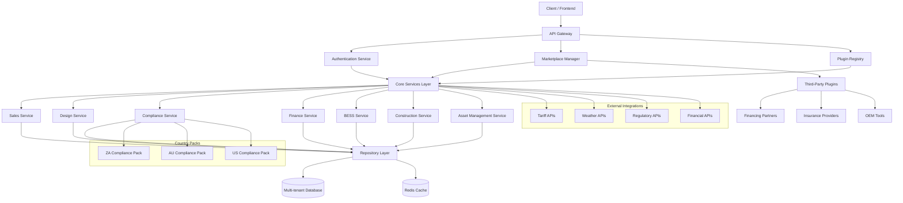
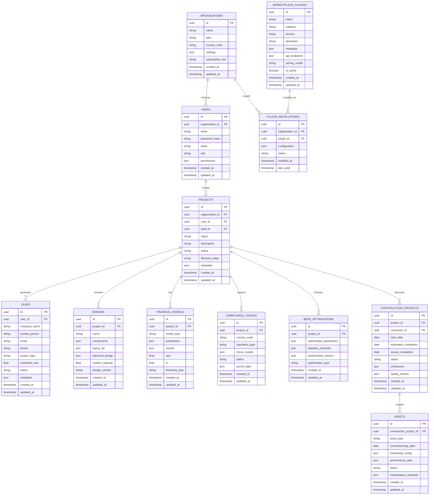

# NextGen Fusion Commercial Solar Platform - Technical Architecture Document

*A Modular, AI-Enhanced, All-in-One Solar Lifecycle Operating System*

## 1. Architecture Design

```mermaid
graph TD
    A[User Browser] --> B[React Frontend Application]
    B --> C[API Gateway - Node.js/Express]
    C --> D[Sales & Proposals Service]
    C --> E[Design Service - Python/FastAPI]
    C --> F[Compliance & Permitting Service]
    C --> G[Finance Service - Python/FastAPI]
    C --> H[BESS Service - Python/FastAPI]
    C --> I[Tariffs Service - Python/FastAPI]
    C --> J[Forecasts Service - Python/FastAPI]
    C --> K[Construction Management Service]
    C --> L[Asset Management & O&M Service]
    C --> M[Marketplace & Plugin Manager]
    
    E --> N[(PostgreSQL - Design DB)]
    F --> O[(PostgreSQL - Compliance DB)]
    G --> P[(PostgreSQL - Finance DB)]
    H --> Q[(PostgreSQL - BESS DB)]
    I --> R[(PostgreSQL - Tariffs DB)]
    J --> S[(PostgreSQL - Forecasts DB)]
    K --> T[(PostgreSQL - Construction DB)]
    L --> U[(PostgreSQL - Asset DB)]
    M --> V[(PostgreSQL - Marketplace DB)]
    
    W[Redis Cache] --> C
    X[External APIs] --> I
    X --> J
    Y[Trae AI SDK] --> C
    
    M --> Z[Third-Party Plugins]
    Z --> AA[Financing Partners]
    Z --> BB[Insurance Providers]
    Z --> CC[OEM Tools]
    Z --> DD[Specialized Services]
    
    subgraph "Country Packs"
        EE[South Africa Pack]
        FF[Australia Pack]
        GG[United States Pack]
    end
    
    F --> EE
    F --> FF
    F --> GG
    
    subgraph "Frontend Layer"
        B
    end
    
    subgraph "Gateway & Marketplace Layer"
        C
        W
        M
    end
    
    subgraph "Core Services Layer"
        D
        E
        F
        G
        H
        I
        J
        K
        L
    end
    
    subgraph "Data Layer"
        N
        O
        P
        Q
        R
        S
        T
        U
        V
    end
    
    subgraph "External Ecosystem"
        X
        Y
        Z
    end
```



## 2. Technology Description

- **Frontend**: React@18 + TypeScript@5 + Three.js@0.158 + Tailwind CSS@3 + Vite@5
- **Gateway & Marketplace**: Node.js@18 + Express@4 + JWT + Redis@7 + Plugin SDK
- **Core Services**: Python@3.11 + FastAPI@0.104 + SQLAlchemy@2.0 + Pydantic@2.0
- **Database**: PostgreSQL@15 + Redis@7 + Multi-tenant architecture
- **Optimization**: OR-Tools@9.8 (for BESS MILP) + ML libraries
- **AI Integration**: Trae AI SDK + Custom ML models
- **Plugin Framework**: RESTful APIs + WebHooks + SDK
- **Infrastructure**: Docker + Kubernetes + Terraform + Global CDN
- **Country Packs**: Modular compliance and regulatory frameworks

## 3. Route Definitions

| Route | Purpose |
|-------|---------|
| `/` | Landing page with platform overview and navigation |
| `/login` | User authentication and authorization |
| `/register` | New user registration with role selection |
| `/dashboard` | Main dashboard with project overview and quick actions |
| `/sales` | CRM, lead management, and proposal generation |
| `/design` | 3D BIM modeling interface for photovoltaic system design |
| `/design/wizard` | Step-by-step design wizard for guided system creation |
| `/components` | Component library browser and selector |
| `/finance` | Financial modeling and analysis tools |
| `/finance/monte-carlo` | Monte Carlo simulation interface |
| `/compliance` | Regulatory compliance checker and permit generator |
| `/optimization` | BESS optimization and energy management |
| `/construction` | Project management, scheduling, and quality control |
| `/assets` | Asset management, O&M, and performance monitoring |
| `/marketplace` | Third-party plugins and services marketplace |
| `/reports` | Bankability reports and documentation generator |
| `/analytics` | Advanced analytics and business intelligence |
| `/settings` | User preferences and system configuration |
| `/admin` | Administrative interface for system management |

## 4. API Definitions

### 4.1 Authentication & User Management APIs

**User Login**
```
POST /api/auth/login
```

Request:
| Param Name | Param Type | isRequired | Description |
|------------|------------|------------|-------------|
| email | string | true | User email address |
| password | string | true | User password (plain text) |

Response:
| Param Name | Param Type | Description |
|------------|------------|-------------|
| access_token | string | JWT access token |
| refresh_token | string | JWT refresh token |
| user | object | User profile information |

Example:
```json
{
  "email": "user@example.com",
  "password": "securepassword123"
}
```

### 4.2 Sales & CRM APIs

**Create Lead**
```
POST /api/sales/leads
```

Request:
| Param Name | Param Type | isRequired | Description |
|------------|------------|------------|-------------|
| company_name | string | true | Lead company name |
| contact_person | string | true | Primary contact person |
| email | string | true | Contact email address |
| phone | string | false | Contact phone number |
| project_type | string | true | Type of solar project |
| estimated_size | number | false | Estimated system size in kW |

**Generate Proposal**
```
POST /api/sales/proposals
```

Request:
| Param Name | Param Type | isRequired | Description |
|------------|------------|------------|-------------|
| lead_id | string | true | Lead identifier |
| design_id | string | true | Associated design project |
| pricing_model | string | true | PPA, lease, or purchase |
| custom_terms | object | false | Custom proposal terms |

### 4.3 Design Service APIs

**Create Design Project**
```
POST /api/design/projects
```

Request:
| Param Name | Param Type | isRequired | Description |
|------------|------------|------------|-------------|
| name | string | true | Project name |
| location | object | true | Geographic coordinates and address |
| system_type | string | true | Type of solar system (rooftop, ground-mount, etc.) |

Response:
| Param Name | Param Type | Description |
|------------|------------|-------------|
| project_id | string | Unique project identifier |
| status | string | Project creation status |

**Get 3D Model Data**
```
GET /api/design/projects/{project_id}/model
```

Response:
| Param Name | Param Type | Description |
|------------|------------|-------------|
| geometry | object | 3D geometry data for Three.js |
| components | array | List of system components |
| performance | object | System performance metrics |

### 4.4 Finance Service APIs

**Run Monte Carlo Analysis**
```
POST /api/finance/monte-carlo
```

Request:
| Param Name | Param Type | isRequired | Description |
|------------|------------|------------|-------------|
| project_id | string | true | Design project identifier |
| scenarios | number | false | Number of simulation scenarios (default: 1000) |
| variables | object | true | Uncertain variables and distributions |

Response:
| Param Name | Param Type | Description |
|------------|------------|-------------|
| results | object | Statistical analysis results |
| confidence_intervals | object | Confidence intervals for key metrics |
| risk_metrics | object | Risk assessment data |

### 4.5 BESS Optimization APIs

**Optimize Battery Dispatch**
```
POST /api/bess/optimize
```

Request:
| Param Name | Param Type | isRequired | Description |
|------------|------------|------------|-------------|
| project_id | string | true | Design project identifier |
| optimization_period | string | true | Optimization timeframe (day, month, year) |
| constraints | object | true | Battery and system constraints |
| tariff_schedule | object | true | Electricity tariff structure |

Response:
| Param Name | Param Type | Description |
|------------|------------|-------------|
| dispatch_schedule | array | Optimal battery charge/discharge schedule |
| cost_savings | number | Projected cost savings |
| performance_metrics | object | System performance indicators |

### 4.6 Compliance Service APIs

**Check Regulatory Compliance**
```
POST /api/compliance/check
```

Request:
| Param Name | Param Type | isRequired | Description |
|------------|------------|------------|-------------|
| project_id | string | true | Design project identifier |
| country_code | string | true | Country code (US, AU, ZA) |
| jurisdiction | string | false | Specific jurisdiction or state |

Response:
| Param Name | Param Type | Description |
|------------|------------|-------------|
| compliance_status | string | Overall compliance status |
| violations | array | List of compliance violations |
| recommendations | array | Recommended actions |

### 4.7 Construction Management APIs

**Create Construction Project**
```
POST /api/construction/projects
```

Request:
| Param Name | Param Type | isRequired | Description |
|------------|------------|------------|-------------|
| design_id | string | true | Associated design project |
| start_date | string | true | Project start date |
| estimated_completion | string | true | Estimated completion date |
| contractor_id | string | false | Assigned contractor |

### 4.8 Asset Management APIs

**Register Asset**
```
POST /api/assets/register
```

Request:
| Param Name | Param Type | isRequired | Description |
|------------|------------|------------|-------------|
| project_id | string | true | Associated project |
| commissioning_date | string | true | System commissioning date |
| monitoring_config | object | true | Monitoring system configuration |

### 4.9 Marketplace APIs

**List Available Plugins**
```
GET /api/marketplace/plugins
```

Response:
| Param Name | Param Type | Description |
|------------|------------|-------------|
| plugins | array | List of available plugins |
| categories | array | Plugin categories |
| featured | array | Featured plugins |

**Install Plugin**
```
POST /api/marketplace/plugins/{plugin_id}/install
```

Request:
| Param Name | Param Type | isRequired | Description |
|------------|------------|------------|-------------|
| organization_id | string | true | Target organization |
| configuration | object | false | Plugin configuration |

### 4.10 Country Pack APIs

**Get Country Regulations**
```
GET /api/compliance/countries/{country_code}/regulations
```

Response:
| Param Name | Param Type | Description |
|------------|------------|-------------|
| regulations | array | List of applicable regulations |
| incentives | array | Available incentives |
| permit_requirements | array | Permit requirements |

## 5. Server Architecture Diagram



## 6. Data Model

### 6.1 Data Model Definition



### 6.2 Data Definition Language

**Organizations Table**
```sql
-- Create organizations table
CREATE TABLE organizations (
    id UUID PRIMARY KEY DEFAULT gen_random_uuid(),
    name VARCHAR(255) NOT NULL,
    type VARCHAR(50) NOT NULL CHECK (type IN ('epc', 'engineering', 'installer', 'developer', 'finance')),
    country_code VARCHAR(3) NOT NULL,
    settings JSONB DEFAULT '{}',
    subscription_tier VARCHAR(50) DEFAULT 'starter' CHECK (subscription_tier IN ('starter', 'professional', 'enterprise')),
    created_at TIMESTAMP WITH TIME ZONE DEFAULT NOW(),
    updated_at TIMESTAMP WITH TIME ZONE DEFAULT NOW()
);

-- Create indexes
CREATE INDEX idx_organizations_type ON organizations(type);
CREATE INDEX idx_organizations_country ON organizations(country_code);
```

**Users Table**
```sql
-- Create users table
CREATE TABLE users (
    id UUID PRIMARY KEY DEFAULT gen_random_uuid(),
    organization_id UUID REFERENCES organizations(id) ON DELETE CASCADE,
    email VARCHAR(255) UNIQUE NOT NULL,
    password_hash VARCHAR(255) NOT NULL,
    first_name VARCHAR(100) NOT NULL,
    last_name VARCHAR(100) NOT NULL,
    role VARCHAR(50) DEFAULT 'user' CHECK (role IN ('admin', 'manager', 'engineer', 'designer', 'sales', 'viewer')),
    permissions JSONB DEFAULT '{}',
    created_at TIMESTAMP WITH TIME ZONE DEFAULT NOW(),
    updated_at TIMESTAMP WITH TIME ZONE DEFAULT NOW()
);

-- Create indexes
CREATE INDEX idx_users_email ON users(email);
CREATE INDEX idx_users_role ON users(role);
CREATE INDEX idx_users_organization ON users(organization_id);
```

**Leads Table**
```sql
-- Create leads table
CREATE TABLE leads (
    id UUID PRIMARY KEY DEFAULT gen_random_uuid(),
    user_id UUID NOT NULL REFERENCES users(id) ON DELETE CASCADE,
    company_name VARCHAR(255) NOT NULL,
    contact_person VARCHAR(255) NOT NULL,
    email VARCHAR(255) NOT NULL,
    phone VARCHAR(50),
    project_type VARCHAR(100) NOT NULL,
    estimated_size DECIMAL(10,2),
    status VARCHAR(50) DEFAULT 'new' CHECK (status IN ('new', 'qualified', 'proposal', 'negotiation', 'won', 'lost')),
    metadata JSONB DEFAULT '{}',
    created_at TIMESTAMP WITH TIME ZONE DEFAULT NOW(),
    updated_at TIMESTAMP WITH TIME ZONE DEFAULT NOW()
);

-- Create indexes
CREATE INDEX idx_leads_user_id ON leads(user_id);
CREATE INDEX idx_leads_status ON leads(status);
CREATE INDEX idx_leads_created_at ON leads(created_at DESC);
```

**Projects Table**
```sql
-- Create projects table
CREATE TABLE projects (
    id UUID PRIMARY KEY DEFAULT gen_random_uuid(),
    organization_id UUID NOT NULL REFERENCES organizations(id) ON DELETE CASCADE,
    user_id UUID NOT NULL REFERENCES users(id) ON DELETE CASCADE,
    lead_id UUID REFERENCES leads(id) ON DELETE SET NULL,
    name VARCHAR(255) NOT NULL,
    location JSONB NOT NULL,
    system_type VARCHAR(100) NOT NULL,
    status VARCHAR(50) DEFAULT 'draft' CHECK (status IN ('draft', 'active', 'completed', 'archived')),
    lifecycle_stage VARCHAR(50) DEFAULT 'design' CHECK (lifecycle_stage IN ('sales', 'design', 'permitting', 'finance', 'construction', 'operations')),
    created_at TIMESTAMP WITH TIME ZONE DEFAULT NOW(),
    updated_at TIMESTAMP WITH TIME ZONE DEFAULT NOW()
);

-- Create indexes
CREATE INDEX idx_projects_organization_id ON projects(organization_id);
CREATE INDEX idx_projects_user_id ON projects(user_id);
CREATE INDEX idx_projects_lead_id ON projects(lead_id);
CREATE INDEX idx_projects_status ON projects(status);
CREATE INDEX idx_projects_lifecycle_stage ON projects(lifecycle_stage);
CREATE INDEX idx_projects_created_at ON projects(created_at DESC);
```

**Designs Table**
```sql
-- Create designs table
CREATE TABLE designs (
    id UUID PRIMARY KEY DEFAULT gen_random_uuid(),
    project_id UUID NOT NULL REFERENCES projects(id) ON DELETE CASCADE,
    name VARCHAR(255) NOT NULL,
    components JSONB DEFAULT '{}',
    layout_3d JSONB DEFAULT '{}',
    electrical_design JSONB DEFAULT '{}',
    system_capacity DECIMAL(10,2),
    design_version VARCHAR(50) DEFAULT '1.0',
    created_at TIMESTAMP WITH TIME ZONE DEFAULT NOW(),
    updated_at TIMESTAMP WITH TIME ZONE DEFAULT NOW()
);

-- Create indexes
CREATE INDEX idx_designs_project_id ON designs(project_id);
CREATE INDEX idx_designs_created_at ON designs(created_at DESC);
```

**Financial Models Table**
```sql
-- Create financial_models table
CREATE TABLE financial_models (
    id UUID PRIMARY KEY DEFAULT gen_random_uuid(),
    project_id UUID NOT NULL REFERENCES projects(id) ON DELETE CASCADE,
    model_type VARCHAR(100) NOT NULL,
    parameters JSONB DEFAULT '{}',
    results JSONB DEFAULT '{}',
    npv DECIMAL(15,2),
    irr DECIMAL(5,2),
    financing_type VARCHAR(50),
    created_at TIMESTAMP WITH TIME ZONE DEFAULT NOW(),
    updated_at TIMESTAMP WITH TIME ZONE DEFAULT NOW()
);

-- Create indexes
CREATE INDEX idx_financial_models_project_id ON financial_models(project_id);
CREATE INDEX idx_financial_models_type ON financial_models(model_type);
```

**Compliance Checks Table**
```sql
-- Create compliance_checks table
CREATE TABLE compliance_checks (
    id UUID PRIMARY KEY DEFAULT gen_random_uuid(),
    project_id UUID NOT NULL REFERENCES projects(id) ON DELETE CASCADE,
    country_code VARCHAR(3) NOT NULL,
    regulation_type VARCHAR(100) NOT NULL,
    check_results JSONB DEFAULT '{}',
    status VARCHAR(50) DEFAULT 'pending' CHECK (status IN ('pending', 'passed', 'failed', 'warning')),
    permit_data JSONB DEFAULT '{}',
    created_at TIMESTAMP WITH TIME ZONE DEFAULT NOW(),
    updated_at TIMESTAMP WITH TIME ZONE DEFAULT NOW()
);

-- Create indexes
CREATE INDEX idx_compliance_checks_project_id ON compliance_checks(project_id);
CREATE INDEX idx_compliance_checks_country ON compliance_checks(country_code);
CREATE INDEX idx_compliance_checks_status ON compliance_checks(status);
```

**BESS Optimizations Table**
```sql
-- Create bess_optimizations table
CREATE TABLE bess_optimizations (
    id UUID PRIMARY KEY DEFAULT gen_random_uuid(),
    project_id UUID NOT NULL REFERENCES projects(id) ON DELETE CASCADE,
    optimization_parameters JSONB DEFAULT '{}',
    dispatch_schedule JSONB DEFAULT '{}',
    performance_metrics JSONB DEFAULT '{}',
    optimization_type VARCHAR(50) DEFAULT 'daily',
    created_at TIMESTAMP WITH TIME ZONE DEFAULT NOW(),
    updated_at TIMESTAMP WITH TIME ZONE DEFAULT NOW()
);

-- Create indexes
CREATE INDEX idx_bess_optimizations_project_id ON bess_optimizations(project_id);
CREATE INDEX idx_bess_optimizations_type ON bess_optimizations(optimization_type);
```

**Construction Projects Table**
```sql
-- Create construction_projects table
CREATE TABLE construction_projects (
    id UUID PRIMARY KEY DEFAULT gen_random_uuid(),
    project_id UUID NOT NULL REFERENCES projects(id) ON DELETE CASCADE,
    contractor_id UUID,
    start_date DATE,
    estimated_completion DATE,
    actual_completion DATE,
    status VARCHAR(50) DEFAULT 'planned' CHECK (status IN ('planned', 'active', 'delayed', 'completed', 'cancelled')),
    milestones JSONB DEFAULT '{}',
    quality_checks JSONB DEFAULT '{}',
    created_at TIMESTAMP WITH TIME ZONE DEFAULT NOW(),
    updated_at TIMESTAMP WITH TIME ZONE DEFAULT NOW()
);

-- Create indexes
CREATE INDEX idx_construction_projects_project_id ON construction_projects(project_id);
CREATE INDEX idx_construction_projects_status ON construction_projects(status);
CREATE INDEX idx_construction_projects_start_date ON construction_projects(start_date);
```

**Assets Table**
```sql
-- Create assets table
CREATE TABLE assets (
    id UUID PRIMARY KEY DEFAULT gen_random_uuid(),
    construction_project_id UUID NOT NULL REFERENCES construction_projects(id) ON DELETE CASCADE,
    asset_type VARCHAR(100) NOT NULL,
    commissioning_date DATE,
    monitoring_config JSONB DEFAULT '{}',
    performance_data JSONB DEFAULT '{}',
    status VARCHAR(50) DEFAULT 'commissioned' CHECK (status IN ('commissioned', 'operational', 'maintenance', 'decommissioned')),
    maintenance_schedule JSONB DEFAULT '{}',
    created_at TIMESTAMP WITH TIME ZONE DEFAULT NOW(),
    updated_at TIMESTAMP WITH TIME ZONE DEFAULT NOW()
);

-- Create indexes
CREATE INDEX idx_assets_construction_project_id ON assets(construction_project_id);
CREATE INDEX idx_assets_type ON assets(asset_type);
CREATE INDEX idx_assets_status ON assets(status);
```

**Marketplace Plugins Table**
```sql
-- Create marketplace_plugins table
CREATE TABLE marketplace_plugins (
    id UUID PRIMARY KEY DEFAULT gen_random_uuid(),
    name VARCHAR(255) NOT NULL,
    category VARCHAR(100) NOT NULL,
    version VARCHAR(50) NOT NULL,
    developer VARCHAR(255) NOT NULL,
    metadata JSONB DEFAULT '{}',
    api_endpoints JSONB DEFAULT '{}',
    pricing_model VARCHAR(50) DEFAULT 'free' CHECK (pricing_model IN ('free', 'subscription', 'usage', 'one_time')),
    is_active BOOLEAN DEFAULT true,
    created_at TIMESTAMP WITH TIME ZONE DEFAULT NOW(),
    updated_at TIMESTAMP WITH TIME ZONE DEFAULT NOW()
);

-- Create indexes
CREATE INDEX idx_marketplace_plugins_category ON marketplace_plugins(category);
CREATE INDEX idx_marketplace_plugins_developer ON marketplace_plugins(developer);
CREATE INDEX idx_marketplace_plugins_active ON marketplace_plugins(is_active);
```

**Plugin Installations Table**
```sql
-- Create plugin_installations table
CREATE TABLE plugin_installations (
    id UUID PRIMARY KEY DEFAULT gen_random_uuid(),
    organization_id UUID NOT NULL REFERENCES organizations(id) ON DELETE CASCADE,
    plugin_id UUID NOT NULL REFERENCES marketplace_plugins(id) ON DELETE CASCADE,
    configuration JSONB DEFAULT '{}',
    status VARCHAR(50) DEFAULT 'active' CHECK (status IN ('active', 'inactive', 'suspended')),
    installed_at TIMESTAMP WITH TIME ZONE DEFAULT NOW(),
    last_used TIMESTAMP WITH TIME ZONE
);

-- Create indexes
CREATE INDEX idx_plugin_installations_org_id ON plugin_installations(organization_id);
CREATE INDEX idx_plugin_installations_plugin_id ON plugin_installations(plugin_id);
CREATE INDEX idx_plugin_installations_status ON plugin_installations(status);
CREATE UNIQUE INDEX idx_plugin_installations_unique ON plugin_installations(organization_id, plugin_id);
```

**Initial Data**
```sql
-- Insert sample organizations
INSERT INTO organizations (name, type, country_code, subscription_tier) VALUES
('SolarTech Solutions', 'epc', 'US', 'professional'),
('Green Energy Engineering', 'engineering', 'AU', 'enterprise'),
('Renewable Installers Co', 'installer', 'ZA', 'starter');

-- Insert sample marketplace plugins
INSERT INTO marketplace_plugins (name, category, version, developer, pricing_model, is_active) VALUES
('Advanced Financial Modeling', 'finance', '2.1.0', 'FinTech Solar', 'subscription', true),
('Insurance Risk Assessment', 'insurance', '1.5.0', 'RiskGuard Solutions', 'usage', true),
('OEM Component Catalog', 'components', '3.0.0', 'ComponentHub', 'free', true),
('Weather Data Premium', 'forecasting', '1.2.0', 'WeatherPro', 'subscription', true);
```

**Designs Table**
```sql
-- Create designs table
CREATE TABLE designs (
    id UUID PRIMARY KEY DEFAULT gen_random_uuid(),
    project_id UUID NOT NULL REFERENCES projects(id) ON DELETE CASCADE,
    name VARCHAR(255) NOT NULL,
    geometry_data JSONB,
    performance_metrics JSONB,
    status VARCHAR(50) DEFAULT 'draft' CHECK (status IN ('draft', 'validated', 'approved')),
    created_at TIMESTAMP WITH TIME ZONE DEFAULT NOW(),
    updated_at TIMESTAMP WITH TIME ZONE DEFAULT NOW()
);

-- Create indexes
CREATE INDEX idx_designs_project_id ON designs(project_id);
CREATE INDEX idx_designs_status ON designs(status);
```

**Components Table**
```sql
-- Create components table
CREATE TABLE components (
    id UUID PRIMARY KEY DEFAULT gen_random_uuid(),
    design_id UUID NOT NULL REFERENCES designs(id) ON DELETE CASCADE,
    component_type VARCHAR(100) NOT NULL,
    manufacturer VARCHAR(255),
    model VARCHAR(255),
    specifications JSONB,
    quantity INTEGER NOT NULL DEFAULT 1,
    unit_cost DECIMAL(12,2)
);

-- Create indexes
CREATE INDEX idx_components_design_id ON components(design_id);
CREATE INDEX idx_components_type ON components(component_type);
```

**Financial Models Table**
```sql
-- Create financial_models table
CREATE TABLE financial_models (
    id UUID PRIMARY KEY DEFAULT gen_random_uuid(),
    project_id UUID NOT NULL REFERENCES projects(id) ON DELETE CASCADE,
    model_type VARCHAR(100) NOT NULL CHECK (model_type IN ('monte_carlo', 'ppa', 'lease', 'loan')),
    parameters JSONB NOT NULL,
    results JSONB,
    created_at TIMESTAMP WITH TIME ZONE DEFAULT NOW()
);

-- Create indexes
CREATE INDEX idx_financial_models_project_id ON financial_models(project_id);
CREATE INDEX idx_financial_models_type ON financial_models(model_type);
```

**Compliance Checks Table**
```sql
-- Create compliance_checks table
CREATE TABLE compliance_checks (
    id UUID PRIMARY KEY DEFAULT gen_random_uuid(),
    project_id UUID NOT NULL REFERENCES projects(id) ON DELETE CASCADE,
    country_code VARCHAR(3) NOT NULL CHECK (country_code IN ('US', 'AU', 'ZA')),
    jurisdiction VARCHAR(100),
    rules_checked JSONB NOT NULL,
    status VARCHAR(50) DEFAULT 'pending' CHECK (status IN ('pending', 'compliant', 'non_compliant')),
    checked_at TIMESTAMP WITH TIME ZONE DEFAULT NOW()
);

-- Create indexes
CREATE INDEX idx_compliance_checks_project_id ON compliance_checks(project_id);
CREATE INDEX idx_compliance_checks_country ON compliance_checks(country_code);
CREATE INDEX idx_compliance_checks_status ON compliance_checks(status);
```

**BESS Optimizations Table**
```sql
-- Create bess_optimizations table
CREATE TABLE bess_optimizations (
    id UUID PRIMARY KEY DEFAULT gen_random_uuid(),
    project_id UUID NOT NULL REFERENCES projects(id) ON DELETE CASCADE,
    constraints JSONB NOT NULL,
    dispatch_schedule JSONB,
    cost_savings DECIMAL(12,2),
    optimized_at TIMESTAMP WITH TIME ZONE DEFAULT NOW()
);

-- Create indexes
CREATE INDEX idx_bess_optimizations_project_id ON bess_optimizations(project_id);
CREATE INDEX idx_bess_optimizations_optimized_at ON bess_optimizations(optimized_at DESC);
```

**Tariff Data Table**
```sql
-- Create tariff_data table
CREATE TABLE tariff_data (
    id UUID PRIMARY KEY DEFAULT gen_random_uuid(),
    country_code VARCHAR(3) NOT NULL,
    utility_name VARCHAR(255) NOT NULL,
    tariff_name VARCHAR(255) NOT NULL,
    tariff_structure JSONB NOT NULL,
    effective_date DATE NOT NULL,
    expiry_date DATE,
    version INTEGER DEFAULT 1,
    created_at TIMESTAMP WITH TIME ZONE DEFAULT NOW()
);

-- Create indexes
CREATE INDEX idx_tariff_data_country ON tariff_data(country_code);
CREATE INDEX idx_tariff_data_utility ON tariff_data(utility_name);
CREATE INDEX idx_tariff_data_effective_date ON tariff_data(effective_date DESC);
```

**Initial Data**
```sql
-- Insert sample user
INSERT INTO users (email, password_hash, first_name, last_name, role)
VALUES ('admin@nextgenfusion.com', '$2b$12$example_hash', 'System', 'Administrator', 'admin');

-- Insert sample project
INSERT INTO projects (user_id, name, location, system_type)
VALUES (
    (SELECT id FROM users WHERE email = 'admin@nextgenfusion.com'),
    'Demo Solar Installation',
    '{"lat": -33.8688, "lng": 151.2093, "address": "Sydney, NSW, Australia"}',
    'rooftop'
);
```