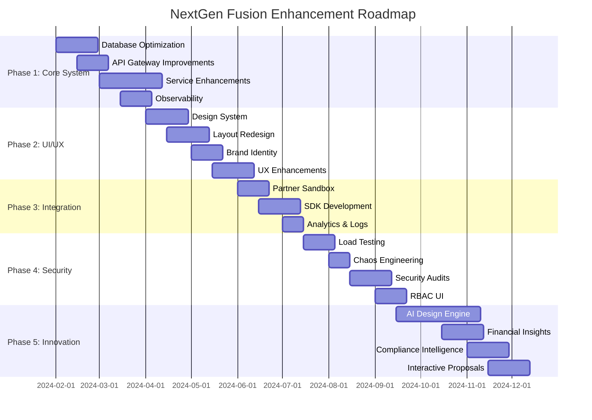

# NextGen Fusion — Enhancement Roadmap

## Executive Summary

This roadmap outlines a comprehensive 5-phase enhancement plan to transform NextGen Fusion from its current Phase 3 implementation into a premium, scalable, and market-leading commercial solar platform. The roadmap focuses on system optimization, UI/UX transformation, partner readiness, security hardening, and innovative product differentiators.

**Target Outcome**: A lean, optimized, and scalable system with distinct professional UI and premium user experience ready to impress partners and investors.

---

## Phase 1: Core System Fine-Tuning
**Duration**: 8-10 weeks  
**Focus**: Stability, performance, and maintainability  
**Priority**: High

### 1.1 Database Optimization

#### Deliverables
- **Query Performance Analysis**
  - Review execution plans for all critical queries
  - Identify and add missing indexes on high-traffic tables
  - Optimize N+1 query patterns in ORM relationships
  - Target: 50% reduction in average query response time

- **Caching Layer Implementation**
  - Deploy Redis cluster for expensive query caching
  - Implement cache-aside pattern for design calculations
  - Add cache warming strategies for frequently accessed data
  - Target: 80% cache hit rate for read operations

- **Multi-Tenant Isolation Testing**
  - Stress test tenant data isolation under 10x load
  - Validate row-level security (RLS) performance
  - Implement tenant-specific connection pooling
  - Target: Zero data leakage, <5% performance degradation

#### Technical Specifications
```sql
-- Example index optimizations
CREATE INDEX CONCURRENTLY idx_projects_tenant_status 
ON projects(tenant_id, status) WHERE status IN ('active', 'pending');

CREATE INDEX CONCURRENTLY idx_design_models_project_created 
ON design_3d_models(project_id, created_at DESC);
```

#### Success Metrics
- Database query P95 latency: <100ms
- Cache hit ratio: >80%
- Multi-tenant isolation: 100% secure under load

### 1.2 API Gateway Improvements

#### Deliverables
- **API Versioning Strategy**
  - Implement v1/v2 routing with backward compatibility
  - Add version negotiation headers
  - Create deprecation timeline for legacy endpoints

- **Enhanced Logging & Tracing**
  - Implement correlation IDs across all requests
  - Add structured JSON logging with request/response details
  - Integrate with OpenTelemetry for distributed tracing

- **Dynamic Rate Limiting**
  - Per-tenant rate limiting based on subscription tier
  - Adaptive rate limiting during peak usage
  - Grace period handling for burst traffic

#### Technical Specifications
```typescript
// API versioning middleware
interface VersionedRequest extends Request {
  apiVersion: 'v1' | 'v2';
  correlationId: string;
}

// Rate limiting configuration
interface RateLimitConfig {
  tenant_id: string;
  plan_type: 'free' | 'premium' | 'enterprise';
  requests_per_minute: number;
  burst_allowance: number;
}
```

#### Success Metrics
- API response time P95: <200ms
- Rate limiting accuracy: 99.9%
- Correlation ID coverage: 100%

### 1.3 Service Enhancements

#### svc-design: Advanced 3D Solar Layout
- **Shading Analysis Engine**
  - Implement shadow calculation algorithms
  - Add time-of-day and seasonal shading analysis
  - Integrate weather data for cloud cover impact

- **Tilt/Azimuth Optimization**
  - Auto-calculate optimal panel angles
  - Consider local latitude and solar irradiance data
  - Provide multiple layout scenarios with ROI comparison

#### svc-currency: FX Rate History & Forecasting
- **Historical Rate Storage**
  - Store daily FX rates for 5+ years
  - Implement rate change notifications
  - Add currency volatility indicators

- **Forecasting Engine**
  - Integrate with financial data providers
  - Implement basic trend analysis
  - Provide confidence intervals for projections

#### svc-project: Task Dependencies & Scheduling
- **Gantt-Style Scheduling**
  - Implement critical path method (CPM)
  - Add task dependency management
  - Resource allocation and conflict detection

- **Project Timeline Optimization**
  - Auto-schedule based on resource availability
  - Weather-dependent task scheduling
  - Milestone tracking with automated alerts

#### svc-compliance: Pluggable Rules Engine
- **Policy Module Framework**
  - Create pluggable compliance rule architecture
  - Support for country-specific regulation packs
  - Version control for regulation updates

- **Dynamic Rule Evaluation**
  - Real-time compliance checking
  - Rule conflict detection and resolution
  - Audit trail for all compliance decisions

### 1.4 Observability Enhancement

#### Deliverables
- **Comprehensive Metrics**
  - Endpoint-specific latency tracking
  - Error ratio monitoring by service
  - Tenant-specific usage analytics
  - Business metrics (projects created, designs completed)

- **OpenTelemetry Integration**
  - Distributed tracing across all services
  - Custom span attributes for business context
  - Trace sampling strategies for performance

#### Success Metrics
- Service availability: 99.9%
- Mean time to detection (MTTD): <5 minutes
- Mean time to recovery (MTTR): <15 minutes

---

## Phase 2: UI/UX Overhaul — From "Cookie-Cutter" to Unique & Professional
**Duration**: 10-12 weeks  
**Focus**: Branding, usability, and distinctiveness  
**Priority**: High

### 2.1 Design System Upgrade

#### Custom Design Language
- **Color Palette**
  ```css
  :root {
    /* Primary Solar-Inspired Colors */
    --solar-blue: #1E40AF;
    --solar-yellow: #F59E0B;
    --deep-grey: #374151;
    
    /* Semantic Colors */
    --success: #10B981;
    --warning: #F59E0B;
    --error: #EF4444;
    --info: #3B82F6;
    
    /* Neutral Palette */
    --grey-50: #F9FAFB;
    --grey-900: #111827;
  }
  ```

- **Typography System**
  - Primary: Inter (professional sans-serif)
  - Accent: JetBrains Mono (technical data)
  - Scale: 12px, 14px, 16px, 18px, 24px, 32px, 48px

- **Spacing Scale**
  - Base unit: 4px
  - Scale: 4, 8, 12, 16, 24, 32, 48, 64, 96px

#### Component Library
- **Core Components**
  - Buttons (primary, secondary, ghost, danger)
  - Cards (project, metric, status)
  - Modals (confirmation, form, full-screen)
  - Forms (input, select, checkbox, radio)
  - Navigation (sidebar, breadcrumb, tabs)

- **Micro-Animations**
  - Button hover states (scale + shadow)
  - Card entrance animations (fade + slide)
  - Loading states (skeleton screens)
  - Transition timing: 200ms ease-out

### 2.2 Layout & Navigation Redesign

#### Dashboard Redesign
- **Grid-Based Layout**
  - 12-column responsive grid system
  - Widget-based dashboard with drag-and-drop
  - Customizable layouts per user role

- **Data Visualizations**
  - Project status overview (donut charts)
  - Financial metrics (line charts with trends)
  - Compliance status (progress indicators)
  - Performance metrics (gauge charts)

#### Workflow Optimization
- **Reduced Click Paths**
  - Quick actions from dashboard
  - Contextual menus and shortcuts
  - Bulk operations for common tasks

- **Mobile-First Responsive**
  - Breakpoints: 320px, 768px, 1024px, 1440px
  - Touch-optimized interactions
  - Progressive disclosure for complex features

### 2.3 Brand Identity

#### Custom Iconography
- **Solar Industry Icons**
  - Solar panels, inverters, batteries
  - Weather conditions, shading analysis
  - Financial charts, compliance badges

- **Icon System**
  - 16px, 20px, 24px sizes
  - Consistent stroke width (1.5px)
  - Rounded corners (2px radius)

#### Visual Hierarchy
- **Typography Pairing**
  - Headers: Inter Bold
  - Body: Inter Regular
  - Code/Data: JetBrains Mono

### 2.4 User Experience Enhancements

#### Advanced Features
- **Dark Mode Support**
  - System preference detection
  - Manual toggle with persistence
  - Optimized contrast ratios (WCAG AA)

- **Notifications & Activity Feed**
  - Real-time project updates
  - Compliance alerts and reminders
  - System maintenance notifications

- **3D Design Module Enhancements**
  - Drag-and-drop panel placement
  - Multi-select and bulk operations
  - Undo/redo functionality
  - Keyboard shortcuts for power users

- **Rich Charts & Dashboards**
  - Interactive charts with drill-down
  - Export capabilities (PDF, PNG, CSV)
  - Real-time data updates
  - Comparative analysis views

#### Success Metrics
- User task completion rate: >90%
- Average time to complete common tasks: -40%
- User satisfaction score: >4.5/5
- Mobile usage adoption: >30%

---

## Phase 3: Integration & Partner Readiness
**Duration**: 6-8 weeks  
**Focus**: Ecosystem expansion and partner enablement  
**Priority**: Medium-High

### 3.1 Partner Sandbox Environment

#### Deliverables
- **Isolated Sandbox Infrastructure**
  - Dedicated environment with mock data
  - Reset capabilities for testing
  - Rate limiting appropriate for development

- **Comprehensive API Documentation**
  - Interactive API explorer (Swagger/OpenAPI)
  - Code examples in multiple languages
  - Webhook documentation and testing tools

- **Mock Data Sets**
  - Realistic project scenarios
  - Various compliance requirements
  - Multi-currency transaction examples

### 3.2 Integration SDK Development

#### TypeScript SDK
```typescript
// Example SDK structure
export class NextGenFusionSDK {
  constructor(apiKey: string, environment: 'sandbox' | 'production') {}
  
  projects: ProjectsAPI;
  designs: DesignsAPI;
  compliance: ComplianceAPI;
  currency: CurrencyAPI;
}

interface ProjectsAPI {
  create(project: CreateProjectRequest): Promise<Project>;
  get(id: string): Promise<Project>;
  list(filters?: ProjectFilters): Promise<Project[]>;
  update(id: string, updates: UpdateProjectRequest): Promise<Project>;
}
```

#### Python SDK
```python
# Example Python SDK
class NextGenFusionClient:
    def __init__(self, api_key: str, environment: str = 'production'):
        self.api_key = api_key
        self.base_url = self._get_base_url(environment)
        
    @property
    def projects(self) -> ProjectsAPI:
        return ProjectsAPI(self)
        
    @property
    def designs(self) -> DesignsAPI:
        return DesignsAPI(self)
```

### 3.3 Audit Logs & Analytics

#### Partner-Specific Analytics
- **Usage Dashboards**
  - API call volume and patterns
  - Error rates and response times
  - Feature adoption metrics

- **Audit Trail**
  - All API calls with timestamps
  - Data access and modification logs
  - Compliance and security events

### 3.4 Marketplace Preparation

#### Integration Framework
- **Plugin Architecture**
  - Standardized integration points
  - Webhook system for real-time updates
  - OAuth 2.0 for secure authentication

- **Certification Process**
  - Integration testing requirements
  - Security and compliance validation
  - Performance benchmarking

#### Success Metrics
- Partner onboarding time: <2 weeks
- SDK adoption rate: >70% of new partners
- API uptime for partners: 99.95%

---

## Phase 4: Performance & Security Hardening
**Duration**: 8-10 weeks  
**Focus**: Scalability, reliability, and security  
**Priority**: High

### 4.1 Load Testing & Performance

#### 10x Traffic Load Testing
- **Test Scenarios**
  - Concurrent user sessions: 10,000+
  - API requests per second: 5,000+
  - Database connections: 1,000+
  - File uploads: 100 concurrent

- **Performance Targets**
  - API response time P95: <300ms
  - Database query P95: <100ms
  - UI page load time: <2.5s
  - System availability: 99.9%

#### Auto-Scaling Configuration
```yaml
# Kubernetes HPA example
apiVersion: autoscaling/v2
kind: HorizontalPodAutoscaler
metadata:
  name: nextgen-fusion-hpa
spec:
  scaleTargetRef:
    apiVersion: apps/v1
    kind: Deployment
    name: nextgen-fusion-api
  minReplicas: 3
  maxReplicas: 50
  metrics:
  - type: Resource
    resource:
      name: cpu
      target:
        type: Utilization
        averageUtilization: 70
```

### 4.2 Chaos Engineering

#### Automated Chaos Tests
- **Service Failure Scenarios**
  - Random service shutdowns
  - Network partition simulation
  - Database connection failures
  - Third-party API timeouts

- **Recovery Validation**
  - Circuit breaker effectiveness
  - Graceful degradation
  - Data consistency checks
  - User experience during failures

### 4.3 Security Auditing

#### Penetration Testing
- **External Security Assessment**
  - OWASP Top 10 vulnerability testing
  - API security testing
  - Authentication and authorization flaws
  - Data encryption validation

#### Static Code Analysis
- **Automated Security Scanning**
  - SAST tools integration (SonarQube, Snyk)
  - Dependency vulnerability scanning
  - Secret detection in code repositories
  - License compliance checking

### 4.4 Role-Based Access Control UI

#### Admin Interface
- **Visual Permission Management**
  - Drag-and-drop role assignment
  - Permission matrix visualization
  - Bulk user management
  - Audit trail for permission changes

- **Role Templates**
  - Pre-defined roles (Admin, Manager, User, Viewer)
  - Custom role creation
  - Permission inheritance
  - Temporary access grants

#### Success Metrics
- System handles 10x traffic with <5% performance degradation
- Zero critical security vulnerabilities
- RBAC adoption rate: >95% of organizations
- Mean time to recover from chaos tests: <5 minutes

---

## Phase 5: Product Differentiators (Innovation Track)
**Duration**: 12-16 weeks  
**Focus**: AI-powered features and competitive advantages  
**Priority**: Medium (Innovation)

### 5.1 AI-Enhanced Design

#### Auto-Optimization Engine
- **Machine Learning Models**
  - Panel layout optimization using genetic algorithms
  - Site constraint analysis (shading, obstacles, regulations)
  - Energy production prediction models
  - Cost-benefit optimization

- **Implementation Architecture**
```python
# AI Service Architecture
class DesignOptimizer:
    def __init__(self):
        self.layout_model = LayoutOptimizationModel()
        self.shading_analyzer = ShadingAnalysisEngine()
        self.energy_predictor = EnergyPredictionModel()
    
    def optimize_layout(self, site_data: SiteData) -> OptimizedLayout:
        constraints = self.analyze_constraints(site_data)
        layouts = self.layout_model.generate_candidates(constraints)
        return self.select_optimal_layout(layouts)
```

#### Features
- **Intelligent Panel Placement**
  - Automatic obstacle avoidance
  - Optimal spacing calculations
  - Multiple layout alternatives
  - Performance impact analysis

- **Site Analysis**
  - Satellite imagery integration
  - Terrain analysis and slope calculations
  - Local weather pattern consideration
  - Regulatory compliance checking

### 5.2 Financial Insights

#### ROI Calculator Enhancement
- **Local Incentive Integration**
  - Real-time incentive database
  - Tax credit calculations
  - Utility rebate programs
  - Financing option comparisons

- **Advanced Financial Modeling**
  - Net present value (NPV) calculations
  - Internal rate of return (IRR)
  - Payback period analysis
  - Sensitivity analysis for key variables

#### Implementation
```typescript
interface FinancialAnalysis {
  initial_investment: number;
  annual_savings: number[];
  incentives: Incentive[];
  financing_options: FinancingOption[];
  roi_metrics: {
    npv: number;
    irr: number;
    payback_period: number;
    total_savings_20_years: number;
  };
}
```

### 5.3 Compliance Intelligence

#### Predictive Compliance Analysis
- **Risk Assessment Engine**
  - Regulatory change prediction
  - Compliance risk scoring
  - Proactive alert system
  - Remediation recommendations

- **Intelligent Document Review**
  - Automated permit application checking
  - Missing information detection
  - Compliance gap analysis
  - Submission readiness scoring

### 5.4 Interactive Proposals

#### Investor-Ready PDF Generation
- **Dynamic Report Builder**
  - Customizable templates
  - Real-time data integration
  - Interactive charts and visualizations
  - Professional branding

- **Content Modules**
  - Executive summary
  - Technical specifications
  - Financial projections
  - Risk analysis
  - Implementation timeline

#### Features
- **Multi-Format Export**
  - PDF for formal presentations
  - Interactive web proposals
  - PowerPoint integration
  - Mobile-optimized viewing

- **Collaboration Tools**
  - Comment and annotation system
  - Version control and tracking
  - Approval workflows
  - Digital signatures

#### Success Metrics
- AI optimization improves energy output by 15-25%
- Financial accuracy within 5% of actual performance
- Compliance prediction accuracy >90%
- Proposal generation time reduced by 80%

---

## Implementation Timeline

### Overall Schedule (40-46 weeks total)



### Resource Requirements

#### Team Composition
- **Phase 1**: 3 Backend Engineers, 1 DevOps Engineer, 1 DBA
- **Phase 2**: 2 Frontend Engineers, 1 UI/UX Designer, 1 Design System Specialist
- **Phase 3**: 2 Backend Engineers, 1 Technical Writer, 1 Partner Success Manager
- **Phase 4**: 2 Security Engineers, 1 Performance Engineer, 1 DevOps Engineer
- **Phase 5**: 2 ML Engineers, 1 Data Scientist, 2 Full-Stack Engineers

#### Budget Estimates
- **Phase 1**: $180,000 - $220,000
- **Phase 2**: $160,000 - $200,000
- **Phase 3**: $120,000 - $150,000
- **Phase 4**: $140,000 - $180,000
- **Phase 5**: $250,000 - $320,000

**Total Estimated Budget**: $850,000 - $1,070,000

---

## Success Metrics & KPIs

### Technical Metrics
- **Performance**: API P95 latency <300ms, UI load time <2.5s
- **Reliability**: 99.9% uptime, MTTR <15 minutes
- **Scalability**: Handle 10x traffic with <5% performance degradation
- **Security**: Zero critical vulnerabilities, 100% compliance

### Business Metrics
- **User Experience**: Task completion rate >90%, satisfaction >4.5/5
- **Partner Adoption**: >70% SDK adoption, <2 week onboarding
- **Innovation Impact**: 15-25% energy output improvement via AI
- **Market Position**: Premium pricing tier justification

### Operational Metrics
- **Development Velocity**: 20% faster feature delivery
- **Support Efficiency**: 50% reduction in support tickets
- **Partner Success**: 95% partner retention rate
- **Revenue Impact**: 40% increase in enterprise deal size

---

## Risk Mitigation

### Technical Risks
- **Performance Degradation**: Implement gradual rollout with monitoring
- **Security Vulnerabilities**: Continuous security scanning and audits
- **Integration Complexity**: Comprehensive testing and rollback procedures

### Business Risks
- **Market Competition**: Focus on unique differentiators and innovation
- **Partner Adoption**: Invest in developer experience and support
- **Resource Constraints**: Prioritize phases based on business impact

### Mitigation Strategies
- **Feature Flags**: Enable gradual rollout and quick rollback
- **A/B Testing**: Validate UI/UX changes with user feedback
- **Monitoring**: Comprehensive observability for early issue detection
- **Documentation**: Maintain up-to-date technical and user documentation

---

## Conclusion

This enhancement roadmap transforms NextGen Fusion into a premium, scalable, and innovative commercial solar platform. The phased approach ensures systematic improvement while maintaining system stability and user experience. The end result will be a system that is lean, optimized, and scalable with a distinct, professional UI ready to impress partners and investors while delivering a premium user experience.

**Next Steps**:
1. Stakeholder review and approval
2. Detailed sprint planning for Phase 1
3. Resource allocation and team formation
4. Kick-off meeting and timeline confirmation

**Success Criteria**: Upon completion, NextGen Fusion will be positioned as the leading commercial solar platform with best-in-class performance, security, and user experience, ready for enterprise adoption and partner ecosystem expansion.