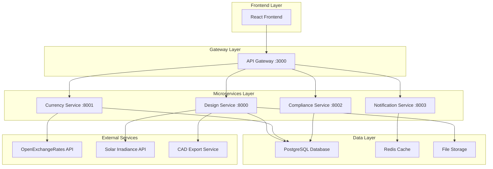
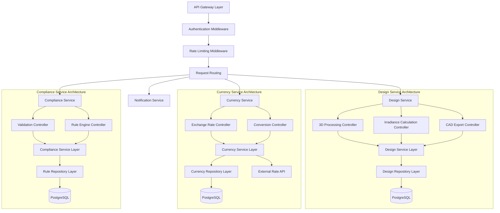
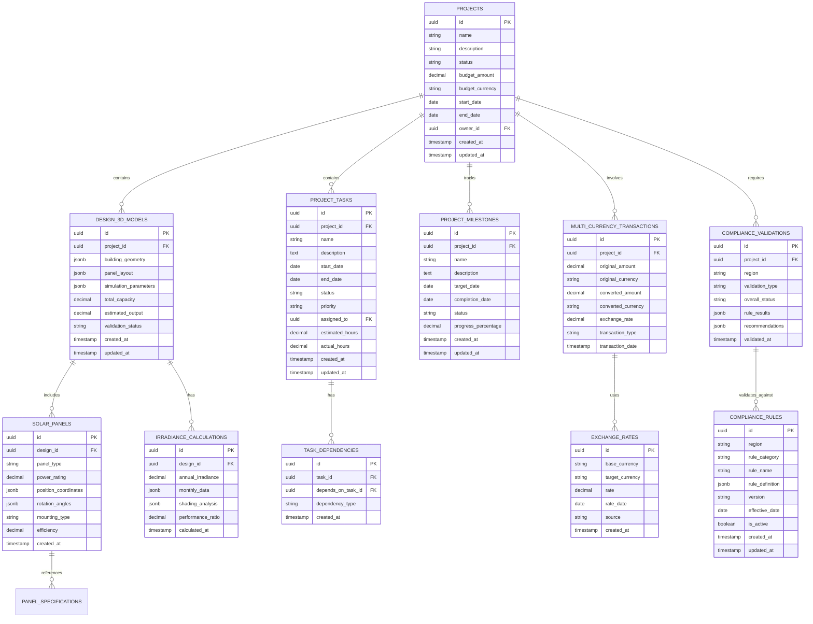

# NextGen Fusion Commercial Solar Platform - Phase 3 API Specifications

## 1. Architecture Overview



## 2. Technology Stack

- **Frontend**: React@18 + TypeScript + Three.js + Tailwind CSS + Vite
- **API Gateway**: Express@4 + TypeScript + JWT middleware
- **Backend Services**: FastAPI + Python + SQLAlchemy + Alembic
- **Database**: PostgreSQL@15 + Redis@7
- **External APIs**: OpenExchangeRates, Solar irradiance services
- **File Storage**: AWS S3 or compatible object storage
- **Monitoring**: Prometheus + Grafana

## 3. Route Definitions

| Route | Purpose |
|-------|----------|
| /design/3d-studio | 3D solar panel design interface with WebGL rendering |
| /design/library | Solar panel component library and specifications |
| /projects/gantt | Interactive Gantt chart for project timeline management |
| /projects/milestones | Milestone tracking and progress monitoring |
| /currency/dashboard | Multi-currency financial dashboard and conversion tools |
| /currency/reports | Financial reporting with currency analysis |
| /compliance/validation | Automated compliance checking and validation |
| /compliance/reports | Regulatory reporting and audit trail management |
| /monitoring/metrics | System performance and health monitoring dashboard |
| /admin/scaling | Infrastructure scaling controls and configuration |

## 4. API Definitions

### 4.1 Design Service APIs

#### 3D Design Management

```
POST /api/v1/design/3d-layout
```

**Purpose**: Create or update 3D solar panel layout

**Request**:
| Param Name | Param Type | Required | Description |
|------------|------------|----------|-------------|
| project_id | UUID | true | Project identifier |
| building_model | object | true | 3D building geometry data |
| panel_layout | array | true | Solar panel placement coordinates |
| simulation_params | object | false | Sun angle and irradiance parameters |

**Response**:
| Param Name | Param Type | Description |
|------------|------------|-------------|
| layout_id | UUID | Unique layout identifier |
| energy_output | number | Estimated annual energy production (kWh) |
| irradiance_map | object | Solar irradiance visualization data |
| validation_status | string | Design validation result |

**Example Request**:
```json
{
  "project_id": "123e4567-e89b-12d3-a456-426614174000",
  "building_model": {
    "geometry": {
      "vertices": [[0,0,0], [10,0,0], [10,10,0], [0,10,0]],
      "faces": [[0,1,2,3]]
    },
    "roof_surfaces": [
      {
        "surface_id": "roof_1",
        "area": 100,
        "tilt_angle": 30,
        "azimuth": 180
      }
    ]
  },
  "panel_layout": [
    {
      "panel_id": "panel_1",
      "position": {"x": 2, "y": 2, "z": 0},
      "rotation": {"x": 30, "y": 0, "z": 180},
      "panel_type": "monocrystalline_400w"
    }
  ],
  "simulation_params": {
    "latitude": -26.2041,
    "longitude": 28.0473,
    "timezone": "Africa/Johannesburg"
  }
}
```

**Example Response**:
```json
{
  "layout_id": "456e7890-e89b-12d3-a456-426614174001",
  "energy_output": 15420.5,
  "irradiance_map": {
    "annual_irradiance": 1850,
    "monthly_data": [120, 135, 155, 165, 170, 160, 155, 160, 150, 140, 125, 115],
    "shading_analysis": {
      "total_shading_loss": 5.2,
      "critical_periods": ["06:00-08:00", "16:00-18:00"]
    }
  },
  "validation_status": "valid"
}
```

---

```
GET /api/v1/design/irradiance-calculation/{layout_id}
```

**Purpose**: Calculate solar irradiance for specific layout

**Request**:
| Param Name | Param Type | Required | Description |
|------------|------------|----------|-------------|
| layout_id | UUID | true | Layout identifier from URL path |
| calculation_type | string | false | "annual", "monthly", "daily", "hourly" |
| include_shading | boolean | false | Include shading analysis |

**Response**:
| Param Name | Param Type | Description |
|------------|------------|-------------|
| total_irradiance | number | Total solar irradiance (kWh/m²/year) |
| panel_efficiency | number | Overall system efficiency percentage |
| energy_yield | number | Expected energy yield (kWh/year) |
| performance_ratio | number | System performance ratio |

---

```
POST /api/v1/design/export-cad
```

**Purpose**: Export design to CAD format

**Request**:
| Param Name | Param Type | Required | Description |
|------------|------------|----------|-------------|
| layout_id | UUID | true | Layout to export |
| format | string | true | "dwg", "dxf", "step", "iges" |
| include_annotations | boolean | false | Include technical annotations |
| coordinate_system | string | false | "local", "utm", "geographic" |

**Response**:
| Param Name | Param Type | Description |
|------------|------------|-------------|
| download_url | string | Temporary URL for file download |
| file_size | number | File size in bytes |
| expires_at | string | URL expiration timestamp |

---

```
POST /api/v1/design/import-gis
```

**Purpose**: Import GIS data for site modeling

**Request**:
| Param Name | Param Type | Required | Description |
|------------|------------|----------|-------------|
| project_id | UUID | true | Target project identifier |
| gis_file | file | true | GIS file (shapefile, KML, GeoJSON) |
| coordinate_system | string | true | Source coordinate reference system |
| feature_types | array | false | Specific features to import |

**Response**:
| Param Name | Param Type | Description |
|------------|------------|-------------|
| import_id | UUID | Import operation identifier |
| features_imported | number | Number of features successfully imported |
| building_footprints | array | Detected building geometries |
| terrain_model | object | Digital elevation model data |

### 4.2 Currency Service APIs

#### Exchange Rate Management

```
GET /api/v1/currency/rates
```

**Purpose**: Get current exchange rates

**Request**:
| Param Name | Param Type | Required | Description |
|------------|------------|----------|-------------|
| base_currency | string | false | Base currency (default: USD) |
| target_currencies | string | false | Comma-separated target currencies |
| date | string | false | Historical date (YYYY-MM-DD) |

**Response**:
| Param Name | Param Type | Description |
|------------|------------|-------------|
| base | string | Base currency code |
| rates | object | Exchange rates for target currencies |
| last_updated | string | Last update timestamp |
| source | string | Data source identifier |

**Example Response**:
```json
{
  "base": "USD",
  "rates": {
    "ZAR": 18.45,
    "AUD": 1.52,
    "EUR": 0.85,
    "GBP": 0.73
  },
  "last_updated": "2024-01-15T10:30:00Z",
  "source": "openexchangerates"
}
```

---

```
POST /api/v1/currency/convert
```

**Purpose**: Convert amount between currencies

**Request**:
| Param Name | Param Type | Required | Description |
|------------|------------|----------|-------------|
| amount | number | true | Amount to convert |
| from_currency | string | true | Source currency code |
| to_currency | string | true | Target currency code |
| conversion_date | string | false | Specific date for historical rates |

**Response**:
| Param Name | Param Type | Description |
|------------|------------|-------------|
| original_amount | number | Input amount |
| converted_amount | number | Converted amount |
| exchange_rate | number | Applied exchange rate |
| conversion_fee | number | Applied conversion fee |

---

```
GET /api/v1/currency/historical
```

**Purpose**: Get historical exchange rate data

**Request**:
| Param Name | Param Type | Required | Description |
|------------|------------|----------|-------------|
| base_currency | string | true | Base currency code |
| target_currency | string | true | Target currency code |
| start_date | string | true | Start date (YYYY-MM-DD) |
| end_date | string | true | End date (YYYY-MM-DD) |
| interval | string | false | "daily", "weekly", "monthly" |

**Response**:
| Param Name | Param Type | Description |
|------------|------------|-------------|
| currency_pair | string | Currency pair identifier |
| data_points | array | Historical rate data points |
| statistics | object | Min, max, average rates |

### 4.3 Compliance Service APIs

#### Compliance Validation

```
POST /api/v1/compliance/validate
```

**Purpose**: Validate design against regional compliance rules

**Request**:
| Param Name | Param Type | Required | Description |
|------------|------------|----------|-------------|
| project_id | UUID | true | Project identifier |
| region | string | true | "ZA", "AU", "US" |
| validation_type | string | false | "full", "quick", "specific" |
| rule_categories | array | false | Specific rule categories to check |

**Response**:
| Param Name | Param Type | Description |
|------------|------------|-------------|
| validation_id | UUID | Validation session identifier |
| overall_status | string | "pass", "fail", "warning" |
| rule_results | array | Individual rule validation results |
| recommendations | array | Suggested improvements |

**Example Response**:
```json
{
  "validation_id": "789e0123-e89b-12d3-a456-426614174002",
  "overall_status": "warning",
  "rule_results": [
    {
      "rule_id": "NRS_097_2_3_GRID_CONNECTION",
      "rule_name": "Grid Connection Standards",
      "status": "pass",
      "details": "System meets grid connection requirements",
      "reference": "NRS 097-2-3 Section 4.2"
    },
    {
      "rule_id": "NERSA_LICENSING_THRESHOLD",
      "rule_name": "NERSA Licensing Requirements",
      "status": "warning",
      "details": "System capacity (950kW) approaches licensing threshold (1MW)",
      "reference": "NERSA Licensing Guidelines 2023",
      "recommendation": "Consider reducing capacity to 900kW to avoid licensing requirements"
    }
  ],
  "recommendations": [
    "Reduce system capacity by 50kW to stay below licensing threshold",
    "Ensure proper earthing system documentation"
  ]
}
```

---

```
GET /api/v1/compliance/rules/{region}
```

**Purpose**: Get compliance rules for specific region

**Request**:
| Param Name | Param Type | Required | Description |
|------------|------------|----------|-------------|
| region | string | true | Region code from URL path |
| category | string | false | Rule category filter |
| version | string | false | Specific rule version |

**Response**:
| Param Name | Param Type | Description |
|------------|------------|-------------|
| region | string | Region identifier |
| rules | array | Available compliance rules |
| last_updated | string | Rules last update date |
| version | string | Rule set version |

---

```
POST /api/v1/compliance/report
```

**Purpose**: Generate compliance report

**Request**:
| Param Name | Param Type | Required | Description |
|------------|------------|----------|-------------|
| validation_id | UUID | true | Validation session identifier |
| report_format | string | false | "pdf", "html", "json" |
| include_recommendations | boolean | false | Include improvement recommendations |
| template | string | false | Report template identifier |

**Response**:
| Param Name | Param Type | Description |
|------------|------------|-------------|
| report_id | UUID | Generated report identifier |
| download_url | string | Report download URL |
| report_size | number | Report file size |
| generated_at | string | Report generation timestamp |

### 4.4 Project Management APIs

#### Task and Milestone Management

```
POST /api/v1/projects/{project_id}/tasks
```

**Purpose**: Create new project task

**Request**:
| Param Name | Param Type | Required | Description |
|------------|------------|----------|-------------|
| project_id | UUID | true | Project identifier from URL |
| name | string | true | Task name |
| description | string | false | Task description |
| start_date | string | true | Task start date (ISO 8601) |
| end_date | string | true | Task end date (ISO 8601) |
| assigned_to | UUID | false | User ID of assignee |
| dependencies | array | false | Array of dependent task IDs |
| priority | string | false | "low", "medium", "high", "critical" |

**Response**:
| Param Name | Param Type | Description |
|------------|------------|-------------|
| task_id | UUID | Created task identifier |
| status | string | Task status |
| created_at | string | Task creation timestamp |
| estimated_duration | number | Estimated duration in hours |

---

```
GET /api/v1/projects/{project_id}/gantt
```

**Purpose**: Get Gantt chart data for project

**Request**:
| Param Name | Param Type | Required | Description |
|------------|------------|----------|-------------|
| project_id | UUID | true | Project identifier from URL |
| start_date | string | false | Chart start date filter |
| end_date | string | false | Chart end date filter |
| include_dependencies | boolean | false | Include task dependencies |

**Response**:
| Param Name | Param Type | Description |
|------------|------------|-------------|
| project_timeline | object | Overall project timeline |
| tasks | array | Task data for Gantt visualization |
| milestones | array | Project milestones |
| critical_path | array | Critical path task sequence |

---

```
POST /api/v1/projects/{project_id}/milestones
```

**Purpose**: Create project milestone

**Request**:
| Param Name | Param Type | Required | Description |
|------------|------------|----------|-------------|
| project_id | UUID | true | Project identifier from URL |
| name | string | true | Milestone name |
| target_date | string | true | Target completion date |
| description | string | false | Milestone description |
| criteria | array | false | Completion criteria |

**Response**:
| Param Name | Param Type | Description |
|------------|------------|-------------|
| milestone_id | UUID | Created milestone identifier |
| status | string | Milestone status |
| progress_percentage | number | Current progress percentage |

### 4.5 Notification Service APIs

#### Notification Management

```
POST /api/v1/notifications/send
```

**Purpose**: Send notification to users

**Request**:
| Param Name | Param Type | Required | Description |
|------------|------------|----------|-------------|
| recipients | array | true | Array of user IDs |
| type | string | true | "email", "sms", "push", "in_app" |
| subject | string | true | Notification subject |
| message | string | true | Notification content |
| priority | string | false | "low", "medium", "high", "urgent" |
| scheduled_at | string | false | Scheduled delivery time |

**Response**:
| Param Name | Param Type | Description |
|------------|------------|-------------|
| notification_id | UUID | Notification identifier |
| delivery_status | string | Initial delivery status |
| estimated_delivery | string | Estimated delivery time |

---

```
GET /api/v1/notifications/user/{user_id}
```

**Purpose**: Get notifications for specific user

**Request**:
| Param Name | Param Type | Required | Description |
|------------|------------|----------|-------------|
| user_id | UUID | true | User identifier from URL |
| status | string | false | "unread", "read", "archived" |
| limit | number | false | Maximum notifications to return |
| offset | number | false | Pagination offset |

**Response**:
| Param Name | Param Type | Description |
|------------|------------|-------------|
| notifications | array | User notifications |
| total_count | number | Total notification count |
| unread_count | number | Unread notification count |

### 4.6 Monitoring APIs

#### System Health and Metrics

```
GET /api/v1/monitoring/health
```

**Purpose**: Get system health status

**Response**:
| Param Name | Param Type | Description |
|------------|------------|-------------|
| status | string | Overall system status |
| services | object | Individual service health |
| database | object | Database connection status |
| external_apis | object | External API availability |

**Example Response**:
```json
{
  "status": "healthy",
  "services": {
    "design_service": {
      "status": "healthy",
      "response_time": 45,
      "last_check": "2024-01-15T10:30:00Z"
    },
    "currency_service": {
      "status": "healthy",
      "response_time": 23,
      "last_check": "2024-01-15T10:30:00Z"
    },
    "compliance_service": {
      "status": "degraded",
      "response_time": 450,
      "last_check": "2024-01-15T10:30:00Z",
      "warning": "High response time detected"
    }
  },
  "database": {
    "status": "healthy",
    "connections": 15,
    "max_connections": 100
  },
  "external_apis": {
    "openexchangerates": {
      "status": "healthy",
      "last_update": "2024-01-15T10:00:00Z"
    },
    "solar_irradiance_api": {
      "status": "healthy",
      "last_update": "2024-01-15T09:45:00Z"
    }
  }
}
```

---

```
GET /api/v1/monitoring/metrics
```

**Purpose**: Get system performance metrics

**Request**:
| Param Name | Param Type | Required | Description |
|------------|------------|----------|-------------|
| timeframe | string | false | "1h", "24h", "7d", "30d" |
| metrics | string | false | Comma-separated metric names |
| aggregation | string | false | "avg", "min", "max", "sum" |

**Response**:
| Param Name | Param Type | Description |
|------------|------------|-------------|
| timeframe | string | Requested timeframe |
| metrics | object | Performance metrics data |
| alerts | array | Active system alerts |

## 5. Server Architecture



## 6. Data Models

### 6.1 Enhanced Design Data Model



### 6.2 Data Definition Language

#### Enhanced Design Tables

```sql
-- Enhanced 3D design models table
CREATE TABLE design_3d_models (
    id UUID PRIMARY KEY DEFAULT gen_random_uuid(),
    project_id UUID NOT NULL REFERENCES projects(id) ON DELETE CASCADE,
    building_geometry JSONB NOT NULL,
    panel_layout JSONB NOT NULL DEFAULT '[]'::jsonb,
    simulation_parameters JSONB DEFAULT '{}'::jsonb,
    total_capacity DECIMAL(10,2),
    estimated_output DECIMAL(12,2),
    validation_status VARCHAR(50) DEFAULT 'pending',
    created_at TIMESTAMP WITH TIME ZONE DEFAULT NOW(),
    updated_at TIMESTAMP WITH TIME ZONE DEFAULT NOW()
);

-- Solar panel specifications
CREATE TABLE solar_panels (
    id UUID PRIMARY KEY DEFAULT gen_random_uuid(),
    design_id UUID NOT NULL REFERENCES design_3d_models(id) ON DELETE CASCADE,
    panel_type VARCHAR(100) NOT NULL,
    power_rating DECIMAL(8,2) NOT NULL,
    position_coordinates JSONB NOT NULL,
    rotation_angles JSONB NOT NULL,
    mounting_type VARCHAR(50),
    efficiency DECIMAL(5,2),
    created_at TIMESTAMP WITH TIME ZONE DEFAULT NOW()
);

-- Irradiance calculation results
CREATE TABLE irradiance_calculations (
    id UUID PRIMARY KEY DEFAULT gen_random_uuid(),
    design_id UUID NOT NULL REFERENCES design_3d_models(id) ON DELETE CASCADE,
    annual_irradiance DECIMAL(8,2),
    monthly_data JSONB,
    shading_analysis JSONB,
    performance_ratio DECIMAL(5,2),
    calculated_at TIMESTAMP WITH TIME ZONE DEFAULT NOW()
);

-- Create indexes for performance
CREATE INDEX idx_design_3d_models_project_id ON design_3d_models(project_id);
CREATE INDEX idx_solar_panels_design_id ON solar_panels(design_id);
CREATE INDEX idx_irradiance_calculations_design_id ON irradiance_calculations(design_id);
```

#### Project Management Tables

```sql
-- Enhanced project tasks
CREATE TABLE project_tasks (
    id UUID PRIMARY KEY DEFAULT gen_random_uuid(),
    project_id UUID NOT NULL REFERENCES projects(id) ON DELETE CASCADE,
    name VARCHAR(200) NOT NULL,
    description TEXT,
    start_date DATE NOT NULL,
    end_date DATE NOT NULL,
    status VARCHAR(50) DEFAULT 'pending' CHECK (status IN ('pending', 'in_progress', 'completed', 'cancelled')),
    priority VARCHAR(20) DEFAULT 'medium' CHECK (priority IN ('low', 'medium', 'high', 'critical')),
    assigned_to UUID REFERENCES users(id),
    estimated_hours DECIMAL(8,2),
    actual_hours DECIMAL(8,2),
    created_at TIMESTAMP WITH TIME ZONE DEFAULT NOW(),
    updated_at TIMESTAMP WITH TIME ZONE DEFAULT NOW()
);

-- Task dependencies
CREATE TABLE task_dependencies (
    id UUID PRIMARY KEY DEFAULT gen_random_uuid(),
    task_id UUID NOT NULL REFERENCES project_tasks(id) ON DELETE CASCADE,
    depends_on_task_id UUID NOT NULL REFERENCES project_tasks(id) ON DELETE CASCADE,
    dependency_type VARCHAR(50) DEFAULT 'finish_to_start',
    created_at TIMESTAMP WITH TIME ZONE DEFAULT NOW(),
    UNIQUE(task_id, depends_on_task_id)
);

-- Project milestones
CREATE TABLE project_milestones (
    id UUID PRIMARY KEY DEFAULT gen_random_uuid(),
    project_id UUID NOT NULL REFERENCES projects(id) ON DELETE CASCADE,
    name VARCHAR(200) NOT NULL,
    description TEXT,
    target_date DATE NOT NULL,
    completion_date DATE,
    status VARCHAR(50) DEFAULT 'pending' CHECK (status IN ('pending', 'in_progress', 'completed', 'overdue')),
    progress_percentage DECIMAL(5,2) DEFAULT 0 CHECK (progress_percentage >= 0 AND progress_percentage <= 100),
    created_at TIMESTAMP WITH TIME ZONE DEFAULT NOW(),
    updated_at TIMESTAMP WITH TIME ZONE DEFAULT NOW()
);

-- Create indexes
CREATE INDEX idx_project_tasks_project_id ON project_tasks(project_id);
CREATE INDEX idx_project_tasks_assigned_to ON project_tasks(assigned_to);
CREATE INDEX idx_project_tasks_status ON project_tasks(status);
CREATE INDEX idx_task_dependencies_task_id ON task_dependencies(task_id);
CREATE INDEX idx_project_milestones_project_id ON project_milestones(project_id);
```

#### Multi-Currency Tables

```sql
-- Exchange rates
CREATE TABLE exchange_rates (
    id UUID PRIMARY KEY DEFAULT gen_random_uuid(),
    base_currency VARCHAR(3) NOT NULL,
    target_currency VARCHAR(3) NOT NULL,
    rate DECIMAL(12,6) NOT NULL,
    rate_date DATE NOT NULL,
    source VARCHAR(50) NOT NULL,
    created_at TIMESTAMP WITH TIME ZONE DEFAULT NOW(),
    UNIQUE(base_currency, target_currency, rate_date, source)
);

-- Multi-currency transactions
CREATE TABLE multi_currency_transactions (
    id UUID PRIMARY KEY DEFAULT gen_random_uuid(),
    project_id UUID NOT NULL REFERENCES projects(id) ON DELETE CASCADE,
    original_amount DECIMAL(12,2) NOT NULL,
    original_currency VARCHAR(3) NOT NULL,
    converted_amount DECIMAL(12,2) NOT NULL,
    converted_currency VARCHAR(3) NOT NULL,
    exchange_rate DECIMAL(12,6) NOT NULL,
    transaction_type VARCHAR(50) NOT NULL,
    transaction_date TIMESTAMP WITH TIME ZONE DEFAULT NOW()
);

-- Create indexes
CREATE INDEX idx_exchange_rates_currencies ON exchange_rates(base_currency, target_currency);
CREATE INDEX idx_exchange_rates_date ON exchange_rates(rate_date DESC);
CREATE INDEX idx_multi_currency_transactions_project_id ON multi_currency_transactions(project_id);
```

#### Compliance Tables

```sql
-- Compliance rules
CREATE TABLE compliance_rules (
    id UUID PRIMARY KEY DEFAULT gen_random_uuid(),
    region VARCHAR(10) NOT NULL,
    rule_category VARCHAR(100) NOT NULL,
    rule_name VARCHAR(200) NOT NULL,
    rule_definition JSONB NOT NULL,
    version VARCHAR(20) NOT NULL,
    effective_date DATE NOT NULL,
    is_active BOOLEAN DEFAULT true,
    created_at TIMESTAMP WITH TIME ZONE DEFAULT NOW(),
    updated_at TIMESTAMP WITH TIME ZONE DEFAULT NOW()
);

-- Compliance validations
CREATE TABLE compliance_validations (
    id UUID PRIMARY KEY DEFAULT gen_random_uuid(),
    project_id UUID NOT NULL REFERENCES projects(id) ON DELETE CASCADE,
    region VARCHAR(10) NOT NULL,
    validation_type VARCHAR(50) NOT NULL,
    overall_status VARCHAR(20) NOT NULL CHECK (overall_status IN ('pass', 'fail', 'warning')),
    rule_results JSONB NOT NULL DEFAULT '[]'::jsonb,
    recommendations JSONB DEFAULT '[]'::jsonb,
    validated_at TIMESTAMP WITH TIME ZONE DEFAULT NOW()
);

-- Create indexes
CREATE INDEX idx_compliance_rules_region ON compliance_rules(region);
CREATE INDEX idx_compliance_rules_active ON compliance_rules(is_active);
CREATE INDEX idx_compliance_validations_project_id ON compliance_validations(project_id);
CREATE INDEX idx_compliance_validations_region ON compliance_validations(region);
```

#### Initial Data

```sql
-- Insert sample solar panel specifications
INSERT INTO panel_specifications (id, manufacturer, model_number, power_rating, efficiency, dimensions, technology_type) VALUES
('550e8400-e29b-41d4-a716-446655440001', 'SunPower', 'SPR-X22-370', 370.00, 22.80, '{"length": 1690, "width": 1046, "thickness": 40}', 'monocrystalline'),
('550e8400-e29b-41d4-a716-446655440002', 'Canadian Solar', 'CS3W-400P', 400.00, 20.50, '{"length": 2108, "width": 1048, "thickness": 40}', 'polycrystalline'),
('550e8400-e29b-41d4-a716-446655440003', 'Tesla', 'Solar Roof Tile', 71.67, 19.30, '{"length": 1877, "width": 373, "thickness": 45}', 'monocrystalline');

-- Insert compliance rules for South Africa
INSERT INTO compliance_rules (region, rule_category, rule_name, rule_definition, version, effective_date) VALUES
('ZA', 'grid_connection', 'NRS 097-2-3 Grid Connection', '{
  "max_capacity_without_license": 1000,
  "voltage_levels": ["LV", "MV", "HV"],
  "protection_requirements": {
    "anti_islanding": true,
    "voltage_protection": true,
    "frequency_protection": true
  },
  "documentation_required": [
    "single_line_diagram",
    "protection_settings",
    "commissioning_report"
  ]
}', '2023.1', '2023-01-01'),
('ZA', 'licensing', 'NERSA Licensing Thresholds', '{
  "small_scale_embedded_generation": {
    "max_capacity_kw": 1000,
    "registration_required": false
  },
  "medium_scale_embedded_generation": {
    "min_capacity_kw": 1001,
    "max_capacity_kw": 10000,
    "license_required": true
  }
}', '2023.1', '2023-01-01');

-- Insert compliance rules for Australia
INSERT INTO compliance_rules (region, rule_category, rule_name, rule_definition, version, effective_date) VALUES
('AU', 'installation', 'CEC Installation Standards', '{
  "installer_accreditation": true,
  "design_verification": true,
  "safety_requirements": {
    "working_at_height": true,
    "electrical_safety": true,
    "fire_safety_clearances": {
      "roof_edge": 1000,
      "penetrations": 300
    }
  },
  "documentation": [
    "electrical_schematic",
    "structural_assessment",
    "commissioning_checklist"
  ]
}', '2023.1', '2023-01-01');

-- Insert compliance rules for United States
INSERT INTO compliance_rules (region, rule_category, rule_name, rule_definition, version, effective_date) VALUES
('US', 'electrical', 'NEC Article 690 Solar Systems', '{
  "rapid_shutdown": {
    "required": true,
    "voltage_limit": 30,
    "time_limit_seconds": 30
  },
  "grounding": {
    "equipment_grounding": true,
    "system_grounding": true
  },
  "overcurrent_protection": true,
  "disconnecting_means": {
    "ac_disconnect": true,
    "dc_disconnect": true,
    "labeling_required": true
  }
}', '2023.1', '2023-01-01');

-- Insert sample exchange rates
INSERT INTO exchange_rates (base_currency, target_currency, rate, rate_date, source) VALUES
('USD', 'ZAR', 18.45, CURRENT_DATE, 'openexchangerates'),
('USD', 'AUD', 1.52, CURRENT_DATE, 'openexchangerates'),
('ZAR', 'USD', 0.0542, CURRENT_DATE, 'openexchangerates'),
('AUD', 'USD', 0.6579, CURRENT_DATE, 'openexchangerates'),
('ZAR', 'AUD', 0.0824, CURRENT_DATE, 'openexchangerates'),
('AUD', 'ZAR', 12.14, CURRENT_DATE, 'openexchangerates');
```

This comprehensive API specification provides the foundation for implementing Phase 3 of the NextGen Fusion Commercial Solar Platform, with detailed endpoints, data models, and implementation guidelines for all major features including 3D design tools, project management, multi-currency support, and compliance automation.