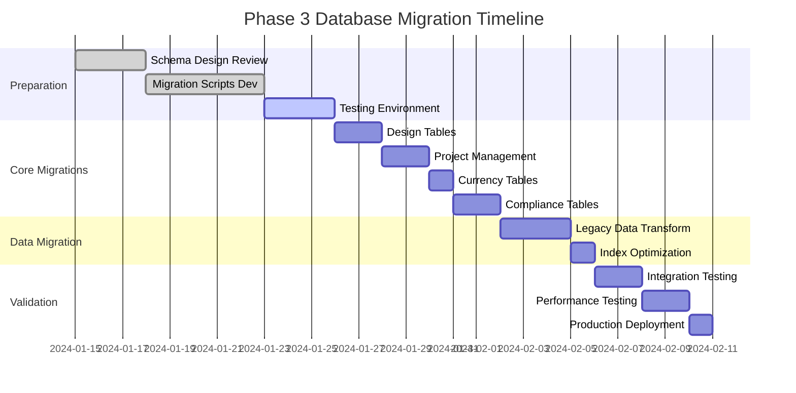

# NextGen Fusion Commercial Solar Platform - Phase 3 Database Migration Plans

## 1. Migration Overview

### 1.1 Migration Strategy

**Approach**: Blue-Green deployment with zero-downtime migrations

**Tools**:
- **Python Services**: Alembic for schema migrations
- **TypeScript Services**: Prisma for schema management
- **Database**: PostgreSQL 15 with logical replication

**Migration Phases**:
1. **Pre-migration**: Schema validation and backup
2. **Schema Migration**: DDL changes with backward compatibility
3. **Data Migration**: Bulk data transformations
4. **Post-migration**: Index optimization and cleanup
5. **Validation**: Data integrity checks and rollback preparation

### 1.2 Migration Timeline



## 2. Schema Changes

### 2.1 New Tables

#### Design and 3D Modeling Tables

```sql
-- Migration: 001_create_design_3d_models.sql
CREATE TABLE design_3d_models (
    id UUID PRIMARY KEY DEFAULT gen_random_uuid(),
    project_id UUID NOT NULL REFERENCES projects(id) ON DELETE CASCADE,
    building_geometry JSONB NOT NULL,
    panel_layout JSONB NOT NULL DEFAULT '[]'::jsonb,
    simulation_parameters JSONB DEFAULT '{}'::jsonb,
    total_capacity DECIMAL(10,2),
    estimated_output DECIMAL(12,2),
    validation_status VARCHAR(50) DEFAULT 'pending' CHECK (validation_status IN ('pending', 'valid', 'invalid', 'warning')),
    created_at TIMESTAMP WITH TIME ZONE DEFAULT NOW(),
    updated_at TIMESTAMP WITH TIME ZONE DEFAULT NOW()
);

-- Add trigger for updated_at
CREATE OR REPLACE FUNCTION update_updated_at_column()
RETURNS TRIGGER AS $$
BEGIN
    NEW.updated_at = NOW();
    RETURN NEW;
END;
$$ language 'plpgsql';

CREATE TRIGGER update_design_3d_models_updated_at
    BEFORE UPDATE ON design_3d_models
    FOR EACH ROW
    EXECUTE FUNCTION update_updated_at_column();

-- Migration: 002_create_solar_panels.sql
CREATE TABLE solar_panels (
    id UUID PRIMARY KEY DEFAULT gen_random_uuid(),
    design_id UUID NOT NULL REFERENCES design_3d_models(id) ON DELETE CASCADE,
    panel_type VARCHAR(100) NOT NULL,
    power_rating DECIMAL(8,2) NOT NULL CHECK (power_rating > 0),
    position_coordinates JSONB NOT NULL,
    rotation_angles JSONB NOT NULL,
    mounting_type VARCHAR(50) DEFAULT 'roof_mounted',
    efficiency DECIMAL(5,2) CHECK (efficiency > 0 AND efficiency <= 100),
    created_at TIMESTAMP WITH TIME ZONE DEFAULT NOW()
);

-- Migration: 003_create_panel_specifications.sql
CREATE TABLE panel_specifications (
    id UUID PRIMARY KEY DEFAULT gen_random_uuid(),
    manufacturer VARCHAR(100) NOT NULL,
    model_number VARCHAR(100) NOT NULL,
    power_rating DECIMAL(8,2) NOT NULL,
    efficiency DECIMAL(5,2) NOT NULL,
    dimensions JSONB NOT NULL, -- {length, width, thickness} in mm
    technology_type VARCHAR(50) NOT NULL,
    temperature_coefficient DECIMAL(6,4),
    warranty_years INTEGER DEFAULT 25,
    certification_standards JSONB DEFAULT '[]'::jsonb,
    created_at TIMESTAMP WITH TIME ZONE DEFAULT NOW(),
    updated_at TIMESTAMP WITH TIME ZONE DEFAULT NOW(),
    UNIQUE(manufacturer, model_number)
);

-- Migration: 004_create_irradiance_calculations.sql
CREATE TABLE irradiance_calculations (
    id UUID PRIMARY KEY DEFAULT gen_random_uuid(),
    design_id UUID NOT NULL REFERENCES design_3d_models(id) ON DELETE CASCADE,
    annual_irradiance DECIMAL(8,2),
    monthly_data JSONB, -- Array of 12 monthly values
    shading_analysis JSONB,
    performance_ratio DECIMAL(5,2) CHECK (performance_ratio >= 0 AND performance_ratio <= 1),
    calculation_method VARCHAR(50) DEFAULT 'pvlib',
    weather_data_source VARCHAR(100),
    calculated_at TIMESTAMP WITH TIME ZONE DEFAULT NOW()
);
```

#### Project Management Tables

```sql
-- Migration: 005_create_project_tasks.sql
CREATE TABLE project_tasks (
    id UUID PRIMARY KEY DEFAULT gen_random_uuid(),
    project_id UUID NOT NULL REFERENCES projects(id) ON DELETE CASCADE,
    name VARCHAR(200) NOT NULL,
    description TEXT,
    start_date DATE NOT NULL,
    end_date DATE NOT NULL,
    status VARCHAR(50) DEFAULT 'pending' CHECK (status IN ('pending', 'in_progress', 'completed', 'cancelled', 'on_hold')),
    priority VARCHAR(20) DEFAULT 'medium' CHECK (priority IN ('low', 'medium', 'high', 'critical')),
    assigned_to UUID REFERENCES users(id),
    estimated_hours DECIMAL(8,2) CHECK (estimated_hours >= 0),
    actual_hours DECIMAL(8,2) CHECK (actual_hours >= 0),
    completion_percentage DECIMAL(5,2) DEFAULT 0 CHECK (completion_percentage >= 0 AND completion_percentage <= 100),
    created_at TIMESTAMP WITH TIME ZONE DEFAULT NOW(),
    updated_at TIMESTAMP WITH TIME ZONE DEFAULT NOW(),
    CONSTRAINT valid_date_range CHECK (end_date >= start_date)
);

CREATE TRIGGER update_project_tasks_updated_at
    BEFORE UPDATE ON project_tasks
    FOR EACH ROW
    EXECUTE FUNCTION update_updated_at_column();

-- Migration: 006_create_task_dependencies.sql
CREATE TABLE task_dependencies (
    id UUID PRIMARY KEY DEFAULT gen_random_uuid(),
    task_id UUID NOT NULL REFERENCES project_tasks(id) ON DELETE CASCADE,
    depends_on_task_id UUID NOT NULL REFERENCES project_tasks(id) ON DELETE CASCADE,
    dependency_type VARCHAR(50) DEFAULT 'finish_to_start' CHECK (dependency_type IN ('finish_to_start', 'start_to_start', 'finish_to_finish', 'start_to_finish')),
    lag_days INTEGER DEFAULT 0,
    created_at TIMESTAMP WITH TIME ZONE DEFAULT NOW(),
    UNIQUE(task_id, depends_on_task_id),
    CONSTRAINT no_self_dependency CHECK (task_id != depends_on_task_id)
);

-- Migration: 007_create_project_milestones.sql
CREATE TABLE project_milestones (
    id UUID PRIMARY KEY DEFAULT gen_random_uuid(),
    project_id UUID NOT NULL REFERENCES projects(id) ON DELETE CASCADE,
    name VARCHAR(200) NOT NULL,
    description TEXT,
    target_date DATE NOT NULL,
    completion_date DATE,
    status VARCHAR(50) DEFAULT 'pending' CHECK (status IN ('pending', 'in_progress', 'completed', 'overdue', 'cancelled')),
    progress_percentage DECIMAL(5,2) DEFAULT 0 CHECK (progress_percentage >= 0 AND progress_percentage <= 100),
    milestone_type VARCHAR(50) DEFAULT 'project' CHECK (milestone_type IN ('project', 'design', 'compliance', 'installation', 'commissioning')),
    created_at TIMESTAMP WITH TIME ZONE DEFAULT NOW(),
    updated_at TIMESTAMP WITH TIME ZONE DEFAULT NOW()
);

CREATE TRIGGER update_project_milestones_updated_at
    BEFORE UPDATE ON project_milestones
    FOR EACH ROW
    EXECUTE FUNCTION update_updated_at_column();
```

#### Multi-Currency Tables

```sql
-- Migration: 008_create_exchange_rates.sql
CREATE TABLE exchange_rates (
    id UUID PRIMARY KEY DEFAULT gen_random_uuid(),
    base_currency VARCHAR(3) NOT NULL,
    target_currency VARCHAR(3) NOT NULL,
    rate DECIMAL(12,6) NOT NULL CHECK (rate > 0),
    rate_date DATE NOT NULL,
    source VARCHAR(50) NOT NULL,
    is_active BOOLEAN DEFAULT true,
    created_at TIMESTAMP WITH TIME ZONE DEFAULT NOW(),
    UNIQUE(base_currency, target_currency, rate_date, source)
);

-- Migration: 009_create_multi_currency_transactions.sql
CREATE TABLE multi_currency_transactions (
    id UUID PRIMARY KEY DEFAULT gen_random_uuid(),
    project_id UUID NOT NULL REFERENCES projects(id) ON DELETE CASCADE,
    original_amount DECIMAL(12,2) NOT NULL,
    original_currency VARCHAR(3) NOT NULL,
    converted_amount DECIMAL(12,2) NOT NULL,
    converted_currency VARCHAR(3) NOT NULL,
    exchange_rate DECIMAL(12,6) NOT NULL CHECK (exchange_rate > 0),
    conversion_fee DECIMAL(12,2) DEFAULT 0 CHECK (conversion_fee >= 0),
    transaction_type VARCHAR(50) NOT NULL CHECK (transaction_type IN ('invoice', 'payment', 'quote', 'budget', 'expense')),
    reference_id UUID, -- Reference to invoice, payment, etc.
    transaction_date TIMESTAMP WITH TIME ZONE DEFAULT NOW(),
    created_by UUID REFERENCES users(id)
);

-- Migration: 010_create_currency_preferences.sql
CREATE TABLE currency_preferences (
    id UUID PRIMARY KEY DEFAULT gen_random_uuid(),
    user_id UUID NOT NULL REFERENCES users(id) ON DELETE CASCADE,
    preferred_currency VARCHAR(3) NOT NULL DEFAULT 'USD',
    display_currencies VARCHAR(3)[] DEFAULT ARRAY['USD', 'ZAR', 'AUD'],
    auto_convert BOOLEAN DEFAULT true,
    created_at TIMESTAMP WITH TIME ZONE DEFAULT NOW(),
    updated_at TIMESTAMP WITH TIME ZONE DEFAULT NOW(),
    UNIQUE(user_id)
);

CREATE TRIGGER update_currency_preferences_updated_at
    BEFORE UPDATE ON currency_preferences
    FOR EACH ROW
    EXECUTE FUNCTION update_updated_at_column();
```

#### Compliance Tables

```sql
-- Migration: 011_create_compliance_rules.sql
CREATE TABLE compliance_rules (
    id UUID PRIMARY KEY DEFAULT gen_random_uuid(),
    region VARCHAR(10) NOT NULL,
    rule_category VARCHAR(100) NOT NULL,
    rule_name VARCHAR(200) NOT NULL,
    rule_code VARCHAR(50), -- e.g., "NRS_097_2_3", "NEC_690"
    rule_definition JSONB NOT NULL,
    validation_logic JSONB, -- Validation rules and conditions
    version VARCHAR(20) NOT NULL,
    effective_date DATE NOT NULL,
    expiry_date DATE,
    is_active BOOLEAN DEFAULT true,
    severity VARCHAR(20) DEFAULT 'error' CHECK (severity IN ('info', 'warning', 'error', 'critical')),
    created_at TIMESTAMP WITH TIME ZONE DEFAULT NOW(),
    updated_at TIMESTAMP WITH TIME ZONE DEFAULT NOW(),
    UNIQUE(region, rule_code, version)
);

CREATE TRIGGER update_compliance_rules_updated_at
    BEFORE UPDATE ON compliance_rules
    FOR EACH ROW
    EXECUTE FUNCTION update_updated_at_column();

-- Migration: 012_create_compliance_validations.sql
CREATE TABLE compliance_validations (
    id UUID PRIMARY KEY DEFAULT gen_random_uuid(),
    project_id UUID NOT NULL REFERENCES projects(id) ON DELETE CASCADE,
    design_id UUID REFERENCES design_3d_models(id) ON DELETE SET NULL,
    region VARCHAR(10) NOT NULL,
    validation_type VARCHAR(50) NOT NULL CHECK (validation_type IN ('full', 'quick', 'specific', 'automated')),
    overall_status VARCHAR(20) NOT NULL CHECK (overall_status IN ('pass', 'fail', 'warning', 'pending')),
    rule_results JSONB NOT NULL DEFAULT '[]'::jsonb,
    recommendations JSONB DEFAULT '[]'::jsonb,
    validation_score DECIMAL(5,2) CHECK (validation_score >= 0 AND validation_score <= 100),
    validated_by UUID REFERENCES users(id),
    validated_at TIMESTAMP WITH TIME ZONE DEFAULT NOW(),
    expires_at TIMESTAMP WITH TIME ZONE
);

-- Migration: 013_create_compliance_reports.sql
CREATE TABLE compliance_reports (
    id UUID PRIMARY KEY DEFAULT gen_random_uuid(),
    validation_id UUID NOT NULL REFERENCES compliance_validations(id) ON DELETE CASCADE,
    report_type VARCHAR(50) NOT NULL CHECK (report_type IN ('summary', 'detailed', 'audit', 'certification')),
    report_format VARCHAR(20) NOT NULL CHECK (report_format IN ('pdf', 'html', 'json', 'xml')),
    file_path VARCHAR(500),
    file_size BIGINT,
    generated_by UUID REFERENCES users(id),
    generated_at TIMESTAMP WITH TIME ZONE DEFAULT NOW(),
    downloaded_at TIMESTAMP WITH TIME ZONE,
    expires_at TIMESTAMP WITH TIME ZONE
);
```

### 2.2 Table Modifications

#### Enhanced Projects Table

```sql
-- Migration: 014_enhance_projects_table.sql
ALTER TABLE projects 
ADD COLUMN IF NOT EXISTS budget_currency VARCHAR(3) DEFAULT 'USD',
ADD COLUMN IF NOT EXISTS project_type VARCHAR(50) DEFAULT 'commercial' CHECK (project_type IN ('residential', 'commercial', 'utility', 'industrial')),
ADD COLUMN IF NOT EXISTS complexity_level VARCHAR(20) DEFAULT 'medium' CHECK (complexity_level IN ('simple', 'medium', 'complex', 'enterprise')),
ADD COLUMN IF NOT EXISTS compliance_regions VARCHAR(10)[] DEFAULT ARRAY['US'],
ADD COLUMN IF NOT EXISTS design_requirements JSONB DEFAULT '{}'::jsonb,
ADD COLUMN IF NOT EXISTS project_metadata JSONB DEFAULT '{}'::jsonb;

-- Add constraints
ALTER TABLE projects 
ADD CONSTRAINT valid_budget_currency CHECK (budget_currency IN ('USD', 'ZAR', 'AUD', 'EUR', 'GBP'));
```

#### Enhanced Users Table

```sql
-- Migration: 015_enhance_users_table.sql
ALTER TABLE users 
ADD COLUMN IF NOT EXISTS timezone VARCHAR(50) DEFAULT 'UTC',
ADD COLUMN IF NOT EXISTS locale VARCHAR(10) DEFAULT 'en_US',
ADD COLUMN IF NOT EXISTS notification_preferences JSONB DEFAULT '{"email": true, "sms": false, "push": true}'::jsonb,
ADD COLUMN IF NOT EXISTS professional_certifications JSONB DEFAULT '[]'::jsonb,
ADD COLUMN IF NOT EXISTS compliance_permissions JSONB DEFAULT '{}'::jsonb;
```

### 2.3 Indexes and Performance Optimization

```sql
-- Migration: 016_create_performance_indexes.sql

-- Design and 3D modeling indexes
CREATE INDEX CONCURRENTLY idx_design_3d_models_project_id ON design_3d_models(project_id);
CREATE INDEX CONCURRENTLY idx_design_3d_models_status ON design_3d_models(validation_status);
CREATE INDEX CONCURRENTLY idx_design_3d_models_created_at ON design_3d_models(created_at DESC);

CREATE INDEX CONCURRENTLY idx_solar_panels_design_id ON solar_panels(design_id);
CREATE INDEX CONCURRENTLY idx_solar_panels_type ON solar_panels(panel_type);

CREATE INDEX CONCURRENTLY idx_irradiance_calculations_design_id ON irradiance_calculations(design_id);
CREATE INDEX CONCURRENTLY idx_irradiance_calculations_calculated_at ON irradiance_calculations(calculated_at DESC);

-- Project management indexes
CREATE INDEX CONCURRENTLY idx_project_tasks_project_id ON project_tasks(project_id);
CREATE INDEX CONCURRENTLY idx_project_tasks_assigned_to ON project_tasks(assigned_to);
CREATE INDEX CONCURRENTLY idx_project_tasks_status ON project_tasks(status);
CREATE INDEX CONCURRENTLY idx_project_tasks_dates ON project_tasks(start_date, end_date);

CREATE INDEX CONCURRENTLY idx_task_dependencies_task_id ON task_dependencies(task_id);
CREATE INDEX CONCURRENTLY idx_task_dependencies_depends_on ON task_dependencies(depends_on_task_id);

CREATE INDEX CONCURRENTLY idx_project_milestones_project_id ON project_milestones(project_id);
CREATE INDEX CONCURRENTLY idx_project_milestones_target_date ON project_milestones(target_date);
CREATE INDEX CONCURRENTLY idx_project_milestones_status ON project_milestones(status);

-- Currency indexes
CREATE INDEX CONCURRENTLY idx_exchange_rates_currencies ON exchange_rates(base_currency, target_currency);
CREATE INDEX CONCURRENTLY idx_exchange_rates_date ON exchange_rates(rate_date DESC);
CREATE INDEX CONCURRENTLY idx_exchange_rates_active ON exchange_rates(is_active) WHERE is_active = true;

CREATE INDEX CONCURRENTLY idx_multi_currency_transactions_project_id ON multi_currency_transactions(project_id);
CREATE INDEX CONCURRENTLY idx_multi_currency_transactions_date ON multi_currency_transactions(transaction_date DESC);
CREATE INDEX CONCURRENTLY idx_multi_currency_transactions_type ON multi_currency_transactions(transaction_type);

-- Compliance indexes
CREATE INDEX CONCURRENTLY idx_compliance_rules_region ON compliance_rules(region);
CREATE INDEX CONCURRENTLY idx_compliance_rules_active ON compliance_rules(is_active) WHERE is_active = true;
CREATE INDEX CONCURRENTLY idx_compliance_rules_category ON compliance_rules(rule_category);

CREATE INDEX CONCURRENTLY idx_compliance_validations_project_id ON compliance_validations(project_id);
CREATE INDEX CONCURRENTLY idx_compliance_validations_region ON compliance_validations(region);
CREATE INDEX CONCURRENTLY idx_compliance_validations_status ON compliance_validations(overall_status);
CREATE INDEX CONCURRENTLY idx_compliance_validations_validated_at ON compliance_validations(validated_at DESC);

-- JSONB indexes for better query performance
CREATE INDEX CONCURRENTLY idx_design_3d_models_building_geometry_gin ON design_3d_models USING GIN (building_geometry);
CREATE INDEX CONCURRENTLY idx_compliance_rules_definition_gin ON compliance_rules USING GIN (rule_definition);
CREATE INDEX CONCURRENTLY idx_compliance_validations_results_gin ON compliance_validations USING GIN (rule_results);
```

## 3. Data Migration Scripts

### 3.1 Legacy Data Transformation

```sql
-- Migration: 017_migrate_legacy_project_data.sql

-- Migrate existing project data to new structure
UPDATE projects 
SET 
    project_type = CASE 
        WHEN budget_amount < 50000 THEN 'residential'
        WHEN budget_amount < 500000 THEN 'commercial'
        ELSE 'utility'
    END,
    complexity_level = CASE 
        WHEN budget_amount < 100000 THEN 'simple'
        WHEN budget_amount < 1000000 THEN 'medium'
        ELSE 'complex'
    END,
    compliance_regions = ARRAY['US'] -- Default to US, update manually as needed
WHERE project_type IS NULL;

-- Create default currency preferences for existing users
INSERT INTO currency_preferences (user_id, preferred_currency, display_currencies)
SELECT 
    id,
    'USD',
    ARRAY['USD', 'ZAR', 'AUD']
FROM users 
WHERE id NOT IN (SELECT user_id FROM currency_preferences);

-- Migrate existing financial data to multi-currency format
INSERT INTO multi_currency_transactions (
    project_id,
    original_amount,
    original_currency,
    converted_amount,
    converted_currency,
    exchange_rate,
    transaction_type,
    transaction_date
)
SELECT 
    id,
    budget_amount,
    COALESCE(budget_currency, 'USD'),
    budget_amount,
    COALESCE(budget_currency, 'USD'),
    1.0,
    'budget',
    created_at
FROM projects 
WHERE budget_amount IS NOT NULL
AND id NOT IN (
    SELECT project_id 
    FROM multi_currency_transactions 
    WHERE transaction_type = 'budget'
);
```

### 3.2 Reference Data Population

```sql
-- Migration: 018_populate_reference_data.sql

-- Insert solar panel specifications
INSERT INTO panel_specifications (manufacturer, model_number, power_rating, efficiency, dimensions, technology_type, temperature_coefficient, certification_standards) VALUES
-- SunPower panels
('SunPower', 'SPR-X22-370', 370.00, 22.80, '{"length": 1690, "width": 1046, "thickness": 40}', 'monocrystalline', -0.0029, '["IEC 61215", "IEC 61730", "UL 1703"]'),
('SunPower', 'SPR-X21-345', 345.00, 21.50, '{"length": 1690, "width": 1046, "thickness": 40}', 'monocrystalline', -0.0031, '["IEC 61215", "IEC 61730", "UL 1703"]'),

-- Canadian Solar panels
('Canadian Solar', 'CS3W-400P', 400.00, 20.50, '{"length": 2108, "width": 1048, "thickness": 40}', 'polycrystalline', -0.0039, '["IEC 61215", "IEC 61730", "UL 1703"]'),
('Canadian Solar', 'CS3U-350P', 350.00, 18.90, '{"length": 1960, "width": 992, "thickness": 40}', 'polycrystalline', -0.0041, '["IEC 61215", "IEC 61730", "UL 1703"]'),

-- Tesla Solar panels
('Tesla', 'Solar Roof Tile', 71.67, 19.30, '{"length": 1877, "width": 373, "thickness": 45}', 'monocrystalline', -0.0035, '["IEC 61215", "IEC 61730", "UL 1703"]'),

-- LG panels
('LG', 'LG365Q1C-A5', 365.00, 21.80, '{"length": 1700, "width": 1016, "thickness": 40}', 'monocrystalline', -0.0030, '["IEC 61215", "IEC 61730", "UL 1703"]'),

-- Jinko Solar panels
('Jinko Solar', 'JKM400M-72H', 400.00, 20.78, '{"length": 2008, "width": 1002, "thickness": 35}', 'monocrystalline', -0.0037, '["IEC 61215", "IEC 61730", "UL 1703"]');

-- Insert current exchange rates
INSERT INTO exchange_rates (base_currency, target_currency, rate, rate_date, source) VALUES
-- USD base rates
('USD', 'ZAR', 18.45, CURRENT_DATE, 'openexchangerates'),
('USD', 'AUD', 1.52, CURRENT_DATE, 'openexchangerates'),
('USD', 'EUR', 0.85, CURRENT_DATE, 'openexchangerates'),
('USD', 'GBP', 0.73, CURRENT_DATE, 'openexchangerates'),

-- ZAR base rates
('ZAR', 'USD', 0.0542, CURRENT_DATE, 'openexchangerates'),
('ZAR', 'AUD', 0.0824, CURRENT_DATE, 'openexchangerates'),
('ZAR', 'EUR', 0.0461, CURRENT_DATE, 'openexchangerates'),

-- AUD base rates
('AUD', 'USD', 0.6579, CURRENT_DATE, 'openexchangerates'),
('AUD', 'ZAR', 12.14, CURRENT_DATE, 'openexchangerates'),
('AUD', 'EUR', 0.5592, CURRENT_DATE, 'openexchangerates');
```

### 3.3 Compliance Rules Population

```sql
-- Migration: 019_populate_compliance_rules.sql

-- South Africa compliance rules
INSERT INTO compliance_rules (region, rule_category, rule_name, rule_code, rule_definition, validation_logic, version, effective_date, severity) VALUES
('ZA', 'grid_connection', 'NRS 097-2-3 Grid Connection Standards', 'NRS_097_2_3', 
'{
  "description": "Grid connection requirements for embedded generation",
  "max_capacity_without_license_kw": 1000,
  "voltage_levels": ["LV", "MV", "HV"],
  "protection_requirements": {
    "anti_islanding": true,
    "voltage_protection": {"min": 0.88, "max": 1.1},
    "frequency_protection": {"min": 49.5, "max": 50.5}
  },
  "documentation_required": [
    "single_line_diagram",
    "protection_settings",
    "commissioning_report",
    "as_built_drawings"
  ]
}',
'{
  "capacity_check": "total_capacity <= 1000",
  "protection_validation": "required_protections_present",
  "documentation_check": "all_documents_submitted"
}',
'2023.1', '2023-01-01', 'error'),

('ZA', 'licensing', 'NERSA Licensing Requirements', 'NERSA_LICENSE', 
'{
  "description": "NERSA licensing thresholds and requirements",
  "small_scale_embedded_generation": {
    "max_capacity_kw": 1000,
    "registration_required": false,
    "exemption_conditions": ["own_use_only", "no_wheeling"]
  },
  "medium_scale_embedded_generation": {
    "min_capacity_kw": 1001,
    "max_capacity_kw": 10000,
    "license_required": true,
    "application_fee": 50000
  }
}',
'{
  "license_threshold_check": "capacity > 1000 ? license_required : registration_exempt",
  "exemption_validation": "own_use_only AND no_wheeling"
}',
'2023.1', '2023-01-01', 'critical'),

-- Australia compliance rules
('AU', 'installation', 'Clean Energy Council Installation Standards', 'CEC_INSTALL', 
'{
  "description": "CEC installation and design standards",
  "installer_requirements": {
    "accreditation_required": true,
    "minimum_experience_years": 2
  },
  "design_requirements": {
    "structural_assessment": true,
    "electrical_design": true,
    "fire_safety_clearances": {
      "roof_edge_mm": 1000,
      "penetrations_mm": 300,
      "walkways_mm": 1000
    }
  },
  "documentation": [
    "electrical_schematic",
    "structural_assessment",
    "commissioning_checklist",
    "installer_declaration"
  ]
}',
'{
  "installer_check": "installer_accredited AND experience >= 2",
  "clearance_validation": "roof_edge >= 1000 AND penetrations >= 300",
  "documentation_complete": "all_required_docs_present"
}',
'2023.1', '2023-01-01', 'error'),

-- United States compliance rules
('US', 'electrical', 'NEC Article 690 Solar Photovoltaic Systems', 'NEC_690', 
'{
  "description": "National Electrical Code requirements for PV systems",
  "rapid_shutdown": {
    "required": true,
    "voltage_limit_v": 30,
    "time_limit_seconds": 30,
    "applicable_areas": ["array_boundary", "equipment"]
  },
  "grounding": {
    "equipment_grounding": true,
    "system_grounding": true,
    "grounding_electrode": true
  },
  "overcurrent_protection": {
    "dc_combiner_required": true,
    "ac_disconnect_required": true
  },
  "labeling_requirements": [
    "rapid_shutdown_device",
    "dc_disconnect",
    "ac_disconnect",
    "point_of_interconnection"
  ]
}',
'{
  "rapid_shutdown_check": "rapid_shutdown_device_present AND voltage_limit <= 30",
  "grounding_validation": "equipment_grounded AND system_grounded",
  "labeling_complete": "all_required_labels_present"
}',
'2023.1', '2023-01-01', 'critical');
```

## 4. Alembic Migration Configuration

### 4.1 Alembic Environment Setup

```python
# alembic/env.py
from logging.config import fileConfig
from sqlalchemy import engine_from_config, pool
from alembic import context
import os
import sys

# Add the project root to the Python path
sys.path.insert(0, os.path.dirname(os.path.dirname(__file__)))

from app.database.models import Base
from app.core.config import settings

# Alembic Config object
config = context.config

# Set the database URL from environment
config.set_main_option('sqlalchemy.url', settings.DATABASE_URL)

# Interpret the config file for Python logging
if config.config_file_name is not None:
    fileConfig(config.config_file_name)

# Target metadata for autogenerate support
target_metadata = Base.metadata

def run_migrations_offline() -> None:
    """Run migrations in 'offline' mode."""
    url = config.get_main_option("sqlalchemy.url")
    context.configure(
        url=url,
        target_metadata=target_metadata,
        literal_binds=True,
        dialect_opts={"paramstyle": "named"},
        compare_type=True,
        compare_server_default=True,
    )

    with context.begin_transaction():
        context.run_migrations()

def run_migrations_online() -> None:
    """Run migrations in 'online' mode."""
    connectable = engine_from_config(
        config.get_section(config.config_ini_section),
        prefix="sqlalchemy.",
        poolclass=pool.NullPool,
    )

    with connectable.connect() as connection:
        context.configure(
            connection=connection,
            target_metadata=target_metadata,
            compare_type=True,
            compare_server_default=True,
        )

        with context.begin_transaction():
            context.run_migrations()

if context.is_offline_mode():
    run_migrations_offline()
else:
    run_migrations_online()
```

### 4.2 Migration Script Template

```python
# alembic/versions/001_create_design_3d_models.py
"""Create design 3D models table

Revision ID: 001
Revises: 
Create Date: 2024-01-15 10:00:00.000000

"""
from alembic import op
import sqlalchemy as sa
from sqlalchemy.dialects import postgresql

# revision identifiers
revision = '001'
down_revision = None
branch_labels = None
depends_on = None

def upgrade() -> None:
    # Create design_3d_models table
    op.create_table(
        'design_3d_models',
        sa.Column('id', postgresql.UUID(as_uuid=True), primary_key=True, server_default=sa.text('gen_random_uuid()')),
        sa.Column('project_id', postgresql.UUID(as_uuid=True), nullable=False),
        sa.Column('building_geometry', postgresql.JSONB(astext_type=sa.Text()), nullable=False),
        sa.Column('panel_layout', postgresql.JSONB(astext_type=sa.Text()), nullable=False, server_default=sa.text("'[]'::jsonb")),
        sa.Column('simulation_parameters', postgresql.JSONB(astext_type=sa.Text()), server_default=sa.text("'{}'::jsonb")),
        sa.Column('total_capacity', sa.DECIMAL(precision=10, scale=2)),
        sa.Column('estimated_output', sa.DECIMAL(precision=12, scale=2)),
        sa.Column('validation_status', sa.VARCHAR(length=50), server_default='pending'),
        sa.Column('created_at', sa.TIMESTAMP(timezone=True), server_default=sa.text('NOW()')),
        sa.Column('updated_at', sa.TIMESTAMP(timezone=True), server_default=sa.text('NOW()')),
        sa.ForeignKeyConstraint(['project_id'], ['projects.id'], ondelete='CASCADE'),
        sa.CheckConstraint("validation_status IN ('pending', 'valid', 'invalid', 'warning')", name='check_validation_status')
    )
    
    # Create indexes
    op.create_index('idx_design_3d_models_project_id', 'design_3d_models', ['project_id'])
    op.create_index('idx_design_3d_models_status', 'design_3d_models', ['validation_status'])
    op.create_index('idx_design_3d_models_created_at', 'design_3d_models', ['created_at'], postgresql_ops={'created_at': 'DESC'})
    
    # Create GIN index for JSONB columns
    op.create_index('idx_design_3d_models_building_geometry_gin', 'design_3d_models', ['building_geometry'], postgresql_using='gin')
    
    # Create trigger for updated_at
    op.execute("""
        CREATE OR REPLACE FUNCTION update_updated_at_column()
        RETURNS TRIGGER AS $$
        BEGIN
            NEW.updated_at = NOW();
            RETURN NEW;
        END;
        $$ language 'plpgsql';
    """)
    
    op.execute("""
        CREATE TRIGGER update_design_3d_models_updated_at
            BEFORE UPDATE ON design_3d_models
            FOR EACH ROW
            EXECUTE FUNCTION update_updated_at_column();
    """)

def downgrade() -> None:
    # Drop trigger and function
    op.execute("DROP TRIGGER IF EXISTS update_design_3d_models_updated_at ON design_3d_models;")
    op.execute("DROP FUNCTION IF EXISTS update_updated_at_column();")
    
    # Drop indexes
    op.drop_index('idx_design_3d_models_building_geometry_gin')
    op.drop_index('idx_design_3d_models_created_at')
    op.drop_index('idx_design_3d_models_status')
    op.drop_index('idx_design_3d_models_project_id')
    
    # Drop table
    op.drop_table('design_3d_models')
```

## 5. Prisma Schema Updates

### 5.1 Enhanced Prisma Schema

```prisma
// prisma/schema.prisma
generator client {
  provider = "prisma-client-js"
  previewFeatures = ["jsonProtocol"]
}

datasource db {
  provider = "postgresql"
  url      = env("DATABASE_URL")
}

// Enhanced Projects model
model Project {
  id                    String   @id @default(dbgenerated("gen_random_uuid()")) @db.Uuid
  name                  String   @db.VarChar(200)
  description           String?
  status                String   @default("planning") @db.VarChar(50)
  budgetAmount          Decimal? @map("budget_amount") @db.Decimal(12, 2)
  budgetCurrency        String   @default("USD") @map("budget_currency") @db.VarChar(3)
  projectType           String   @default("commercial") @map("project_type") @db.VarChar(50)
  complexityLevel       String   @default("medium") @map("complexity_level") @db.VarChar(20)
  complianceRegions     String[] @map("compliance_regions") @db.VarChar(10)
  designRequirements    Json     @default("{}") @map("design_requirements")
  projectMetadata       Json     @default("{}") @map("project_metadata")
  startDate             DateTime? @map("start_date") @db.Date
  endDate               DateTime? @map("end_date") @db.Date
  ownerId               String   @map("owner_id") @db.Uuid
  createdAt             DateTime @default(now()) @map("created_at")
  updatedAt             DateTime @updatedAt @map("updated_at")
  
  // Relations
  owner                 User     @relation(fields: [ownerId], references: [id])
  design3DModels        Design3DModel[]
  tasks                 ProjectTask[]
  milestones            ProjectMilestone[]
  currencyTransactions  MultiCurrencyTransaction[]
  complianceValidations ComplianceValidation[]
  
  @@map("projects")
}

// 3D Design Models
model Design3DModel {
  id                   String   @id @default(dbgenerated("gen_random_uuid()")) @db.Uuid
  projectId            String   @map("project_id") @db.Uuid
  buildingGeometry     Json     @map("building_geometry")
  panelLayout          Json     @default("[]") @map("panel_layout")
  simulationParameters Json     @default("{}") @map("simulation_parameters")
  totalCapacity        Decimal? @map("total_capacity") @db.Decimal(10, 2)
  estimatedOutput      Decimal? @map("estimated_output") @db.Decimal(12, 2)
  validationStatus     String   @default("pending") @map("validation_status") @db.VarChar(50)
  createdAt            DateTime @default(now()) @map("created_at")
  updatedAt            DateTime @updatedAt @map("updated_at")
  
  // Relations
  project              Project  @relation(fields: [projectId], references: [id], onDelete: Cascade)
  solarPanels          SolarPanel[]
  irradianceCalculations IrradianceCalculation[]
  complianceValidations ComplianceValidation[]
  
  @@map("design_3d_models")
}

// Solar Panels
model SolarPanel {
  id                  String   @id @default(dbgenerated("gen_random_uuid()")) @db.Uuid
  designId            String   @map("design_id") @db.Uuid
  panelType           String   @map("panel_type") @db.VarChar(100)
  powerRating         Decimal  @map("power_rating") @db.Decimal(8, 2)
  positionCoordinates Json     @map("position_coordinates")
  rotationAngles      Json     @map("rotation_angles")
  mountingType        String?  @default("roof_mounted") @map("mounting_type") @db.VarChar(50)
  efficiency          Decimal? @db.Decimal(5, 2)
  createdAt           DateTime @default(now()) @map("created_at")
  
  // Relations
  design              Design3DModel @relation(fields: [designId], references: [id], onDelete: Cascade)
  
  @@map("solar_panels")
}

// Project Tasks
model ProjectTask {
  id                    String   @id @default(dbgenerated("gen_random_uuid()")) @db.Uuid
  projectId             String   @map("project_id") @db.Uuid
  name                  String   @db.VarChar(200)
  description           String?
  startDate             DateTime @map("start_date") @db.Date
  endDate               DateTime @map("end_date") @db.Date
  status                String   @default("pending") @db.VarChar(50)
  priority              String   @default("medium") @db.VarChar(20)
  assignedTo            String?  @map("assigned_to") @db.Uuid
  estimatedHours        Decimal? @map("estimated_hours") @db.Decimal(8, 2)
  actualHours           Decimal? @map("actual_hours") @db.Decimal(8, 2)
  completionPercentage  Decimal  @default(0) @map("completion_percentage") @db.Decimal(5, 2)
  createdAt             DateTime @default(now()) @map("created_at")
  updatedAt             DateTime @updatedAt @map("updated_at")
  
  // Relations
  project               Project  @relation(fields: [projectId], references: [id], onDelete: Cascade)
  assignee              User?    @relation(fields: [assignedTo], references: [id])
  dependencies          TaskDependency[] @relation("TaskDependencies")
  dependentTasks        TaskDependency[] @relation("DependentTasks")
  
  @@map("project_tasks")
}

// Task Dependencies
model TaskDependency {
  id               String   @id @default(dbgenerated("gen_random_uuid()")) @db.Uuid
  taskId           String   @map("task_id") @db.Uuid
  dependsOnTaskId  String   @map("depends_on_task_id") @db.Uuid
  dependencyType   String   @default("finish_to_start") @map("dependency_type") @db.VarChar(50)
  lagDays          Int      @default(0) @map("lag_days")
  createdAt        DateTime @default(now()) @map("created_at")
  
  // Relations
  task             ProjectTask @relation("TaskDependencies", fields: [taskId], references: [id], onDelete: Cascade)
  dependsOnTask    ProjectTask @relation("DependentTasks", fields: [dependsOnTaskId], references: [id], onDelete: Cascade)
  
  @@unique([taskId, dependsOnTaskId])
  @@map("task_dependencies")
}

// Multi-Currency Transactions
model MultiCurrencyTransaction {
  id                String   @id @default(dbgenerated("gen_random_uuid()")) @db.Uuid
  projectId         String   @map("project_id") @db.Uuid
  originalAmount    Decimal  @map("original_amount") @db.Decimal(12, 2)
  originalCurrency  String   @map("original_currency") @db.VarChar(3)
  convertedAmount   Decimal  @map("converted_amount") @db.Decimal(12, 2)
  convertedCurrency String   @map("converted_currency") @db.VarChar(3)
  exchangeRate      Decimal  @map("exchange_rate") @db.Decimal(12, 6)
  conversionFee     Decimal  @default(0) @map("conversion_fee") @db.Decimal(12, 2)
  transactionType   String   @map("transaction_type") @db.VarChar(50)
  referenceId       String?  @map("reference_id") @db.Uuid
  transactionDate   DateTime @default(now()) @map("transaction_date")
  createdBy         String?  @map("created_by") @db.Uuid
  
  // Relations
  project           Project  @relation(fields: [projectId], references: [id], onDelete: Cascade)
  creator           User?    @relation(fields: [createdBy], references: [id])
  
  @@map("multi_currency_transactions")
}

// Compliance Validations
model ComplianceValidation {
  id              String   @id @default(dbgenerated("gen_random_uuid()")) @db.Uuid
  projectId       String   @map("project_id") @db.Uuid
  designId        String?  @map("design_id") @db.Uuid
  region          String   @db.VarChar(10)
  validationType  String   @map("validation_type") @db.VarChar(50)
  overallStatus   String   @map("overall_status") @db.VarChar(20)
  ruleResults     Json     @default("[]") @map("rule_results")
  recommendations Json     @default("[]") @map("recommendations")
  validationScore Decimal? @map("validation_score") @db.Decimal(5, 2)
  validatedBy     String?  @map("validated_by") @db.Uuid
  validatedAt     DateTime @default(now()) @map("validated_at")
  expiresAt       DateTime? @map("expires_at")
  
  // Relations
  project         Project       @relation(fields: [projectId], references: [id], onDelete: Cascade)
  design          Design3DModel? @relation(fields: [designId], references: [id], onDelete: SetNull)
  validator       User?         @relation(fields: [validatedBy], references: [id])
  reports         ComplianceReport[]
  
  @@map("compliance_validations")
}
```

## 6. Migration Execution Plan

### 6.1 Pre-Migration Checklist

```bash
#!/bin/bash
# scripts/pre_migration_check.sh

echo "=== Phase 3 Pre-Migration Checklist ==="

# 1. Database backup
echo "1. Creating database backup..."
pg_dump $DATABASE_URL > "backup_$(date +%Y%m%d_%H%M%S).sql"
echo "✓ Database backup created"

# 2. Check database connections
echo "2. Checking database connections..."
psql $DATABASE_URL -c "SELECT version();" > /dev/null
if [ $? -eq 0 ]; then
    echo "✓ Database connection successful"
else
    echo "✗ Database connection failed"
    exit 1
fi

# 3. Verify current schema version
echo "3. Checking current schema version..."
alembic current
echo "✓ Current schema version verified"

# 4. Check for pending migrations
echo "4. Checking for pending migrations..."
alembic check
echo "✓ Migration status checked"

# 5. Validate migration scripts
echo "5. Validating migration scripts..."
alembic upgrade --sql head > migration_preview.sql
echo "✓ Migration SQL generated for review"

# 6. Check disk space
echo "6. Checking available disk space..."
df -h | grep -E '(Filesystem|/dev/)'
echo "✓ Disk space checked"

echo "=== Pre-migration checks completed ==="
```

### 6.2 Migration Execution Script

```bash
#!/bin/bash
# scripts/execute_phase3_migration.sh

set -e  # Exit on any error

echo "=== Starting Phase 3 Database Migration ==="

# Set environment variables
export MIGRATION_LOG="migration_$(date +%Y%m%d_%H%M%S).log"

# Function to log with timestamp
log() {
    echo "[$(date '+%Y-%m-%d %H:%M:%S')] $1" | tee -a $MIGRATION_LOG
}

# Function to handle errors
handle_error() {
    log "ERROR: Migration failed at step: $1"
    log "Rolling back changes..."
    alembic downgrade -1
    exit 1
}

# Step 1: Run pre-migration checks
log "Step 1: Running pre-migration checks"
./scripts/pre_migration_check.sh || handle_error "Pre-migration checks"

# Step 2: Start migration transaction
log "Step 2: Starting database migration"

# Step 3: Execute Alembic migrations
log "Step 3: Executing Alembic migrations"
alembic upgrade head || handle_error "Alembic migration"

# Step 4: Run data migration scripts
log "Step 4: Running data migration scripts"
psql $DATABASE_URL -f migrations/017_migrate_legacy_project_data.sql || handle_error "Legacy data migration"
psql $DATABASE_URL -f migrations/018_populate_reference_data.sql || handle_error "Reference data population"
psql $DATABASE_URL -f migrations/019_populate_compliance_rules.sql || handle_error "Compliance rules population"

# Step 5: Create performance indexes
log "Step 5: Creating performance indexes"
psql $DATABASE_URL -f migrations/016_create_performance_indexes.sql || handle_error "Index creation"

# Step 6: Update Prisma schema
log "Step 6: Updating Prisma schema"
npx prisma db pull || handle_error "Prisma schema update"
npx prisma generate || handle_error "Prisma client generation"

# Step 7: Run post-migration validation
log "Step 7: Running post-migration validation"
./scripts/post_migration_validation.sh || handle_error "Post-migration validation"

# Step 8: Update application configuration
log "Step 8: Updating application configuration"
# Restart services to pick up new schema
docker-compose restart api-gateway
docker-compose restart svc-design

log "=== Phase 3 Database Migration Completed Successfully ==="
log "Migration log saved to: $MIGRATION_LOG"
```

### 6.3 Post-Migration Validation

```bash
#!/bin/bash
# scripts/post_migration_validation.sh

echo "=== Post-Migration Validation ==="

# 1. Verify table creation
echo "1. Verifying new tables..."
psql $DATABASE_URL -c "
    SELECT table_name 
    FROM information_schema.tables 
    WHERE table_schema = 'public' 
    AND table_name IN (
        'design_3d_models', 
        'solar_panels', 
        'project_tasks', 
        'task_dependencies',
        'project_milestones',
        'exchange_rates',
        'multi_currency_transactions',
        'compliance_rules',
        'compliance_validations'
    )
    ORDER BY table_name;
"

# 2. Check data integrity
echo "2. Checking data integrity..."
psql $DATABASE_URL -c "
    SELECT 
        'projects' as table_name, 
        COUNT(*) as record_count 
    FROM projects
    UNION ALL
    SELECT 
        'panel_specifications' as table_name, 
        COUNT(*) as record_count 
    FROM panel_specifications
    UNION ALL
    SELECT 
        'compliance_rules' as table_name, 
        COUNT(*) as record_count 
    FROM compliance_rules
    UNION ALL
    SELECT 
        'exchange_rates' as table_name, 
        COUNT(*) as record_count 
    FROM exchange_rates;
"

# 3. Verify indexes
echo "3. Verifying indexes..."
psql $DATABASE_URL -c "
    SELECT 
        schemaname,
        tablename,
        indexname,
        indexdef
    FROM pg_indexes 
    WHERE tablename IN (
        'design_3d_models', 
        'project_tasks', 
        'exchange_rates',
        'compliance_validations'
    )
    ORDER BY tablename, indexname;
"

# 4. Test basic queries
echo "4. Testing basic queries..."
psql $DATABASE_URL -c "
    -- Test join between projects and new tables
    SELECT 
        p.name as project_name,
        COUNT(d.id) as design_count,
        COUNT(t.id) as task_count
    FROM projects p
    LEFT JOIN design_3d_models d ON p.id = d.project_id
    LEFT JOIN project_tasks t ON p.id = t.project_id
    GROUP BY p.id, p.name
    LIMIT 5;
"

# 5. Verify foreign key constraints
echo "5. Verifying foreign key constraints..."
psql $DATABASE_URL -c "
    SELECT 
        tc.table_name, 
        kcu.column_name, 
        ccu.table_name AS foreign_table_name,
        ccu.column_name AS foreign_column_name 
    FROM information_schema.table_constraints AS tc 
    JOIN information_schema.key_column_usage AS kcu
        ON tc.constraint_name = kcu.constraint_name
        AND tc.table_schema = kcu.table_schema
    JOIN information_schema.constraint_column_usage AS ccu
        ON ccu.constraint_name = tc.constraint_name
        AND ccu.table_schema = tc.table_schema
    WHERE tc.constraint_type = 'FOREIGN KEY'
    AND tc.table_name IN (
        'design_3d_models', 
        'solar_panels', 
        'project_tasks',
        'compliance_validations'
    )
    ORDER BY tc.table_name;
"

echo "✓ Post-migration validation completed"
```

## 7. Rollback Strategy

### 7.1 Rollback Plan

```bash
#!/bin/bash
# scripts/rollback_phase3_migration.sh

echo "=== Phase 3 Migration Rollback ==="

# Confirm rollback
read -p "Are you sure you want to rollback Phase 3 migration? (yes/no): " confirm
if [ "$confirm" != "yes" ]; then
    echo "Rollback cancelled"
    exit 0
fi

# Step 1: Stop application services
echo "1. Stopping application services..."
docker-compose stop api-gateway svc-design

# Step 2: Rollback Alembic migrations
echo "2. Rolling back database schema..."
alembic downgrade base

# Step 3: Restore from backup if needed
read -p "Restore from backup? Enter backup file name (or 'skip'): " backup_file
if [ "$backup_file" != "skip" ] && [ -f "$backup_file" ]; then
    echo "3. Restoring from backup: $backup_file"
    psql $DATABASE_URL < "$backup_file"
else
    echo "3. Skipping backup restore"
fi

# Step 4: Revert Prisma schema
echo "4. Reverting Prisma schema..."
git checkout HEAD~1 -- prisma/schema.prisma
npx prisma generate

# Step 5: Restart services
echo "5. Restarting services..."
docker-compose start api-gateway svc-design

echo "✓ Rollback completed"
```

This comprehensive migration plan ensures a smooth transition to Phase 3 with proper backup, validation, and rollback procedures in place.