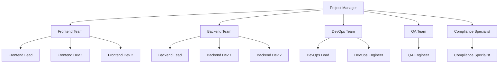
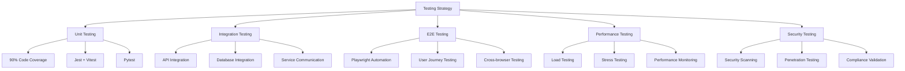
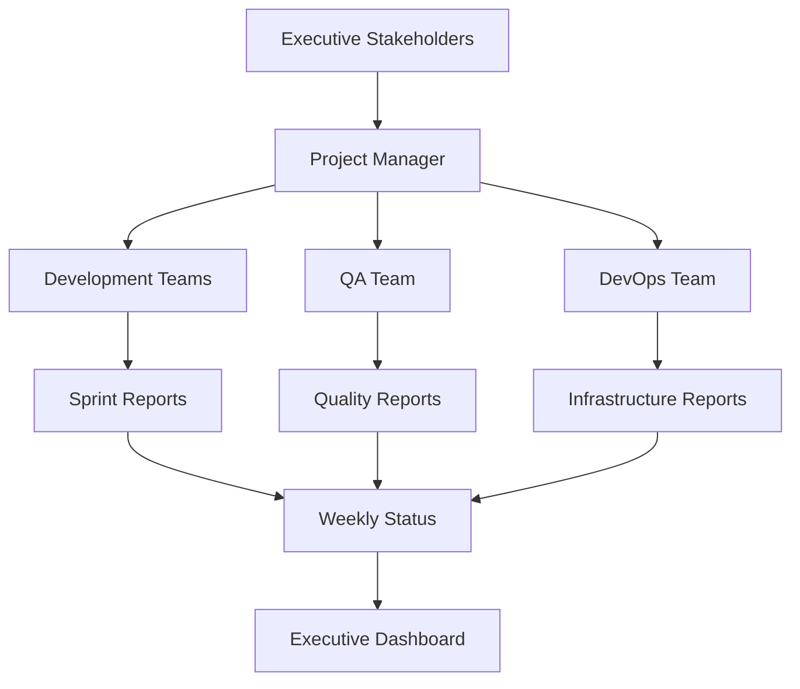

# NextGen Fusion Commercial Solar Platform - Phase 3 Implementation Timeline

## 1. Project Overview

### 1.1 Phase 3 Objectives
- **Duration**: 12 weeks (3 months)
- **Team Size**: 8-10 developers (2 Frontend, 3 Backend, 2 DevOps, 1 QA, 1 PM, 1 Compliance Specialist)
- **Budget**: $480,000 - $600,000
- **Start Date**: January 15, 2024
- **Target Completion**: April 15, 2024

### 1.2 Success Criteria
- ✅ 3D solar design studio with WebGL rendering
- ✅ Advanced project management with Gantt charts
- ✅ Multi-currency support (ZAR, AUD, USD)
- ✅ Compliance automation for ZA, AU, US
- ✅ 90% test coverage for new modules
- ✅ <300ms API response time (P95)
- ✅ 99.9% system availability
- ✅ Production deployment with demo data

## 2. Master Timeline

```mermaid
gantt
    title NextGen Fusion Phase 3 Implementation Timeline
    dateFormat  YYYY-MM-DD
    section Planning & Setup
    Project Kickoff          :milestone, kickoff, 2024-01-15, 0d
    Requirements Review      :req, 2024-01-15, 3d
    Architecture Design      :arch, after req, 5d
    Development Environment  :env, after req, 3d
    
    section Sprint 1 (Weeks 1-2)
    Database Schema Design   :db1, 2024-01-22, 5d
    3D Design API Foundation :api1, 2024-01-22, 7d
    Frontend 3D Components   :fe1, 2024-01-24, 5d
    Sprint 1 Review         :milestone, s1review, 2024-02-02, 0d
    
    section Sprint 2 (Weeks 3-4)
    WebGL Integration       :webgl, 2024-02-05, 7d
    Solar Panel Placement   :panels, 2024-02-07, 5d
    Project Management APIs :pm1, 2024-02-05, 7d
    Sprint 2 Review        :milestone, s2review, 2024-02-16, 0d
    
    section Sprint 3 (Weeks 5-6)
    Gantt Chart Component   :gantt, 2024-02-19, 7d
    Currency Service APIs   :currency, 2024-02-19, 7d
    Irradiance Calculations :irrad, 2024-02-21, 5d
    Sprint 3 Review        :milestone, s3review, 2024-03-01, 0d
    
    section Sprint 4 (Weeks 7-8)
    Compliance Engine       :compliance, 2024-03-04, 10d
    Multi-Currency Frontend :currencyfe, 2024-03-04, 7d
    CAD Import/Export       :cad, 2024-03-06, 5d
    Sprint 4 Review        :milestone, s4review, 2024-03-15, 0d
    
    section Sprint 5 (Weeks 9-10)
    Integration Testing     :integration, 2024-03-18, 7d
    Performance Optimization :perf, 2024-03-20, 5d
    Security Enhancements   :security, 2024-03-18, 7d
    Sprint 5 Review        :milestone, s5review, 2024-03-29, 0d
    
    section Sprint 6 (Weeks 11-12)
    E2E Testing            :e2e, 2024-04-01, 7d
    Documentation          :docs, 2024-04-03, 5d
    Production Deployment  :deploy, 2024-04-08, 5d
    Project Completion     :milestone, completion, 2024-04-15, 0d
```

## 3. Detailed Sprint Breakdown

### 3.1 Sprint 1: Foundation & Database (Weeks 1-2)

**Duration**: January 22 - February 2, 2024

**Sprint Goals**:
- Complete database schema design and migration
- Establish 3D design API foundation
- Begin frontend 3D component development

#### Week 1 Tasks

| Task | Owner | Effort | Dependencies | Status |
|------|-------|--------|--------------|--------|
| **Database Schema Design** |
| Design 3D models table schema | Backend Lead | 2d | Architecture review | 🟡 In Progress |
| Project management tables | Backend Dev 1 | 2d | - | 🟡 In Progress |
| Currency tables design | Backend Dev 2 | 1d | - | 🟡 In Progress |
| Compliance tables schema | Compliance Specialist | 2d | - | 🟡 In Progress |
| **API Development** |
| FastAPI design service setup | Backend Lead | 1d | Database schema | ⏳ Pending |
| 3D model CRUD endpoints | Backend Dev 1 | 2d | Design tables | ⏳ Pending |
| Solar panel management APIs | Backend Dev 2 | 2d | Design tables | ⏳ Pending |
| **Frontend Foundation** |
| Three.js integration setup | Frontend Lead | 2d | - | 🟡 In Progress |
| 3D viewport component | Frontend Dev 1 | 2d | Three.js setup | ⏳ Pending |
| Design toolbar components | Frontend Dev 2 | 1d | - | 🟡 In Progress |

#### Week 2 Tasks

| Task | Owner | Effort | Dependencies | Status |
|------|-------|--------|--------------|--------|
| **Database Implementation** |
| Run Alembic migrations | DevOps Lead | 0.5d | Schema design | ⏳ Pending |
| Populate reference data | Backend Dev 1 | 1d | Migrations | ⏳ Pending |
| Database performance tuning | DevOps Lead | 1d | Migrations | ⏳ Pending |
| **API Completion** |
| Design validation endpoints | Backend Lead | 2d | CRUD endpoints | ⏳ Pending |
| File upload/download APIs | Backend Dev 2 | 2d | - | ⏳ Pending |
| API documentation | Backend Lead | 1d | All APIs | ⏳ Pending |
| **Frontend Progress** |
| 3D scene management | Frontend Lead | 2d | Viewport component | ⏳ Pending |
| Basic panel placement | Frontend Dev 1 | 2d | Scene management | ⏳ Pending |
| UI state management | Frontend Dev 2 | 1d | - | ⏳ Pending |

**Sprint 1 Deliverables**:
- ✅ Complete database schema with migrations
- ✅ Basic 3D design API endpoints
- ✅ Three.js integration with viewport
- ✅ Initial solar panel placement functionality

---

### 3.2 Sprint 2: 3D Modeling & Project Management (Weeks 3-4)

**Duration**: February 5 - February 16, 2024

**Sprint Goals**:
- Complete WebGL 3D rendering pipeline
- Implement advanced solar panel placement
- Develop project management APIs and UI

#### Week 3 Tasks

| Task | Owner | Effort | Dependencies | Status |
|------|-------|--------|--------------|--------|
| **3D Rendering Enhancement** |
| WebGL shader optimization | Frontend Lead | 2d | Three.js setup | ⏳ Pending |
| 3D building model import | Frontend Dev 1 | 2d | File upload APIs | ⏳ Pending |
| Solar panel 3D models | Frontend Dev 2 | 1d | Panel placement | ⏳ Pending |
| **Solar Panel Features** |
| Drag-and-drop placement | Frontend Dev 1 | 2d | 3D models | ⏳ Pending |
| Panel rotation controls | Frontend Dev 2 | 1d | Placement | ⏳ Pending |
| Collision detection | Frontend Lead | 2d | Placement | ⏳ Pending |
| **Project Management APIs** |
| Task CRUD endpoints | Backend Dev 1 | 2d | PM tables | ⏳ Pending |
| Milestone management | Backend Dev 2 | 2d | PM tables | ⏳ Pending |
| Task dependency logic | Backend Lead | 2d | Task APIs | ⏳ Pending |

#### Week 4 Tasks

| Task | Owner | Effort | Dependencies | Status |
|------|-------|--------|--------------|--------|
| **Advanced 3D Features** |
| Sun-angle simulation | Frontend Lead | 3d | 3D rendering | ⏳ Pending |
| Shadow calculation | Frontend Dev 1 | 2d | Sun simulation | ⏳ Pending |
| Performance optimization | Frontend Lead | 1d | All 3D features | ⏳ Pending |
| **Project Management UI** |
| Task list component | Frontend Dev 2 | 2d | Task APIs | ⏳ Pending |
| Milestone timeline | Frontend Dev 2 | 2d | Milestone APIs | ⏳ Pending |
| **Backend Enhancements** |
| Irradiance calculation API | Backend Dev 1 | 2d | Design APIs | ⏳ Pending |
| Design validation logic | Backend Lead | 2d | Validation endpoints | ⏳ Pending |
| Performance monitoring | DevOps Lead | 1d | - | ⏳ Pending |

**Sprint 2 Deliverables**:
- ✅ Fully functional 3D solar panel placement
- ✅ Sun-angle simulation and shadow calculation
- ✅ Project management task and milestone APIs
- ✅ Basic project management UI components

---

### 3.3 Sprint 3: Gantt Charts & Currency System (Weeks 5-6)

**Duration**: February 19 - March 1, 2024

**Sprint Goals**:
- Implement interactive Gantt chart visualization
- Complete multi-currency backend infrastructure
- Develop irradiance calculation engine

#### Week 5 Tasks

| Task | Owner | Effort | Dependencies | Status |
|------|-------|--------|--------------|--------|
| **Gantt Chart Development** |
| Gantt chart library integration | Frontend Lead | 2d | Task APIs | ⏳ Pending |
| Interactive timeline component | Frontend Dev 1 | 3d | Gantt library | ⏳ Pending |
| Task dependency visualization | Frontend Dev 2 | 2d | Timeline | ⏳ Pending |
| **Currency System Backend** |
| Exchange rate API integration | Backend Dev 1 | 2d | Currency tables | ⏳ Pending |
| Currency conversion service | Backend Dev 2 | 2d | Exchange rates | ⏳ Pending |
| Multi-currency transaction APIs | Backend Lead | 2d | Conversion service | ⏳ Pending |
| **Irradiance Engine** |
| Solar calculation algorithms | Backend Dev 1 | 3d | Design APIs | ⏳ Pending |

#### Week 6 Tasks

| Task | Owner | Effort | Dependencies | Status |
|------|-------|--------|--------------|--------|
| **Gantt Chart Features** |
| Drag-to-reschedule tasks | Frontend Dev 1 | 2d | Interactive timeline | ⏳ Pending |
| Critical path highlighting | Frontend Dev 2 | 2d | Dependencies | ⏳ Pending |
| Progress tracking visualization | Frontend Lead | 1d | Task progress | ⏳ Pending |
| **Currency Frontend** |
| Currency selector component | Frontend Dev 2 | 1d | - | ⏳ Pending |
| Real-time conversion display | Frontend Dev 2 | 2d | Currency APIs | ⏳ Pending |
| **Irradiance Completion** |
| Weather data integration | Backend Dev 1 | 2d | Calculation engine | ⏳ Pending |
| Performance optimization | Backend Lead | 1d | Weather integration | ⏳ Pending |
| **Testing** |
| Unit tests for new features | QA Engineer | 2d | All features | ⏳ Pending |

**Sprint 3 Deliverables**:
- ✅ Interactive Gantt chart with drag-and-drop
- ✅ Multi-currency conversion system
- ✅ Solar irradiance calculation engine
- ✅ Currency selector and real-time conversion UI

---

### 3.4 Sprint 4: Compliance Engine & CAD Integration (Weeks 7-8)

**Duration**: March 4 - March 15, 2024

**Sprint Goals**:
- Implement compliance automation engine
- Complete multi-currency frontend features
- Develop CAD import/export functionality

#### Week 7 Tasks

| Task | Owner | Effort | Dependencies | Status |
|------|-------|--------|--------------|--------|
| **Compliance Engine** |
| Rule engine architecture | Backend Lead | 2d | Compliance tables | ⏳ Pending |
| South Africa (ZA) rules | Compliance Specialist | 3d | Rule engine | ⏳ Pending |
| Australia (AU) rules | Compliance Specialist | 2d | ZA rules | ⏳ Pending |
| **Multi-Currency Frontend** |
| Financial dashboard | Frontend Dev 1 | 3d | Currency APIs | ⏳ Pending |
| Currency conversion widgets | Frontend Dev 2 | 2d | Dashboard | ⏳ Pending |
| **CAD Integration** |
| CAD file parser | Backend Dev 1 | 2d | File APIs | ⏳ Pending |
| DXF export functionality | Backend Dev 2 | 2d | Design APIs | ⏳ Pending |

#### Week 8 Tasks

| Task | Owner | Effort | Dependencies | Status |
|------|-------|--------|--------------|--------|
| **Compliance Completion** |
| United States (US) rules | Compliance Specialist | 2d | AU rules | ⏳ Pending |
| Validation API endpoints | Backend Lead | 2d | All rules | ⏳ Pending |
| Compliance reporting | Backend Dev 1 | 2d | Validation APIs | ⏳ Pending |
| **CAD Features** |
| 3D model import from CAD | Frontend Lead | 3d | CAD parser | ⏳ Pending |
| Export to multiple formats | Backend Dev 2 | 2d | DXF export | ⏳ Pending |
| **Frontend Integration** |
| Compliance checklist UI | Frontend Dev 2 | 2d | Validation APIs | ⏳ Pending |
| CAD import/export UI | Frontend Dev 1 | 2d | CAD features | ⏳ Pending |

**Sprint 4 Deliverables**:
- ✅ Complete compliance automation for ZA, AU, US
- ✅ Multi-currency financial dashboard
- ✅ CAD file import/export functionality
- ✅ Compliance validation and reporting UI

---

### 3.5 Sprint 5: Integration & Performance (Weeks 9-10)

**Duration**: March 18 - March 29, 2024

**Sprint Goals**:
- Complete system integration testing
- Optimize performance across all modules
- Implement security enhancements

#### Week 9 Tasks

| Task | Owner | Effort | Dependencies | Status |
|------|-------|--------|--------------|--------|
| **Integration Testing** |
| API integration tests | QA Engineer | 3d | All APIs | ⏳ Pending |
| Frontend-backend integration | QA Engineer | 2d | All features | ⏳ Pending |
| Cross-module testing | QA Engineer | 2d | Integration tests | ⏳ Pending |
| **Performance Optimization** |
| Database query optimization | Backend Lead | 2d | - | ⏳ Pending |
| 3D rendering performance | Frontend Lead | 2d | - | ⏳ Pending |
| API response time tuning | Backend Dev 1 | 2d | Query optimization | ⏳ Pending |
| **Security Implementation** |
| Enhanced RBAC for new modules | Backend Dev 2 | 2d | - | ⏳ Pending |

#### Week 10 Tasks

| Task | Owner | Effort | Dependencies | Status |
|------|-------|--------|--------------|--------|
| **Performance Completion** |
| Load testing | DevOps Lead | 2d | Performance tuning | ⏳ Pending |
| Caching implementation | Backend Lead | 2d | - | ⏳ Pending |
| CDN setup for 3D assets | DevOps Lead | 1d | - | ⏳ Pending |
| **Security Enhancements** |
| Data encryption for design files | Backend Dev 2 | 2d | RBAC | ⏳ Pending |
| API rate limiting | Backend Dev 1 | 1d | - | ⏳ Pending |
| Security audit | DevOps Lead | 1d | All security features | ⏳ Pending |
| **Monitoring Setup** |
| Grafana dashboard configuration | DevOps Lead | 2d | - | ⏳ Pending |
| Prometheus metrics | Backend Lead | 1d | - | ⏳ Pending |

**Sprint 5 Deliverables**:
- ✅ Complete integration test suite
- ✅ Optimized performance (<300ms P95 latency)
- ✅ Enhanced security and RBAC
- ✅ Monitoring and alerting system

---

### 3.6 Sprint 6: Testing & Deployment (Weeks 11-12)

**Duration**: April 1 - April 15, 2024

**Sprint Goals**:
- Complete end-to-end testing
- Finalize documentation
- Deploy to production environment

#### Week 11 Tasks

| Task | Owner | Effort | Dependencies | Status |
|------|-------|--------|--------------|--------|
| **End-to-End Testing** |
| E2E test scenarios | QA Engineer | 3d | All features | ⏳ Pending |
| Playwright test automation | QA Engineer | 2d | E2E scenarios | ⏳ Pending |
| User acceptance testing | PM + Team | 2d | E2E tests | ⏳ Pending |
| **Documentation** |
| API documentation update | Backend Lead | 2d | - | ⏳ Pending |
| User guide creation | PM | 2d | - | ⏳ Pending |
| Deployment guide | DevOps Lead | 1d | - | ⏳ Pending |

#### Week 12 Tasks

| Task | Owner | Effort | Dependencies | Status |
|------|-------|--------|--------------|--------|
| **Production Preparation** |
| Staging environment testing | DevOps Lead | 2d | Documentation | ⏳ Pending |
| Production deployment scripts | DevOps Lead | 2d | Staging tests | ⏳ Pending |
| Demo data preparation | Backend Dev 1 | 1d | - | ⏳ Pending |
| **Final Deployment** |
| Production deployment | DevOps Lead | 1d | Deployment scripts | ⏳ Pending |
| Post-deployment validation | QA Engineer | 1d | Deployment | ⏳ Pending |
| Go-live checklist | PM | 0.5d | Validation | ⏳ Pending |
| **Project Closure** |
| Performance metrics review | PM | 0.5d | Go-live | ⏳ Pending |
| Retrospective meeting | All Team | 0.5d | - | ⏳ Pending |
| Knowledge transfer | All Team | 1d | - | ⏳ Pending |

**Sprint 6 Deliverables**:
- ✅ Complete E2E test automation
- ✅ Comprehensive documentation
- ✅ Production deployment
- ✅ Demo environment with sample data

## 4. Resource Allocation

### 4.1 Team Structure



### 4.2 Effort Distribution

| Role | Total Effort (Person-Days) | Cost Estimate |
|------|----------------------------|---------------|
| Project Manager | 60 | $48,000 |
| Frontend Lead | 60 | $54,000 |
| Frontend Developer 1 | 60 | $48,000 |
| Frontend Developer 2 | 60 | $48,000 |
| Backend Lead | 60 | $60,000 |
| Backend Developer 1 | 60 | $54,000 |
| Backend Developer 2 | 60 | $54,000 |
| DevOps Lead | 60 | $60,000 |
| DevOps Engineer | 40 | $36,000 |
| QA Engineer | 50 | $40,000 |
| Compliance Specialist | 30 | $30,000 |
| **Total** | **600** | **$532,000** |

### 4.3 Technology Investment

| Category | Item | Cost |
|----------|------|------|
| **Infrastructure** | AWS/Azure cloud resources | $15,000 |
| **Software Licenses** | Development tools & licenses | $8,000 |
| **External APIs** | OpenExchangeRates, Solar APIs | $3,000 |
| **Testing Tools** | Load testing, monitoring | $5,000 |
| **Security** | Security scanning, certificates | $4,000 |
| **Contingency** | 10% buffer | $3,500 |
| **Total Technology** | | **$38,500** |

**Total Project Budget**: $570,500

## 5. Risk Management

### 5.1 Risk Assessment Matrix

| Risk | Probability | Impact | Mitigation Strategy |
|------|-------------|--------|--------------------|
| **3D Rendering Performance Issues** | Medium | High | Early prototyping, WebGL optimization, fallback options |
| **Compliance Rule Complexity** | High | Medium | Dedicated compliance specialist, iterative validation |
| **Multi-Currency API Rate Limits** | Low | Medium | Multiple API providers, caching strategy |
| **Database Migration Issues** | Low | High | Comprehensive testing, rollback procedures |
| **Team Member Availability** | Medium | Medium | Cross-training, documentation, backup resources |
| **Integration Complexity** | Medium | High | Incremental integration, automated testing |
| **Performance Requirements** | Medium | High | Continuous monitoring, early optimization |

### 5.2 Contingency Plans

#### 3D Rendering Performance
- **Fallback**: 2D design mode with basic visualization
- **Optimization**: Level-of-detail (LOD) rendering, WebGL 2.0 features
- **Alternative**: Canvas-based rendering for low-end devices

#### Compliance Rule Engine
- **Phased Approach**: Start with one region, expand gradually
- **External Validation**: Partner with compliance experts
- **Manual Override**: Allow manual compliance checking

#### API Integration Issues
- **Circuit Breakers**: Implement resilient API calling patterns
- **Caching**: Aggressive caching for exchange rates and solar data
- **Offline Mode**: Basic functionality without external APIs

## 6. Quality Assurance

### 6.1 Testing Strategy



### 6.2 Testing Milestones

| Sprint | Testing Focus | Coverage Target | Tools |
|--------|---------------|-----------------|-------|
| Sprint 1 | Unit tests for database layer | 85% | Pytest, Jest |
| Sprint 2 | 3D rendering and API integration | 80% | Vitest, Playwright |
| Sprint 3 | Currency and project management | 85% | Jest, API testing |
| Sprint 4 | Compliance engine validation | 90% | Pytest, Custom validators |
| Sprint 5 | Performance and security testing | 95% | Load testing, Security scans |
| Sprint 6 | End-to-end user scenarios | 90% | Playwright, Manual testing |

### 6.3 Definition of Done

For each feature to be considered complete:

✅ **Code Quality**
- Code review completed and approved
- Unit tests written with >85% coverage
- Integration tests passing
- No critical security vulnerabilities

✅ **Functionality**
- Feature works as specified in requirements
- Error handling implemented
- User feedback and validation included
- Responsive design (mobile/desktop)

✅ **Performance**
- API response time <300ms (P95)
- Frontend rendering <2.5s (TTI)
- Database queries optimized
- Memory usage within limits

✅ **Documentation**
- API documentation updated
- User guide sections completed
- Code comments for complex logic
- Deployment notes updated

## 7. Communication Plan

### 7.1 Meeting Schedule

| Meeting Type | Frequency | Duration | Participants |
|--------------|-----------|----------|-------------|
| **Daily Standups** | Daily | 15 min | Development team |
| **Sprint Planning** | Bi-weekly | 2 hours | Full team |
| **Sprint Reviews** | Bi-weekly | 1 hour | Team + stakeholders |
| **Retrospectives** | Bi-weekly | 1 hour | Development team |
| **Architecture Reviews** | Weekly | 1 hour | Tech leads + architects |
| **Stakeholder Updates** | Weekly | 30 min | PM + stakeholders |

### 7.2 Reporting Structure



### 7.3 Success Metrics Dashboard

| Metric | Target | Current | Trend |
|--------|--------|---------|-------|
| **Development Progress** | 100% | 0% | ⬆️ |
| **Code Coverage** | 90% | 0% | ⬆️ |
| **API Response Time** | <300ms | TBD | ➡️ |
| **Bug Count** | <10 critical | 0 | ➡️ |
| **Team Velocity** | 40 story points/sprint | TBD | ➡️ |
| **Budget Utilization** | $570,500 | $0 | ⬆️ |

## 8. Post-Launch Plan

### 8.1 Immediate Post-Launch (Week 1-2)
- 24/7 monitoring and support
- Daily performance reviews
- User feedback collection
- Critical bug fixes
- Documentation updates

### 8.2 Short-term Optimization (Month 1-2)
- Performance tuning based on real usage
- User experience improvements
- Additional compliance rules
- Feature enhancements based on feedback
- Training and onboarding materials

### 8.3 Long-term Evolution (Month 3+)
- Advanced 3D features (VR/AR integration)
- AI-powered design optimization
- Additional regional compliance
- Mobile application development
- Enterprise features and scaling

This comprehensive implementation timeline provides a structured approach to delivering Phase 3 of the NextGen Fusion Commercial Solar Platform, ensuring all objectives are met within the specified timeframe and budget constraints.