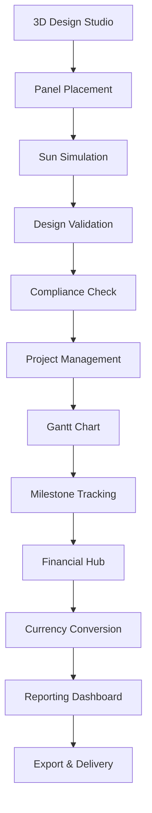

# NextGen Fusion Commercial Solar Platform - Phase 3 Technical Architecture

## 1. Product Overview

Phase 3 transforms NextGen Fusion into a comprehensive commercial solar platform with advanced 3D design capabilities, intelligent project management, global multi-currency support, and automated compliance validation across three major markets (South Africa, Australia, United States).

This phase delivers enterprise-grade solar design tools with WebGL-powered 3D modeling, sophisticated project workflows with Gantt chart visualization, real-time currency conversion, and region-specific compliance automation to accelerate commercial solar deployments while ensuring regulatory adherence.

## 2. Core Features

### 2.1 User Roles

| Role | Registration Method | Core Permissions |
|------|---------------------|------------------|
| Solar Engineer | Professional certification verification | Full design access, 3D modeling, technical calculations |
| Project Manager | Company invitation + role assignment | Project oversight, timeline management, resource allocation |
| Compliance Officer | Regional certification + approval workflow | Compliance validation, regulatory reporting, audit trails |
| Commercial Client | Company registration + project assignment | Project visibility, milestone tracking, report access |
| System Administrator | Internal provisioning | User management, system configuration, monitoring |

### 2.2 Feature Module

Our Phase 3 platform consists of the following enhanced modules:

1. **3D Solar Design Studio**: WebGL-powered design interface, drag-and-drop panel placement, sun-angle simulation
2. **Advanced Project Management**: Gantt charts, milestone tracking, dependency management, notification system
3. **Multi-Currency Financial Hub**: Real-time FX rates, currency conversion, localized pricing, financial reporting
4. **Compliance Automation Engine**: Region-specific rule validation, automated reporting, regulatory checklist management
5. **Scalability & Monitoring Dashboard**: Performance metrics, system health, scaling controls, security monitoring

### 2.3 Page Details

| Page Name | Module Name | Feature description |
|-----------|-------------|---------------------|
| 3D Design Studio | WebGL Renderer | Initialize Three.js scene, load building models, enable camera controls for 3D navigation |
| 3D Design Studio | Panel Placement Tool | Drag-and-drop solar panels onto roof surfaces, snap-to-grid functionality, collision detection |
| 3D Design Studio | Sun Simulation Engine | Calculate solar irradiance based on geographic location, time of year, panel orientation |
| 3D Design Studio | Design Export/Import | Save/load design files, export to CAD formats (DWG, DXF), import GIS data |
| Project Management | Gantt Chart View | Interactive timeline visualization, task dependencies, critical path highlighting |
| Project Management | Milestone Tracker | Progress indicators, completion status, automated notifications for deadlines |
| Project Management | Resource Allocation | Team assignment, workload balancing, capacity planning tools |
| Currency Hub | Exchange Rate Monitor | Real-time FX data integration, historical rate charts, rate alert system |
| Currency Hub | Multi-Currency Calculator | Convert project costs, quotes, invoices across ZAR/AUD/USD currencies |
| Currency Hub | Financial Reporting | Generate reports in multiple currencies, profit/loss analysis, budget tracking |
| Compliance Center | Rule Engine Dashboard | Configure region-specific compliance rules, validation workflows, audit trails |
| Compliance Center | Automated Validation | Real-time compliance checking, error highlighting, corrective action suggestions |
| Compliance Center | Regulatory Reporting | Generate compliance reports for NRS-097-2-3 (ZA), CEC standards (AU), NEC codes (US) |
| Monitoring Dashboard | System Metrics | Display API response times, database performance, service health status |
| Monitoring Dashboard | Scaling Controls | Horizontal scaling triggers, load balancing configuration, resource allocation |
| Monitoring Dashboard | Security Monitoring | Access logs, authentication events, data encryption status, threat detection |

## 3. Core Process

### Solar Engineer Flow
1. Access 3D Design Studio → Load building model or create new design
2. Place solar panels using drag-and-drop interface → Configure panel specifications
3. Run sun-angle simulation → Analyze irradiance and energy output
4. Generate technical drawings → Export design files for installation
5. Submit design for compliance validation → Address any regulatory issues

### Project Manager Flow
1. Create new commercial project → Define scope, timeline, and resources
2. Set up Gantt chart with milestones → Assign tasks to team members
3. Monitor project progress → Update timelines and dependencies
4. Track budget across multiple currencies → Generate financial reports
5. Coordinate compliance approvals → Manage client communications

### Compliance Officer Flow
1. Configure regional compliance rules → Set up validation workflows
2. Review submitted designs → Run automated compliance checks
3. Generate regulatory reports → Submit to relevant authorities
4. Maintain audit trails → Ensure documentation compliance



## 4. User Interface Design

### 4.1 Design Style
- **Primary Colors**: Deep blue (#1e40af) for technical elements, green (#059669) for energy/sustainability
- **Secondary Colors**: Orange (#ea580c) for alerts, gray (#6b7280) for neutral elements
- **Button Style**: Rounded corners (8px), subtle shadows, hover animations for 3D elements
- **Typography**: Inter font family, 14px base size, 16px for headings, monospace for technical data
- **Layout Style**: Split-panel design for 3D workspace, card-based dashboards, floating toolbars
- **Icons**: Lucide React icons with custom solar/engineering symbols, 3D-style depth effects

### 4.2 Page Design Overview

| Page Name | Module Name | UI Elements |
|-----------|-------------|-------------|
| 3D Design Studio | WebGL Canvas | Full-screen 3D viewport, floating toolbar, property panels, dark theme for focus |
| 3D Design Studio | Panel Library | Draggable component grid, search/filter, specifications popup, thumbnail previews |
| Project Management | Gantt Chart | Interactive timeline, color-coded tasks, dependency lines, zoom controls |
| Project Management | Dashboard Cards | KPI widgets, progress bars, notification badges, responsive grid layout |
| Currency Hub | Exchange Rates | Real-time rate display, historical charts, currency selector dropdown, conversion calculator |
| Compliance Center | Rule Engine | JSON editor with syntax highlighting, validation status indicators, error tooltips |
| Compliance Center | Checklist Widget | Pass/Fail/Attention states with color coding, expandable details, progress tracking |
| Monitoring Dashboard | Metrics Visualization | Real-time charts, gauge components, alert panels, system status indicators |

### 4.3 Responsiveness
Desktop-first approach optimized for professional workstations with 3D design capabilities. Tablet adaptation for project management and reporting functions. Mobile-responsive dashboards for monitoring and notifications. Touch-optimized controls for tablet-based field inspections.

## 5. Technical Implementation

### 5.1 Frontend Architecture

**3D Rendering Stack:**
- Three.js for WebGL rendering and 3D scene management
- React Three Fiber for React integration
- Drei for common 3D components and helpers
- React DnD for drag-and-drop panel placement

**Project Management Components:**
- React Gantt Chart library or custom implementation
- Date-fns for timeline calculations
- React Query for data synchronization
- Zustand stores for project state management

**Multi-Currency Integration:**
- React Number Format for currency display
- Chart.js for exchange rate visualization
- Custom currency conversion hooks
- Localization with react-i18next

### 5.2 Backend Services

**Design Service Extensions:**
```python
# New FastAPI endpoints
@router.post("/api/v1/design/3d-layout")
@router.get("/api/v1/design/irradiance-calculation")
@router.post("/api/v1/design/export-cad")
@router.post("/api/v1/design/import-gis")
```

**Currency Service:**
```python
# New microservice for currency management
@router.get("/api/v1/currency/rates")
@router.post("/api/v1/currency/convert")
@router.get("/api/v1/currency/historical")
```

**Compliance Service:**
```python
# Compliance rule engine
@router.post("/api/v1/compliance/validate")
@router.get("/api/v1/compliance/rules/{region}")
@router.post("/api/v1/compliance/report")
```

### 5.3 Database Schema Extensions

**Design Tables:**
```sql
CREATE TABLE design_3d_models (
    id UUID PRIMARY KEY,
    project_id UUID REFERENCES projects(id),
    model_data JSONB,
    panel_layout JSONB,
    simulation_results JSONB,
    created_at TIMESTAMP DEFAULT NOW()
);

CREATE TABLE solar_panels (
    id UUID PRIMARY KEY,
    manufacturer VARCHAR(100),
    model_number VARCHAR(100),
    power_rating DECIMAL(8,2),
    dimensions JSONB,
    efficiency DECIMAL(5,2)
);
```

**Project Management Tables:**
```sql
CREATE TABLE project_tasks (
    id UUID PRIMARY KEY,
    project_id UUID REFERENCES projects(id),
    name VARCHAR(200),
    description TEXT,
    start_date DATE,
    end_date DATE,
    dependencies JSONB,
    status VARCHAR(50),
    assigned_to UUID REFERENCES users(id)
);

CREATE TABLE project_milestones (
    id UUID PRIMARY KEY,
    project_id UUID REFERENCES projects(id),
    name VARCHAR(200),
    target_date DATE,
    completion_date DATE,
    status VARCHAR(50)
);
```

**Currency Tables:**
```sql
CREATE TABLE exchange_rates (
    id UUID PRIMARY KEY,
    base_currency VARCHAR(3),
    target_currency VARCHAR(3),
    rate DECIMAL(12,6),
    date DATE,
    source VARCHAR(50)
);

CREATE TABLE multi_currency_transactions (
    id UUID PRIMARY KEY,
    project_id UUID REFERENCES projects(id),
    original_amount DECIMAL(12,2),
    original_currency VARCHAR(3),
    converted_amount DECIMAL(12,2),
    converted_currency VARCHAR(3),
    exchange_rate DECIMAL(12,6),
    transaction_date TIMESTAMP
);
```

**Compliance Tables:**
```sql
CREATE TABLE compliance_rules (
    id UUID PRIMARY KEY,
    region VARCHAR(10),
    rule_type VARCHAR(50),
    rule_data JSONB,
    version VARCHAR(20),
    effective_date DATE
);

CREATE TABLE compliance_validations (
    id UUID PRIMARY KEY,
    project_id UUID REFERENCES projects(id),
    rule_id UUID REFERENCES compliance_rules(id),
    validation_result JSONB,
    status VARCHAR(50),
    validated_at TIMESTAMP
);
```

### 5.4 API Gateway Enhancements

**New Route Configurations:**
```typescript
// Enhanced routing for new services
app.use('/api/v1/design', designServiceProxy);
app.use('/api/v1/currency', currencyServiceProxy);
app.use('/api/v1/compliance', complianceServiceProxy);
app.use('/api/v1/monitoring', monitoringServiceProxy);

// Role-based access control
app.use('/api/v1/admin', requireRole('admin'));
app.use('/api/v1/engineering', requireRole(['engineer', 'admin']));
app.use('/api/v1/compliance', requireRole(['compliance_officer', 'admin']));
```

### 5.5 Monitoring & Observability

**Prometheus Metrics:**
```python
# Custom metrics for solar platform
design_calculations_total = Counter('design_calculations_total')
threejs_render_duration = Histogram('threejs_render_duration_seconds')
compliance_validations_total = Counter('compliance_validations_total')
currency_conversions_total = Counter('currency_conversions_total')
```

**Grafana Dashboard Panels:**
- 3D rendering performance metrics
- Design calculation throughput
- Compliance validation success rates
- Currency conversion accuracy
- Project completion timelines

## 6. Testing Strategy

### 6.1 Unit Testing (90% Coverage Goal)

**Frontend Testing:**
```typescript
// 3D component testing with React Testing Library
describe('SolarPanelPlacement', () => {
  test('should place panel on roof surface', () => {
    // Test drag-and-drop functionality
  });
  
  test('should calculate irradiance correctly', () => {
    // Test sun-angle simulation
  });
});
```

**Backend Testing:**
```python
# FastAPI endpoint testing
def test_design_calculation():
    response = client.post("/api/v1/design/irradiance-calculation", 
                          json=test_design_data)
    assert response.status_code == 200
    assert "energy_output" in response.json()
```

### 6.2 Integration Testing

**3D Simulation Validation:**
- Test against known solar irradiance datasets
- Validate energy output calculations
- Verify CAD export/import accuracy

**Multi-Currency Workflows:**
- Test real-time exchange rate integration
- Validate currency conversion accuracy
- Test financial report generation

### 6.3 End-to-End Testing (Playwright)

**Complete Workflow Tests:**
```typescript
test('Solar Design to Compliance Workflow', async ({ page }) => {
  // 1. Create new project
  await page.goto('/projects/new');
  await page.fill('[data-testid="project-name"]', 'Test Solar Project');
  
  // 2. Design solar layout
  await page.goto('/design/3d-studio');
  await page.dragAndDrop('[data-testid="solar-panel"]', '[data-testid="roof-surface"]');
  
  // 3. Run compliance check
  await page.click('[data-testid="validate-compliance"]');
  await expect(page.locator('[data-testid="compliance-status"]')).toContainText('Pass');
  
  // 4. Generate report
  await page.click('[data-testid="generate-report"]');
  await expect(page.locator('[data-testid="download-link"]')).toBeVisible();
  
  // 5. Export invoice
  await page.goto('/projects/financial');
  await page.selectOption('[data-testid="currency-selector"]', 'USD');
  await page.click('[data-testid="export-invoice"]');
});
```

### 6.4 Load Testing

**Performance Targets:**
- 500 concurrent users in 3D design studio
- 1000 concurrent currency conversions
- 100 simultaneous compliance validations
- Sub-300ms API response times under load

**Load Testing Scenarios:**
```javascript
// K6 load testing script
import { check } from 'k6';
import http from 'k6/http';

export let options = {
  stages: [
    { duration: '2m', target: 100 },
    { duration: '5m', target: 500 },
    { duration: '2m', target: 0 },
  ],
};

export default function() {
  let response = http.post('http://localhost:8000/api/v1/design/irradiance-calculation', {
    // Test payload
  });
  
  check(response, {
    'status is 200': (r) => r.status === 200,
    'response time < 300ms': (r) => r.timings.duration < 300,
  });
}
```

### 6.5 Compliance Testing

**Regional Rule Validation:**
- South Africa: NRS-097-2-3 grid connection standards
- Australia: Clean Energy Council (CEC) installation requirements
- United States: National Electrical Code (NEC) safety standards

**Automated Regression Tests:**
```python
# Compliance rule regression testing
def test_south_africa_nrs_097_compliance():
    design_data = load_test_design('za_commercial_100kw')
    result = validate_compliance(design_data, region='ZA')
    assert result['nrs_097_2_3']['grid_connection'] == 'PASS'
    assert result['nersa_licensing']['threshold_check'] == 'PASS'

def test_australia_cec_compliance():
    design_data = load_test_design('au_commercial_250kw')
    result = validate_compliance(design_data, region='AU')
    assert result['cec_standards']['installation'] == 'PASS'
    assert result['cec_standards']['safety'] == 'PASS'
```

## 7. Implementation Timeline

### Phase 3.1 (Weeks 1-4): Foundation
- Set up 3D rendering infrastructure (Three.js integration)
- Implement basic solar panel placement
- Create currency service with exchange rate integration
- Design compliance rule engine architecture

### Phase 3.2 (Weeks 5-8): Core Features
- Complete 3D design studio with sun simulation
- Implement Gantt chart project management
- Add multi-currency financial workflows
- Build compliance validation for one region (start with US/NEC)

### Phase 3.3 (Weeks 9-12): Advanced Features
- CAD/GIS import/export functionality
- Advanced project management (dependencies, notifications)
- Complete compliance automation for all three regions
- Implement monitoring and scaling infrastructure

### Phase 3.4 (Weeks 13-16): Testing & Deployment
- Comprehensive testing (unit, integration, E2E, load)
- Performance optimization and security hardening
- Staging environment deployment with demo data
- Documentation and training materials

## 8. Deployment & Infrastructure

### 8.1 Scalability Architecture

**Horizontal Scaling:**
- ECS/EKS clusters for FastAPI services
- Auto-scaling based on CPU/memory metrics
- Load balancing with health checks
- CDN caching for 3D assets and static files

**Database Scaling:**
- Read replicas for reporting queries
- Connection pooling optimization
- Query performance monitoring
- Automated backup and recovery

### 8.2 Security Enhancements

**Data Protection:**
- Encryption at rest for design files
- TLS 1.3 for all API communications
- JWT token rotation and validation
- Role-based access control (RBAC) extension

**Compliance Security:**
- Audit logging for all compliance actions
- Data residency controls (US/EU/AU/ZA)
- GDPR/CCPA compliance for user data
- SOC 2 Type II preparation

### 8.3 Monitoring & Alerting

**Key Metrics:**
- API response times (P95 < 300ms)
- 3D rendering performance
- Currency conversion accuracy
- Compliance validation success rates
- System availability (99.9% target)

**Alert Conditions:**
- High error rates (>1%)
- Slow response times (>500ms)
- Failed compliance validations
- Currency rate update failures
- Security incidents

## 9. Success Criteria

By the end of Phase 3, the NextGen Fusion Commercial Solar Platform will deliver:

✅ **Advanced 3D Design Capabilities**: WebGL-powered solar panel placement with real-time sun simulation

✅ **Enterprise Project Management**: Gantt charts, milestone tracking, and automated notifications

✅ **Global Currency Support**: Real-time conversion for ZAR, AUD, USD with financial reporting

✅ **Automated Compliance**: Region-specific validation for South Africa, Australia, and United States

✅ **Production-Ready Infrastructure**: Scalable, secure, and monitored platform ready for commercial deployment

✅ **Comprehensive Testing**: 90% code coverage with full E2E workflow validation

This foundation positions NextGen Fusion as the leading commercial solar design and project management platform, ready to accelerate solar adoption across three major global markets.