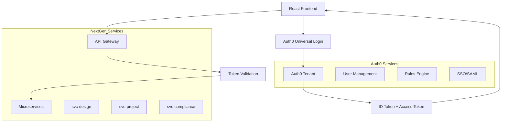

# Authentication System Implementation Clarification
## NextGen Fusion Commercial Solar Platform

### Document Purpose

This document provides a comprehensive clarification of the Authentication System Implementation for the NextGen Fusion Commercial Solar Platform, translating technical specifications into actionable guidance for the development team.

**Target Audience**: Development team, DevOps engineers, QA testers
**Implementation Timeline**: 6 weeks
**Current Status**: 85% backend completion, 0% Auth0/Cognito integration

---

## 1. Implementation Overview

### Current State Analysis

**What We Have (85% Backend Complete)**:
- Custom JWT authentication system in place
- Basic user authentication endpoints (`/api/auth/login`)
- User stores and authentication hooks in React frontend
- Role-based access control foundation
- Authentication middleware for API protection

**What We're Missing (0% Auth0 Integration)**:
- Auth0/Cognito tenant configuration
- OIDC/OAuth2 flow implementation
- Enterprise SSO/SAML support
- Token refresh and rotation mechanisms
- Production-grade security features

**Why This Upgrade Matters**:
- **Security**: Enterprise-grade authentication with industry standards
- **Scalability**: Support for thousands of concurrent users
- **Compliance**: SOC 2, GDPR, and enterprise security requirements
- **Features**: SSO, MFA, social logins, and advanced user management

### Success Definition

**Technical Targets**:
- 99.9% authentication service availability
- <200ms authentication response time
- Zero security vulnerabilities in production
- 100% test coverage for authentication flows

**Business Targets**:
- Seamless user experience during migration
- Enterprise customer onboarding capability
- Reduced support tickets for authentication issues

---

## 2. Technical Architecture Deep Dive

### Architecture Flow



### Integration Points

**Frontend Integration**:
- Replace custom `authStore.ts` with Auth0 React SDK
- Update `useAuth` hook to use Auth0 methods
- Modify protected routes to use Auth0 authentication state
- Update UI components to display Auth0 user information

**Backend Integration**:
- Update API Gateway to validate Auth0 JWT tokens
- Modify microservice authentication middleware
- Update database user models to store Auth0 user IDs
- Implement token introspection for sensitive operations

**Data Flow**:
1. User clicks "Sign In" → Auth0 Universal Login
2. Auth0 returns tokens → React app stores in memory/localStorage
3. API calls include Bearer token → API Gateway validates with Auth0
4. Valid requests forwarded to microservices with user context
5. Microservices use user context for authorization decisions

---

## 3. Key Components Explained

### 3.1 Auth0 Tenant Setup

**What It Is**: Your dedicated Auth0 environment that manages users, applications, and security policies.

**Configuration Steps**:
```bash
# 1. Create Auth0 account and tenant
# 2. Configure application settings
# 3. Set up API resource
# 4. Configure callback URLs
# 5. Set up custom claims for roles
```

**Critical Settings**:
- **Application Type**: Single Page Application (SPA)
- **Grant Types**: Authorization Code + PKCE
- **Token Lifetime**: 1 hour access, 30 days refresh
- **Callback URLs**: Development and production domains

### 3.2 React Components Architecture

**Auth0Provider Wrapper**:
```typescript
// Wraps entire app, provides authentication context
<Auth0Provider domain="..." clientId="...">
  <App />
</Auth0Provider>
```

**useAuth Hook**:
```typescript
// Custom hook that combines Auth0 with our user store
const { user, login, logout, getToken } = useAuth();
```

**Component Hierarchy**:
```
App.tsx
├── Auth0Provider
├── AppRoutes
│   ├── ProtectedRoute (checks authentication)
│   ├── Dashboard (requires login)
│   └── PublicRoute (no auth required)
└── UserProfile (shows user info)
```

### 3.3 RBAC System Enhancement

**Current Roles** (to be migrated):
- `admin`: Full system access
- `user`: Basic project access
- `viewer`: Read-only access

**Enhanced Roles** (Auth0-managed):
- `Super Admin`: Platform administration
- `Organization Admin`: Company-level management
- `Project Manager`: Project creation and management
- `Engineer`: Design and technical access
- `Viewer`: Read-only access

**Permission Structure**:
```json
{
  "permissions": [
    "read:projects",
    "write:projects",
    "delete:projects",
    "read:designs",
    "write:designs",
    "admin:users",
    "admin:billing"
  ]
}
```

---

## 4. Step-by-Step Implementation Guide

### Week 1-2: Auth0 Foundation

**Day 1-3: Auth0 Setup**
1. Create Auth0 tenant (development)
2. Configure SPA application
3. Set up API resource with scopes
4. Test basic login flow

**Day 4-7: React Integration**
1. Install Auth0 React SDK: `npm install @auth0/auth0-react`
2. Replace App.tsx with Auth0Provider
3. Update useAuth hook
4. Test authentication flow

**Day 8-10: Component Updates**
1. Create LoginButton component
2. Update UserProfile component
3. Modify ProtectedRoute component
4. Update navigation components

### Week 3-4: Backend Integration

**Day 11-14: API Gateway Updates**
1. Install Auth0 validation library
2. Update authentication middleware
3. Configure token validation
4. Test API protection

**Day 15-18: Microservice Updates**
1. Update svc-design authentication
2. Update svc-project authentication
3. Update svc-compliance authentication
4. Test service-to-service communication

**Day 19-21: Database Migration**
1. Add Auth0 user ID fields
2. Create user mapping table
3. Update user queries
4. Test data consistency

### Week 5-6: Enterprise Features & Testing

**Day 22-25: SSO/SAML Setup**
1. Configure SAML connection
2. Test enterprise login
3. Set up user provisioning
4. Document SSO onboarding

**Day 26-30: Security & Performance**
1. Implement token refresh
2. Add security headers
3. Performance testing
4. Security audit

**Day 31-35: Migration & Deployment**
1. User migration scripts
2. Production deployment
3. Monitoring setup
4. Documentation completion

---

## 5. Integration Points Detail

### 5.1 Frontend Store Integration

**Current authStore.ts**:
```typescript
// Current implementation
interface AuthState {
  user: User | null;
  token: string | null;
  isAuthenticated: boolean;
}
```

**Updated authStore.ts**:
```typescript
// Auth0-integrated implementation
interface AuthState {
  user: Auth0User | null;
  auth0Token: string | null;
  isAuthenticated: boolean;
  permissions: string[];
  roles: string[];
}
```

**Migration Strategy**:
1. Keep existing store structure
2. Add Auth0-specific fields
3. Update store methods to use Auth0 SDK
4. Maintain backward compatibility during transition

### 5.2 API Gateway Integration

**Current Middleware**:
```python
# Custom JWT validation
def verify_jwt(token):
    # Custom implementation
    pass
```

**Updated Middleware**:
```python
# Auth0 JWT validation
from jose import jwt
from auth0.v3.authentication import GetToken

def verify_auth0_token(token):
    # Validate with Auth0 public key
    # Extract user claims
    # Return user context
    pass
```

### 5.3 Microservice Updates

**Each microservice needs**:
1. Updated authentication middleware
2. Auth0 user ID mapping
3. Permission-based authorization
4. Updated test cases

**Example for svc-design**:
```python
# Before
@require_auth
def create_design(user_id, design_data):
    pass

# After
@require_auth0
@require_permission('write:designs')
def create_design(auth0_user_id, design_data):
    pass
```

---

## 6. Security Requirements Deep Dive

### 6.1 OIDC Flow Implementation

**Authorization Code Flow with PKCE**:
1. **Code Challenge**: Generated by client
2. **Authorization Request**: Redirect to Auth0
3. **User Authentication**: Auth0 handles login
4. **Authorization Code**: Returned to callback
5. **Token Exchange**: Code + verifier for tokens
6. **Token Usage**: Access token for API calls

**Security Benefits**:
- No client secret required (public client)
- PKCE prevents code interception attacks
- Short-lived access tokens (1 hour)
- Secure refresh token rotation

### 6.2 Token Management

**Access Token Strategy**:
- **Lifetime**: 1 hour
- **Storage**: Memory (not localStorage for security)
- **Refresh**: Automatic via Auth0 SDK
- **Validation**: JWT signature + expiration

**Refresh Token Strategy**:
- **Lifetime**: 30 days
- **Rotation**: New refresh token with each use
- **Storage**: Secure httpOnly cookie (production)
- **Revocation**: Immediate on logout

### 6.3 Enterprise Security Features

**Multi-Factor Authentication (MFA)**:
- SMS, email, or authenticator app
- Configurable per organization
- Risk-based authentication

**Single Sign-On (SSO)**:
- SAML 2.0 support
- Active Directory integration
- Google Workspace, Microsoft 365

**Security Monitoring**:
- Failed login attempt tracking
- Anomaly detection
- Audit logs for compliance

---

## 7. Migration Strategy

### 7.1 Zero-Downtime Migration Plan

**Phase 1: Parallel Systems (Week 1-2)**
- Deploy Auth0 alongside existing system
- New users register via Auth0
- Existing users continue with custom JWT
- No disruption to current users

**Phase 2: User Migration (Week 3-4)**
- Email existing users about upgrade
- Provide migration tool/process
- Gradual migration over 2 weeks
- Support both systems simultaneously

**Phase 3: System Cutover (Week 5-6)**
- Migrate remaining users
- Disable custom JWT system
- Full Auth0 implementation
- Monitor for issues

### 7.2 Data Migration

**User Data Mapping**:
```sql
-- Create mapping table
CREATE TABLE user_migration (
    old_user_id UUID,
    auth0_user_id VARCHAR(255),
    migration_date TIMESTAMP,
    status VARCHAR(50)
);
```

**Migration Script**:
```python
# Migrate user data
def migrate_user(old_user_id, auth0_user_id):
    # Update all user references
    # Maintain data integrity
    # Log migration status
    pass
```

### 7.3 Rollback Procedures

**Rollback Triggers**:
- Authentication failure rate > 5%
- User complaints > threshold
- Performance degradation
- Security incidents

**Rollback Steps**:
1. Re-enable custom JWT system
2. Redirect traffic from Auth0
3. Restore user sessions
4. Investigate and fix issues
5. Plan re-migration

---

## 8. Testing & Validation Framework

### 8.1 Authentication Testing

**Unit Tests**:
```typescript
// Test Auth0 integration
describe('useAuth hook', () => {
  it('should login user successfully', async () => {
    // Mock Auth0 response
    // Test login flow
    // Verify user state
  });
  
  it('should handle token refresh', async () => {
    // Mock token expiration
    // Test refresh flow
    // Verify new token
  });
});
```

**Integration Tests**:
```python
# Test API authentication
def test_protected_endpoint():
    # Get Auth0 token
    # Call protected endpoint
    # Verify response
    pass

def test_invalid_token():
    # Use invalid token
    # Expect 401 response
    pass
```

**End-to-End Tests**:
```javascript
// Playwright test
test('complete authentication flow', async ({ page }) => {
  await page.goto('/login');
  await page.click('[data-testid="login-button"]');
  // Auth0 login flow
  await page.fill('[name="email"]', 'test@example.com');
  await page.fill('[name="password"]', 'password');
  await page.click('[type="submit"]');
  // Verify redirect and authentication
  await expect(page).toHaveURL('/dashboard');
});
```

### 8.2 Security Testing

**Security Test Cases**:
1. **Token Validation**: Invalid, expired, malformed tokens
2. **CSRF Protection**: Cross-site request forgery attempts
3. **XSS Prevention**: Script injection in user data
4. **Rate Limiting**: Brute force login attempts
5. **Session Management**: Concurrent sessions, logout

**Penetration Testing**:
- Third-party security audit
- OWASP Top 10 compliance
- Auth0 security assessment
- Vulnerability scanning

### 8.3 Performance Testing

**Load Testing Scenarios**:
```javascript
// k6 load test
import http from 'k6/http';

export default function () {
  // Test authentication endpoint
  const response = http.post('/api/auth/token', {
    // Auth0 token request
  });
  
  check(response, {
    'status is 200': (r) => r.status === 200,
    'response time < 200ms': (r) => r.timings.duration < 200,
  });
}
```

**Performance Targets**:
- Authentication: <200ms response time
- Token validation: <50ms
- User profile fetch: <100ms
- Concurrent users: 1000+

---

## 9. Deployment Considerations

### 9.1 Environment Configuration

**Development Environment**:
```bash
# .env.development
REACT_APP_AUTH0_DOMAIN=nextgen-dev.us.auth0.com
REACT_APP_AUTH0_CLIENT_ID=dev_client_id
REACT_APP_AUTH0_AUDIENCE=https://api-dev.nextgenfusion.com
REACT_APP_AUTH0_REDIRECT_URI=http://localhost:3000/callback
```

**Staging Environment**:
```bash
# .env.staging
REACT_APP_AUTH0_DOMAIN=nextgen-staging.us.auth0.com
REACT_APP_AUTH0_CLIENT_ID=staging_client_id
REACT_APP_AUTH0_AUDIENCE=https://api-staging.nextgenfusion.com
REACT_APP_AUTH0_REDIRECT_URI=https://staging.nextgenfusion.com/callback
```

**Production Environment**:
```bash
# .env.production
REACT_APP_AUTH0_DOMAIN=nextgen-prod.us.auth0.com
REACT_APP_AUTH0_CLIENT_ID=prod_client_id
REACT_APP_AUTH0_AUDIENCE=https://api.nextgenfusion.com
REACT_APP_AUTH0_REDIRECT_URI=https://app.nextgenfusion.com/callback
```

### 9.2 Configuration Management

**Secrets Management**:
- Auth0 client secrets in environment variables
- JWT signing keys from Auth0 JWKS endpoint
- Database credentials in secure vault
- API keys for external services

**Configuration Validation**:
```typescript
// Validate required environment variables
const requiredEnvVars = [
  'REACT_APP_AUTH0_DOMAIN',
  'REACT_APP_AUTH0_CLIENT_ID',
  'REACT_APP_AUTH0_AUDIENCE'
];

requiredEnvVars.forEach(envVar => {
  if (!process.env[envVar]) {
    throw new Error(`Missing required environment variable: ${envVar}`);
  }
});
```

### 9.3 Deployment Pipeline

**CI/CD Integration**:
```yaml
# GitHub Actions workflow
name: Deploy Authentication
on:
  push:
    branches: [main]
    paths: ['src/auth/**', 'api/auth/**']

jobs:
  test:
    runs-on: ubuntu-latest
    steps:
      - uses: actions/checkout@v2
      - name: Run auth tests
        run: npm run test:auth
      
  deploy:
    needs: test
    runs-on: ubuntu-latest
    steps:
      - name: Deploy to staging
        run: npm run deploy:staging
      - name: Run smoke tests
        run: npm run test:smoke
      - name: Deploy to production
        if: success()
        run: npm run deploy:prod
```

### 9.4 Monitoring & Alerting

**Key Metrics to Monitor**:
- Authentication success/failure rates
- Token validation response times
- Auth0 service availability
- User login patterns and anomalies

**Alert Conditions**:
```yaml
# Monitoring alerts
alerts:
  - name: "High Authentication Failure Rate"
    condition: "auth_failure_rate > 5%"
    severity: "critical"
    
  - name: "Slow Authentication Response"
    condition: "auth_response_time > 500ms"
    severity: "warning"
    
  - name: "Auth0 Service Down"
    condition: "auth0_availability < 99%"
    severity: "critical"
```

---

## 10. Success Criteria & Acceptance

### 10.1 Technical Acceptance Criteria

**Functional Requirements**:
- [ ] Users can log in via Auth0 Universal Login
- [ ] JWT tokens are properly validated by API Gateway
- [ ] Role-based access control works correctly
- [ ] Token refresh happens automatically
- [ ] Logout clears all authentication state
- [ ] SSO integration works for enterprise customers

**Performance Requirements**:
- [ ] Authentication response time < 200ms (95th percentile)
- [ ] Token validation < 50ms (95th percentile)
- [ ] System supports 1000+ concurrent users
- [ ] 99.9% authentication service availability

**Security Requirements**:
- [ ] All authentication flows use HTTPS
- [ ] Tokens are properly secured (no localStorage)
- [ ] CSRF protection is implemented
- [ ] Rate limiting prevents brute force attacks
- [ ] Security audit passes with no critical issues

### 10.2 Business Acceptance Criteria

**User Experience**:
- [ ] Existing users can migrate without data loss
- [ ] Login process is intuitive and fast
- [ ] Error messages are clear and helpful
- [ ] Mobile authentication works seamlessly

**Enterprise Features**:
- [ ] SSO works with major identity providers
- [ ] User provisioning and deprovisioning
- [ ] Audit logs for compliance requirements
- [ ] Multi-factor authentication options

### 10.3 Testing Acceptance

**Test Coverage**:
- [ ] Unit tests: >90% coverage for auth components
- [ ] Integration tests: All API endpoints tested
- [ ] E2E tests: Complete user journeys covered
- [ ] Security tests: OWASP Top 10 compliance

**Quality Gates**:
- [ ] All tests pass in CI/CD pipeline
- [ ] No critical or high severity vulnerabilities
- [ ] Performance benchmarks met
- [ ] Code review approval from security team

### 10.4 Documentation Requirements

**Technical Documentation**:
- [ ] API documentation updated with Auth0 flows
- [ ] Architecture diagrams reflect new system
- [ ] Deployment runbooks completed
- [ ] Troubleshooting guides created

**User Documentation**:
- [ ] Login help documentation
- [ ] SSO setup guides for enterprises
- [ ] Migration guides for existing users
- [ ] FAQ for common authentication issues

---

## Implementation Checklist

### Pre-Implementation
- [ ] Auth0 tenant created and configured
- [ ] Development environment set up
- [ ] Team training on Auth0 concepts completed
- [ ] Migration strategy approved by stakeholders

### Week 1-2: Foundation
- [ ] Auth0 React SDK integrated
- [ ] Basic login/logout flow working
- [ ] User profile component updated
- [ ] Protected routes implemented

### Week 3-4: Backend Integration
- [ ] API Gateway updated for Auth0 tokens
- [ ] Microservices authentication updated
- [ ] Database schema updated for Auth0 user IDs
- [ ] User migration scripts created

### Week 5-6: Enterprise & Production
- [ ] SSO/SAML configuration completed
- [ ] Security testing passed
- [ ] Performance testing passed
- [ ] Production deployment successful

### Post-Implementation
- [ ] User migration completed
- [ ] Monitoring and alerting active
- [ ] Documentation updated
- [ ] Team training on new system completed

---

## Conclusion

This Authentication System Implementation represents a critical upgrade from custom JWT to enterprise-grade Auth0 authentication. The 6-week timeline is aggressive but achievable with proper planning and execution.

**Key Success Factors**:
1. **Thorough Testing**: Comprehensive test coverage at all levels
2. **Gradual Migration**: Zero-downtime transition for existing users
3. **Security First**: Security considerations in every decision
4. **Performance Focus**: Meeting strict performance requirements
5. **Documentation**: Clear documentation for maintenance and troubleshooting

**Risk Mitigation**:
- Parallel system deployment reduces migration risk
- Comprehensive rollback procedures ensure quick recovery
- Extensive testing catches issues before production
- Monitoring and alerting provide early warning of problems

The successful completion of this implementation will provide NextGen Fusion with enterprise-grade authentication capabilities, enabling secure scaling and enterprise customer acquisition.

**Next Steps**:
1. Review and approve this implementation plan
2. Set up Auth0 development tenant
3. Begin Week 1 implementation tasks
4. Schedule regular progress reviews
5. Prepare for user communication about the upgrade

For questions or clarifications, refer to the detailed Authentication System Implementation Specification document or contact the development team lead.