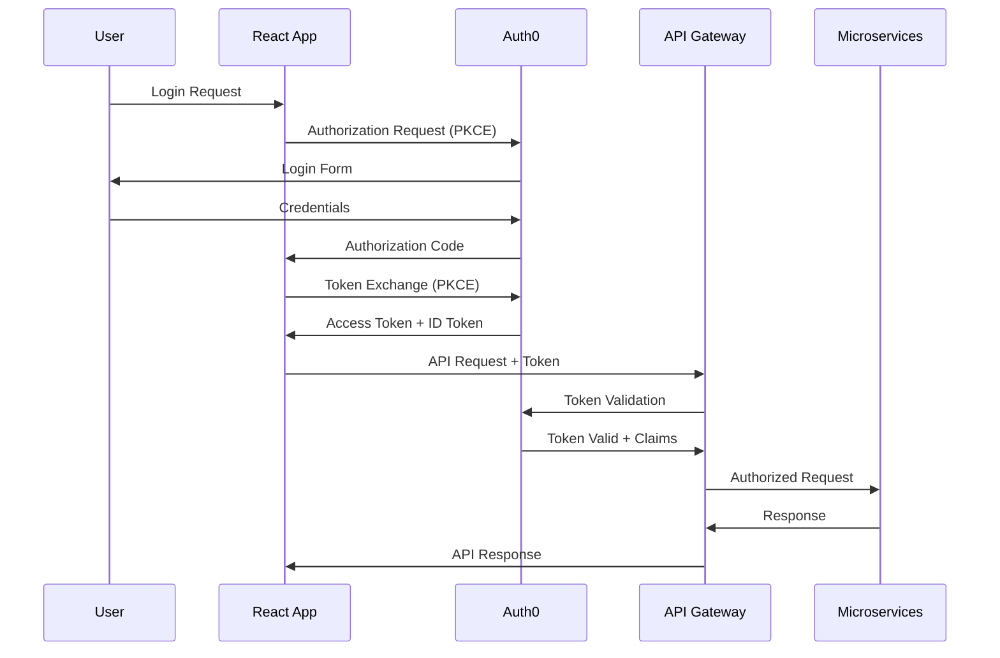

# Authentication System Implementation Specification
## NextGen Fusion Commercial Solar Platform

### Document Overview

This specification provides comprehensive implementation details for upgrading the NextGen Fusion Commercial Solar Platform's authentication system from custom JWT to enterprise-grade Auth0/Cognito integration with full RBAC, SSO/SAML support, and enhanced security features.

**Current Status**: 85% backend completion, 0% Auth0/Cognito integration
**Target**: Enterprise-ready authentication with 99.9% availability
**Timeline**: 4-6 weeks implementation

---

## 1. Auth0/Cognito Tenant Setup and Configuration

### 1.1 Auth0 Tenant Configuration (Recommended)

#### Tenant Setup
```bash
# Auth0 CLI Installation
npm install -g auth0-cli
auth0 login

# Create new tenant
auth0 tenants create --name "nextgen-fusion-prod" --region "us"
```

#### Application Configuration
```json
{
  "name": "NextGen Fusion Solar Platform",
  "app_type": "spa",
  "callbacks": [
    "http://localhost:3000/callback",
    "https://app.nextgenfusion.com/callback",
    "https://staging.nextgenfusion.com/callback"
  ],
  "logout_urls": [
    "http://localhost:3000",
    "https://app.nextgenfusion.com",
    "https://staging.nextgenfusion.com"
  ],
  "allowed_origins": [
    "http://localhost:3000",
    "https://app.nextgenfusion.com",
    "https://staging.nextgenfusion.com"
  ],
  "web_origins": [
    "http://localhost:3000",
    "https://app.nextgenfusion.com",
    "https://staging.nextgenfusion.com"
  ],
  "grant_types": [
    "authorization_code",
    "refresh_token"
  ],
  "token_endpoint_auth_method": "none"
}
```

#### API Configuration
```json
{
  "name": "NextGen Fusion API",
  "identifier": "https://api.nextgenfusion.com",
  "signing_alg": "RS256",
  "scopes": [
    {
      "value": "read:projects",
      "description": "Read project data"
    },
    {
      "value": "write:projects",
      "description": "Create and modify projects"
    },
    {
      "value": "read:designs",
      "description": "Read design data"
    },
    {
      "value": "write:designs",
      "description": "Create and modify designs"
    },
    {
      "value": "admin:all",
      "description": "Full administrative access"
    }
  ]
}
```

### 1.2 Environment Configuration

#### Development Environment
```bash
# .env.development
REACT_APP_AUTH0_DOMAIN=nextgen-fusion-dev.us.auth0.com
REACT_APP_AUTH0_CLIENT_ID=your_dev_client_id
REACT_APP_AUTH0_AUDIENCE=https://api.nextgenfusion.com
REACT_APP_AUTH0_REDIRECT_URI=http://localhost:3000/callback
```

#### Production Environment
```bash
# .env.production
REACT_APP_AUTH0_DOMAIN=nextgen-fusion-prod.us.auth0.com
REACT_APP_AUTH0_CLIENT_ID=your_prod_client_id
REACT_APP_AUTH0_AUDIENCE=https://api.nextgenfusion.com
REACT_APP_AUTH0_REDIRECT_URI=https://app.nextgenfusion.com/callback
```

---

## 2. OIDC/OAuth2 Flow Implementation

### 2.1 Authorization Code Flow with PKCE

#### Flow Diagram


### 2.2 Token Management Strategy

#### Access Token Configuration
```json
{
  "token_lifetime": 3600,
  "token_lifetime_for_web": 7200,
  "refresh_token": {
    "rotation_type": "rotating",
    "expiration_type": "expiring",
    "leeway": 0,
    "token_lifetime": 2592000,
    "infinite_token_lifetime": false,
    "infinite_idle_token_lifetime": false,
    "idle_token_lifetime": 1296000
  }
}
```

---

## 3. Frontend React Authentication Components

### 3.1 Auth0 Provider Setup

#### App.tsx Integration
```typescript
// src/App.tsx
import React from 'react';
import { Auth0Provider } from '@auth0/auth0-react';
import { BrowserRouter } from 'react-router-dom';
import { AppRoutes } from './routes/AppRoutes';
import { ErrorBoundary } from './components/ErrorBoundary';

const domain = process.env.REACT_APP_AUTH0_DOMAIN!;
const clientId = process.env.REACT_APP_AUTH0_CLIENT_ID!;
const audience = process.env.REACT_APP_AUTH0_AUDIENCE!;
const redirectUri = process.env.REACT_APP_AUTH0_REDIRECT_URI!;

function App() {
  return (
    <ErrorBoundary>
      <Auth0Provider
        domain={domain}
        clientId={clientId}
        authorizationParams={{
          redirect_uri: redirectUri,
          audience: audience,
          scope: "openid profile email read:projects write:projects read:designs write:designs"
        }}
        useRefreshTokens={true}
        cacheLocation="localstorage"
      >
        <BrowserRouter>
          <AppRoutes />
        </BrowserRouter>
      </Auth0Provider>
    </ErrorBoundary>
  );
}

export default App;
```

### 3.2 Authentication Hook

#### useAuth Hook
```typescript
// src/hooks/useAuth.ts
import { useAuth0 } from '@auth0/auth0-react';
import { useCallback, useEffect } from 'react';
import { useAuthStore } from '../stores/authStore';

export interface User {
  id: string;
  email: string;
  name: string;
  picture?: string;
  roles: string[];
  permissions: string[];
}

export const useAuth = () => {
  const {
    user: auth0User,
    isAuthenticated,
    isLoading,
    error,
    loginWithRedirect,
    logout: auth0Logout,
    getAccessTokenSilently,
    getIdTokenClaims
  } = useAuth0();

  const { setUser, setToken, clearAuth, user } = useAuthStore();

  const getToken = useCallback(async () => {
    try {
      const token = await getAccessTokenSilently();
      setToken(token);
      return token;
    } catch (error) {
      console.error('Error getting token:', error);
      throw error;
    }
  }, [getAccessTokenSilently, setToken]);

  const getUserRoles = useCallback(async () => {
    try {
      const claims = await getIdTokenClaims();
      return claims?.[`https://nextgenfusion.com/roles`] || [];
    } catch (error) {
      console.error('Error getting user roles:', error);
      return [];
    }
  }, [getIdTokenClaims]);

  const login = useCallback(() => {
    loginWithRedirect();
  }, [loginWithRedirect]);

  const logout = useCallback(() => {
    auth0Logout({
      logoutParams: {
        returnTo: window.location.origin
      }
    });
    clearAuth();
  }, [auth0Logout, clearAuth]);

  useEffect(() => {
    if (isAuthenticated && auth0User) {
      const initializeUser = async () => {
        try {
          const roles = await getUserRoles();
          const token = await getToken();
          
          const userData: User = {
            id: auth0User.sub!,
            email: auth0User.email!,
            name: auth0User.name!,
            picture: auth0User.picture,
            roles,
            permissions: [] // Will be populated from roles
          };
          
          setUser(userData);
        } catch (error) {
          console.error('Error initializing user:', error);
        }
      };
      
      initializeUser();
    }
  }, [isAuthenticated, auth0User, getUserRoles, getToken, setUser]);

  return {
    user,
    isAuthenticated,
    isLoading,
    error,
    login,
    logout,
    getToken,
    getUserRoles
  };
};
```

### 3.3 Authentication Components

#### Login Button Component
```typescript
// src/components/auth/LoginButton.tsx
import React from 'react';
import { useAuth } from '../../hooks/useAuth';
import { Button } from '../ui/Button';
import { LogIn } from 'lucide-react';

interface LoginButtonProps {
  className?: string;
  variant?: 'primary' | 'secondary' | 'outline';
  size?: 'sm' | 'md' | 'lg';
}

export const LoginButton: React.FC<LoginButtonProps> = ({
  className,
  variant = 'primary',
  size = 'md'
}) => {
  const { login, isLoading } = useAuth();

  return (
    <Button
      onClick={login}
      disabled={isLoading}
      variant={variant}
      size={size}
      className={className}
    >
      <LogIn className="w-4 h-4 mr-2" />
      {isLoading ? 'Signing in...' : 'Sign In'}
    </Button>
  );
};
```

#### User Profile Component
```typescript
// src/components/auth/UserProfile.tsx
import React from 'react';
import { useAuth } from '../../hooks/useAuth';
import { Button } from '../ui/Button';
import { Avatar } from '../ui/Avatar';
import { LogOut, User, Settings } from 'lucide-react';
import {
  DropdownMenu,
  DropdownMenuContent,
  DropdownMenuItem,
  DropdownMenuSeparator,
  DropdownMenuTrigger,
} from '../ui/DropdownMenu';

export const UserProfile: React.FC = () => {
  const { user, logout, isAuthenticated } = useAuth();

  if (!isAuthenticated || !user) {
    return null;
  }

  return (
    <DropdownMenu>
      <DropdownMenuTrigger asChild>
        <Button variant="ghost" className="relative h-8 w-8 rounded-full">
          <Avatar className="h-8 w-8">
            
          </Avatar>
        </Button>
      </DropdownMenuTrigger>
      <DropdownMenuContent className="w-56" align="end" forceMount>
        <div className="flex items-center justify-start gap-2 p-2">
          <div className="flex flex-col space-y-1 leading-none">
            <p className="font-medium">{user.name}</p>
            <p className="w-[200px] truncate text-sm text-muted-foreground">
              {user.email}
            </p>
          </div>
        </div>
        <DropdownMenuSeparator />
        <DropdownMenuItem>
          <User className="mr-2 h-4 w-4" />
          <span>Profile</span>
        </DropdownMenuItem>
        <DropdownMenuItem>
          <Settings className="mr-2 h-4 w-4" />
          <span>Settings</span>
        </DropdownMenuItem>
        <DropdownMenuSeparator />
        <DropdownMenuItem onClick={logout}>
          <LogOut className="mr-2 h-4 w-4" />
          <span>Log out</span>
        </DropdownMenuItem>
      </DropdownMenuContent>
    </DropdownMenu>
  );
};
```

### 3.4 Protected Route Component

```typescript
// src/components/auth/ProtectedRoute.tsx
import React from 'react';
import { useAuth } from '../../hooks/useAuth';
import { Navigate, useLocation } from 'react-router-dom';
import { LoadingSpinner } from '../ui/LoadingSpinner';

interface ProtectedRouteProps {
  children: React.ReactNode;
  requiredRoles?: string[];
  requiredPermissions?: string[];
}

export const ProtectedRoute: React.FC<ProtectedRouteProps> = ({
  children,
  requiredRoles = [],
  requiredPermissions = []
}) => {
  const { isAuthenticated, isLoading, user } = useAuth();
  const location = useLocation();

  if (isLoading) {
    return (
      <div className="flex items-center justify-center min-h-screen">
        <LoadingSpinner size="lg" />
      </div>
    );
  }

  if (!isAuthenticated) {
    return <Navigate to="/login" state={{ from: location }} replace />;
  }

  // Check role requirements
  if (requiredRoles.length > 0 && user) {
    const hasRequiredRole = requiredRoles.some(role => 
      user.roles.includes(role)
    );
    
    if (!hasRequiredRole) {
      return <Navigate to="/unauthorized" replace />;
    }
  }

  // Check permission requirements
  if (requiredPermissions.length > 0 && user) {
    const hasRequiredPermission = requiredPermissions.some(permission => 
      user.permissions.includes(permission)
    );
    
    if (!hasRequiredPermission) {
      return <Navigate to="/unauthorized" replace />;
    }
  }

  return <>{children}</>;
};
```

---

## 4. RBAC System Enhancement

### 4.1 Role Definitions

#### Auth0 Role Configuration
```json
{
  "roles": [
    {
      "name": "Admin",
      "description": "Full system administration access",
      "permissions": [
        "admin:all",
        "read:projects",
        "write:projects",
        "delete:projects",
        "read:designs",
        "write:designs",
        "delete:designs",
        "read:users",
        "write:users",
        "read:compliance",
        "write:compliance",
        "read:finance",
        "write:finance"
      ]
    },
    {
      "name": "Manager",
      "description": "Project and team management access",
      "permissions": [
        "read:projects",
        "write:projects",
        "read:designs",
        "write:designs",
        "read:users",
        "read:compliance",
        "read:finance"
      ]
    },
    {
      "name": "Engineer",
      "description": "Technical design and implementation access",
      "permissions": [
        "read:projects",
        "read:designs",
        "write:designs",
        "read:compliance"
      ]
    },
    {
      "name": "Viewer",
      "description": "Read-only access to assigned projects",
      "permissions": [
        "read:projects",
        "read:designs"
      ]
    }
  ]
}
```

### 4.2 Permission-Based Access Control

#### usePermissions Hook
```typescript
// src/hooks/usePermissions.ts
import { useAuth } from './useAuth';
import { useMemo } from 'react';

type Permission = 
  | 'admin:all'
  | 'read:projects'
  | 'write:projects'
  | 'delete:projects'
  | 'read:designs'
  | 'write:designs'
  | 'delete:designs'
  | 'read:users'
  | 'write:users'
  | 'read:compliance'
  | 'write:compliance'
  | 'read:finance'
  | 'write:finance';

type Role = 'Admin' | 'Manager' | 'Engineer' | 'Viewer';

const ROLE_PERMISSIONS: Record<Role, Permission[]> = {
  Admin: [
    'admin:all',
    'read:projects',
    'write:projects',
    'delete:projects',
    'read:designs',
    'write:designs',
    'delete:designs',
    'read:users',
    'write:users',
    'read:compliance',
    'write:compliance',
    'read:finance',
    'write:finance'
  ],
  Manager: [
    'read:projects',
    'write:projects',
    'read:designs',
    'write:designs',
    'read:users',
    'read:compliance',
    'read:finance'
  ],
  Engineer: [
    'read:projects',
    'read:designs',
    'write:designs',
    'read:compliance'
  ],
  Viewer: [
    'read:projects',
    'read:designs'
  ]
};

export const usePermissions = () => {
  const { user } = useAuth();

  const permissions = useMemo(() => {
    if (!user || !user.roles) return [];
    
    const allPermissions = new Set<Permission>();
    
    user.roles.forEach(role => {
      const rolePermissions = ROLE_PERMISSIONS[role as Role] || [];
      rolePermissions.forEach(permission => allPermissions.add(permission));
    });
    
    return Array.from(allPermissions);
  }, [user]);

  const hasPermission = (permission: Permission): boolean => {
    return permissions.includes('admin:all') || permissions.includes(permission);
  };

  const hasRole = (role: Role): boolean => {
    return user?.roles.includes(role) || false;
  };

  const hasAnyRole = (roles: Role[]): boolean => {
    return roles.some(role => hasRole(role));
  };

  const hasAllRoles = (roles: Role[]): boolean => {
    return roles.every(role => hasRole(role));
  };

  return {
    permissions,
    hasPermission,
    hasRole,
    hasAnyRole,
    hasAllRoles,
    isAdmin: hasRole('Admin'),
    isManager: hasRole('Manager'),
    isEngineer: hasRole('Engineer'),
    isViewer: hasRole('Viewer')
  };
};
```

---

## 5. SSO/SAML Configuration

### 5.1 Enterprise Connection Setup

#### SAML Configuration Template
```json
{
  "name": "enterprise-saml",
  "strategy": "samlp",
  "options": {
    "signInEndpoint": "https://customer.idp.com/sso/saml",
    "signOutEndpoint": "https://customer.idp.com/sso/saml/logout",
    "signatureAlgorithm": "rsa-sha256",
    "digestAlgorithm": "sha256",
    "protocolBinding": "urn:oasis:names:tc:SAML:2.0:bindings:HTTP-POST",
    "requestTemplate": "<samlp:AuthnRequest xmlns:samlp=\"urn:oasis:names:tc:SAML:2.0:protocol\" ID=\"@@ID@@\" IssueInstant=\"@@IssueInstant@@\" ProtocolBinding=\"urn:oasis:names:tc:SAML:2.0:bindings:HTTP-POST\" Version=\"2.0\" Destination=\"@@Destination@@\"><saml:Issuer xmlns:saml=\"urn:oasis:names:tc:SAML:2.0:assertion\">@@Issuer@@</saml:Issuer></samlp:AuthnRequest>",
    "userIdAttribute": "http://schemas.xmlsoap.org/ws/2005/05/identity/claims/nameidentifier",
    "fieldsMap": {
      "email": "http://schemas.xmlsoap.org/ws/2005/05/identity/claims/emailaddress",
      "name": "http://schemas.xmlsoap.org/ws/2005/05/identity/claims/name",
      "given_name": "http://schemas.xmlsoap.org/ws/2005/05/identity/claims/givenname",
      "family_name": "http://schemas.xmlsoap.org/ws/2005/05/identity/claims/surname"
    }
  },
  "enabled_clients": ["your_client_id"]
}
```

### 5.2 Enterprise Login Component

```typescript
// src/components/auth/EnterpriseLogin.tsx
import React, { useState } from 'react';
import { useAuth0 } from '@auth0/auth0-react';
import { Button } from '../ui/Button';
import { Input } from '../ui/Input';
import { Building2 } from 'lucide-react';

export const EnterpriseLogin: React.FC = () => {
  const { loginWithRedirect } = useAuth0();
  const [domain, setDomain] = useState('');

  const handleEnterpriseLogin = () => {
    loginWithRedirect({
      authorizationParams: {
        connection: 'enterprise-saml',
        login_hint: domain
      }
    });
  };

  return (
    <div className="space-y-4">
      <div className="space-y-2">
        <label htmlFor="domain" className="text-sm font-medium">
          Company Domain
        </label>
        <Input
          id="domain"
          type="text"
          placeholder="company.com"
          value={domain}
          onChange={(e) => setDomain(e.target.value)}
        />
      </div>
      <Button
        onClick={handleEnterpriseLogin}
        disabled={!domain}
        className="w-full"
      >
        <Building2 className="w-4 h-4 mr-2" />
        Sign in with SSO
      </Button>
    </div>
  );
};
```

---

## 6. JWT Token Management and Refresh

### 6.1 Token Interceptor

```typescript
// src/lib/api.ts
import axios, { AxiosRequestConfig, AxiosResponse } from 'axios';
import { useAuth } from '../hooks/useAuth';

const API_BASE_URL = process.env.REACT_APP_API_BASE_URL || 'http://localhost:8000';

// Create axios instance
export const api = axios.create({
  baseURL: API_BASE_URL,
  timeout: 10000,
  headers: {
    'Content-Type': 'application/json',
  },
});

// Token refresh queue
let isRefreshing = false;
let failedQueue: Array<{
  resolve: (value: string) => void;
  reject: (error: any) => void;
}> = [];

const processQueue = (error: any, token: string | null = null) => {
  failedQueue.forEach(({ resolve, reject }) => {
    if (error) {
      reject(error);
    } else {
      resolve(token!);
    }
  });
  
  failedQueue = [];
};

// Request interceptor to add auth token
api.interceptors.request.use(
  async (config: AxiosRequestConfig) => {
    const token = localStorage.getItem('auth_token');
    
    if (token) {
      config.headers = {
        ...config.headers,
        Authorization: `Bearer ${token}`,
      };
    }
    
    return config;
  },
  (error) => {
    return Promise.reject(error);
  }
);

// Response interceptor to handle token refresh
api.interceptors.response.use(
  (response: AxiosResponse) => {
    return response;
  },
  async (error) => {
    const originalRequest = error.config;
    
    if (error.response?.status === 401 && !originalRequest._retry) {
      if (isRefreshing) {
        return new Promise((resolve, reject) => {
          failedQueue.push({ resolve, reject });
        }).then(token => {
          originalRequest.headers['Authorization'] = `Bearer ${token}`;
          return api(originalRequest);
        }).catch(err => {
          return Promise.reject(err);
        });
      }
      
      originalRequest._retry = true;
      isRefreshing = true;
      
      try {
        // This would be called from the Auth0 hook
        const newToken = await window.getAccessTokenSilently?.();
        
        if (newToken) {
          localStorage.setItem('auth_token', newToken);
          processQueue(null, newToken);
          originalRequest.headers['Authorization'] = `Bearer ${newToken}`;
          return api(originalRequest);
        }
      } catch (refreshError) {
        processQueue(refreshError, null);
        localStorage.removeItem('auth_token');
        window.location.href = '/login';
        return Promise.reject(refreshError);
      } finally {
        isRefreshing = false;
      }
    }
    
    return Promise.reject(error);
  }
);

// Make getAccessTokenSilently available globally for the interceptor
declare global {
  interface Window {
    getAccessTokenSilently?: () => Promise<string>;
  }
}
```

### 6.2 Token Storage Strategy

```typescript
// src/lib/tokenStorage.ts
interface TokenData {
  accessToken: string;
  refreshToken?: string;
  expiresAt: number;
  scope: string;
}

class TokenStorage {
  private readonly ACCESS_TOKEN_KEY = 'auth_access_token';
  private readonly REFRESH_TOKEN_KEY = 'auth_refresh_token';
  private readonly EXPIRES_AT_KEY = 'auth_expires_at';
  private readonly SCOPE_KEY = 'auth_scope';

  setTokens(tokenData: TokenData): void {
    localStorage.setItem(this.ACCESS_TOKEN_KEY, tokenData.accessToken);
    localStorage.setItem(this.EXPIRES_AT_KEY, tokenData.expiresAt.toString());
    localStorage.setItem(this.SCOPE_KEY, tokenData.scope);
    
    if (tokenData.refreshToken) {
      localStorage.setItem(this.REFRESH_TOKEN_KEY, tokenData.refreshToken);
    }
  }

  getAccessToken(): string | null {
    return localStorage.getItem(this.ACCESS_TOKEN_KEY);
  }

  getRefreshToken(): string | null {
    return localStorage.getItem(this.REFRESH_TOKEN_KEY);
  }

  getExpiresAt(): number | null {
    const expiresAt = localStorage.getItem(this.EXPIRES_AT_KEY);
    return expiresAt ? parseInt(expiresAt, 10) : null;
  }

  isTokenExpired(): boolean {
    const expiresAt = this.getExpiresAt();
    if (!expiresAt) return true;
    
    // Add 5 minute buffer
    return Date.now() >= (expiresAt - 300000);
  }

  clearTokens(): void {
    localStorage.removeItem(this.ACCESS_TOKEN_KEY);
    localStorage.removeItem(this.REFRESH_TOKEN_KEY);
    localStorage.removeItem(this.EXPIRES_AT_KEY);
    localStorage.removeItem(this.SCOPE_KEY);
  }

  getTokenData(): TokenData | null {
    const accessToken = this.getAccessToken();
    const expiresAt = this.getExpiresAt();
    const scope = localStorage.getItem(this.SCOPE_KEY);
    
    if (!accessToken || !expiresAt || !scope) {
      return null;
    }
    
    return {
      accessToken,
      refreshToken: this.getRefreshToken() || undefined,
      expiresAt,
      scope
    };
  }
}

export const tokenStorage = new TokenStorage();
```

---

## 7. Social Login Providers

### 7.1 Social Connection Configuration

#### Google OAuth Configuration
```json
{
  "name": "google-oauth2",
  "strategy": "google-oauth2",
  "options": {
    "client_id": "your_google_client_id",
    "client_secret": "your_google_client_secret",
    "allowed_audiences": [
      "your_google_client_id"
    ],
    "scope": [
      "email",
      "profile"
    ]
  },
  "enabled_clients": ["your_auth0_client_id"]
}
```

#### Microsoft Azure AD Configuration
```json
{
  "name": "windowslive",
  "strategy": "windowslive",
  "options": {
    "client_id": "your_microsoft_client_id",
    "client_secret": "your_microsoft_client_secret",
    "scope": [
      "openid",
      "email",
      "profile"
    ]
  },
  "enabled_clients": ["your_auth0_client_id"]
}
```

### 7.2 Social Login Component

```typescript
// src/components/auth/SocialLogin.tsx
import React from 'react';
import { useAuth0 } from '@auth0/auth0-react';
import { Button } from '../ui/Button';
import { Chrome, Microsoft } from 'lucide-react';

export const SocialLogin: React.FC = () => {
  const { loginWithRedirect } = useAuth0();

  const handleGoogleLogin = () => {
    loginWithRedirect({
      authorizationParams: {
        connection: 'google-oauth2'
      }
    });
  };

  const handleMicrosoftLogin = () => {
    loginWithRedirect({
      authorizationParams: {
        connection: 'windowslive'
      }
    });
  };

  return (
    <div className="space-y-3">
      <Button
        onClick={handleGoogleLogin}
        variant="outline"
        className="w-full"
      >
        <Chrome className="w-4 h-4 mr-2" />
        Continue with Google
      </Button>
      
      <Button
        onClick={handleMicrosoftLogin}
        variant="outline"
        className="w-full"
      >
        <Microsoft className="w-4 h-4 mr-2" />
        Continue with Microsoft
      </Button>
    </div>
  );
};
```

---

## 8. Security Hardening and Compliance

### 8.1 Security Configuration

#### Auth0 Security Settings
```json
{
  "tenant_settings": {
    "enabled_locales": ["en"],
    "flags": {
      "enable_client_connections": false,
      "enable_apis_section": true,
      "enable_pipeline2": true,
      "enable_dynamic_client_registration": false,
      "enable_custom_domain_in_emails": true,
      "universal_login": true,
      "enable_legacy_logs_search_v2": false,
      "disable_clickjack_protection_headers": false
    },
    "session_lifetime": 720,
    "idle_session_lifetime": 72,
    "sandbox_version": "16",
    "default_audience": "https://api.nextgenfusion.com",
    "default_directory": "Username-Password-Authentication"
  },
  "anomaly_detection": {
    "shields": {
      "admin_notification_frequency": "daily",
      "admin_notification_threshold": 100,
      "enabled": true,
      "shields": [
        {
          "name": "brute_force_protection",
          "enabled": true,
          "triggers": {
            "stage": "login_failure",
            "threshold": 10
          },
          "action": "block"
        },
        {
          "name": "suspicious_ip_throttling",
          "enabled": true,
          "triggers": {
            "stage": "login_failure",
            "threshold": 50
          },
          "action": "admin_notification"
        }
      ]
    }
  }
}
```

### 8.2 Content Security Policy

```typescript
// src/lib/security.ts
export const CSP_DIRECTIVES = {
  'default-src': ["'self'"],
  'script-src': [
    "'self'",
    "'unsafe-inline'", // Required for Auth0
    "https://*.auth0.com",
    "https://cdn.auth0.com"
  ],
  'style-src': [
    "'self'",
    "'unsafe-inline'",
    "https://fonts.googleapis.com"
  ],
  'font-src': [
    "'self'",
    "https://fonts.gstatic.com"
  ],
  'img-src': [
    "'self'",
    "data:",
    "https://*.auth0.com",
    "https://www.gravatar.com",
    "https://ui-avatars.com"
  ],
  'connect-src': [
    "'self'",
    "https://*.auth0.com",
    "https://api.nextgenfusion.com"
  ],
  'frame-src': [
    "https://*.auth0.com"
  ],
  'frame-ancestors': ["'none'"],
  'base-uri': ["'self'"],
  'form-action': ["'self'", "https://*.auth0.com"]
};

export const generateCSPHeader = (): string => {
  return Object.entries(CSP_DIRECTIVES)
    .map(([directive, sources]) => `${directive} ${sources.join(' ')}`)
    .join('; ');
};
```

---

## 9. Backend Authentication Middleware Updates

### 9.1 Python FastAPI Middleware

```python
# shared/auth/auth0_middleware.py
import jwt
import requests
from fastapi import HTTPException, Security
from fastapi.security import HTTPBearer, HTTPAuthorizationCredentials
from functools import wraps
from typing import Dict, List, Optional
import os
from datetime import datetime, timedelta

class Auth0Middleware:
    def __init__(self):
        self.domain = os.getenv('AUTH0_DOMAIN')
        self.audience = os.getenv('AUTH0_AUDIENCE')
        self.algorithms = ['RS256']
        self.jwks_cache = {}
        self.jwks_cache_expiry = None
        
    def get_jwks(self) -> Dict:
        """Get JSON Web Key Set from Auth0"""
        if (self.jwks_cache and self.jwks_cache_expiry and 
            datetime.utcnow() < self.jwks_cache_expiry):
            return self.jwks_cache
            
        try:
            response = requests.get(f'https://{self.domain}/.well-known/jwks.json')
            response.raise_for_status()
            
            self.jwks_cache = response.json()
            self.jwks_cache_expiry = datetime.utcnow() + timedelta(hours=1)
            
            return self.jwks_cache
        except requests.RequestException as e:
            raise HTTPException(status_code=500, detail=f"Failed to fetch JWKS: {str(e)}")
    
    def get_rsa_key(self, token: str) -> Dict:
        """Extract RSA key from token header"""
        try:
            unverified_header = jwt.get_unverified_header(token)
        except jwt.JWTError:
            raise HTTPException(status_code=401, detail="Invalid token header")
            
        jwks = self.get_jwks()
        
        for key in jwks['keys']:
            if key['kid'] == unverified_header['kid']:
                return {
                    'kty': key['kty'],
                    'kid': key['kid'],
                    'use': key['use'],
                    'n': key['n'],
                    'e': key['e']
                }
                
        raise HTTPException(status_code=401, detail="Unable to find appropriate key")
    
    def verify_token(self, token: str) -> Dict:
        """Verify and decode JWT token"""
        try:
            rsa_key = self.get_rsa_key(token)
            
            payload = jwt.decode(
                token,
                rsa_key,
                algorithms=self.algorithms,
                audience=self.audience,
                issuer=f'https://{self.domain}/'
            )
            
            return payload
            
        except jwt.ExpiredSignatureError:
            raise HTTPException(status_code=401, detail="Token has expired")
        except jwt.JWTClaimsError:
            raise HTTPException(status_code=401, detail="Invalid token claims")
        except jwt.JWTError:
            raise HTTPException(status_code=401, detail="Invalid token")
    
    def get_user_permissions(self, token_payload: Dict) -> List[str]:
        """Extract user permissions from token"""
        permissions_claim = f'https://nextgenfusion.com/permissions'
        return token_payload.get(permissions_claim, [])
    
    def get_user_roles(self, token_payload: Dict) -> List[str]:
        """Extract user roles from token"""
        roles_claim = f'https://nextgenfusion.com/roles'
        return token_payload.get(roles_claim, [])

# Global middleware instance
auth0_middleware = Auth0Middleware()
security = HTTPBearer()

def require_auth(required_permissions: Optional[List[str]] = None):
    """Decorator to require authentication and optional permissions"""
    def decorator(func):
        @wraps(func)
        async def wrapper(*args, **kwargs):
            # Extract token from request
            credentials: HTTPAuthorizationCredentials = Security(security)
            token = credentials.credentials
            
            # Verify token
            payload = auth0_middleware.verify_token(token)
            
            # Check permissions if required
            if required_permissions:
                user_permissions = auth0_middleware.get_user_permissions(payload)
                
                if not any(perm in user_permissions for perm in required_permissions):
                    if 'admin:all' not in user_permissions:
                        raise HTTPException(
                            status_code=403, 
                            detail="Insufficient permissions"
                        )
            
            # Add user info to kwargs
            kwargs['current_user'] = {
                'sub': payload['sub'],
                'email': payload.get('email'),
                'name': payload.get('name'),
                'permissions': auth0_middleware.get_user_permissions(payload),
                'roles': auth0_middleware.get_user_roles(payload)
            }
            
            return await func(*args, **kwargs)
        return wrapper
    return decorator

def require_roles(required_roles: List[str]):
    """Decorator to require specific roles"""
    def decorator(func):
        @wraps(func)
        async def wrapper(*args, **kwargs):
            credentials: HTTPAuthorizationCredentials = Security(security)
            token = credentials.credentials
            
            payload = auth0_middleware.verify_token(token)
            user_roles = auth0_middleware.get_user_roles(payload)
            
            if not any(role in user_roles for role in required_roles):
                if 'Admin' not in user_roles:
                    raise HTTPException(
                        status_code=403, 
                        detail="Insufficient role permissions"
                    )
            
            kwargs['current_user'] = {
                'sub': payload['sub'],
                'email': payload.get('email'),
                'name': payload.get('name'),
                'permissions': auth0_middleware.get_user_permissions(payload),
                'roles': user_roles
            }
            
            return await func(*args, **kwargs)
        return wrapper
    return decorator
```

### 9.2 Updated API Endpoints

```python
# svc-design/app/api/projects.py
from fastapi import APIRouter, Depends, HTTPException
from typing import List, Dict, Any
from ..schemas.project import ProjectCreate, ProjectUpdate, ProjectResponse
from ..services.project_service import ProjectService
from shared.auth.auth0_middleware import require_auth, require_roles

router = APIRouter(prefix="/projects", tags=["projects"])

@router.get("/", response_model=List[ProjectResponse])
@require_auth(required_permissions=["read:projects"])
async def get_projects(current_user: Dict[str, Any]):
    """Get all projects accessible to the current user"""
    service = ProjectService()
    
    # Filter projects based on user role and permissions
    if 'Admin' in current_user['roles'] or 'Manager' in current_user['roles']:
        return await service.get_all_projects()
    else:
        # Regular users only see their assigned projects
        return await service.get_user_projects(current_user['sub'])

@router.post("/", response_model=ProjectResponse)
@require_auth(required_permissions=["write:projects"])
async def create_project(
    project: ProjectCreate,
    current_user: Dict[str, Any]
):
    """Create a new project"""
    service = ProjectService()
    
    # Add creator information
    project_data = project.dict()
    project_data['created_by'] = current_user['sub']
    project_data['owner_email'] = current_user['email']
    
    return await service.create_project(project_data)

@router.put("/{project_id}", response_model=ProjectResponse)
@require_auth(required_permissions=["write:projects"])
async def update_project(
    project_id: str,
    project: ProjectUpdate,
    current_user: Dict[str, Any]
):
    """Update an existing project"""
    service = ProjectService()
    
    # Check if user has access to this project
    existing_project = await service.get_project(project_id)
    if not existing_project:
        raise HTTPException(status_code=404, detail="Project not found")
    
    # Check permissions
    if ('Admin' not in current_user['roles'] and 
        'Manager' not in current_user['roles'] and
        existing_project.created_by != current_user['sub']):
        raise HTTPException(status_code=403, detail="Access denied")
    
    project_data = project.dict(exclude_unset=True)
    project_data['updated_by'] = current_user['sub']
    
    return await service.update_project(project_id, project_data)

@router.delete("/{project_id}")
@require_roles(["Admin", "Manager"])
async def delete_project(
    project_id: str,
    current_user: Dict[str, Any]
):
    """Delete a project (Admin/Manager only)"""
    service = ProjectService()
    
    success = await service.delete_project(project_id)
    if not success:
        raise HTTPException(status_code=404, detail="Project not found")
    
    return {"message": "Project deleted successfully"}
```

---

## 10. Testing Strategies

### 10.1 Authentication Flow Tests

```typescript
// src/tests/auth/auth.test.tsx
import React from 'react';
import { render, screen, waitFor } from '@testing-library/react';
import userEvent from '@testing-library/user-event';
import { Auth0Provider } from '@auth0/auth0-react';
import { BrowserRouter } from 'react-router-dom';
import { LoginButton } from '../../components/auth/LoginButton';
import { ProtectedRoute } from '../../components/auth/ProtectedRoute';

// Mock Auth0
const mockLoginWithRedirect = jest.fn();
const mockLogout = jest.fn();
const mockGetAccessTokenSilently = jest.fn();

jest.mock('@auth0/auth0-react', () => ({
  ...jest.requireActual('@auth0/auth0-react'),
  useAuth0: () => ({
    isAuthenticated: false,
    isLoading: false,
    user: undefined,
    loginWithRedirect: mockLoginWithRedirect,
    logout: mockLogout,
    getAccessTokenSilently: mockGetAccessTokenSilently,
  }),
}));

const TestWrapper: React.FC<{ children: React.ReactNode }> = ({ children }) => (
  <Auth0Provider
    domain="test.auth0.com"
    clientId="test-client-id"
    authorizationParams={{
      redirect_uri: "http://localhost:3000/callback"
    }}
  >
    <BrowserRouter>
      {children}
    </BrowserRouter>
  </Auth0Provider>
);

describe('Authentication Components', () => {
  beforeEach(() => {
    jest.clearAllMocks();
  });

  describe('LoginButton', () => {
    it('should render login button', () => {
      render(
        <TestWrapper>
          <LoginButton />
        </TestWrapper>
      );

      expect(screen.getByText('Sign In')).toBeInTheDocument();
    });

    it('should call loginWithRedirect when clicked', async () => {
      const user = userEvent.setup();
      
      render(
        <TestWrapper>
          <LoginButton />
        </TestWrapper>
      );

      const loginButton = screen.getByText('Sign In');
      await user.click(loginButton);

      expect(mockLoginWithRedirect).toHaveBeenCalledTimes(1);
    });
  });

  describe('ProtectedRoute', () => {
    it('should redirect to login when not authenticated', () => {
      render(
        <TestWrapper>
          <ProtectedRoute>
            <div>Protected Content</div>
          </ProtectedRoute>
        </TestWrapper>
      );

      expect(screen.queryByText('Protected Content')).not.toBeInTheDocument();
    });
  });
});
```

### 10.2 Backend Authentication Tests

```python
# tests/test_auth_middleware.py
import pytest
import jwt
from unittest.mock import patch, MagicMock
from fastapi import HTTPException
from shared.auth.auth0_middleware import Auth0Middleware, require_auth
from datetime import datetime, timedelta

class TestAuth0Middleware:
    def setup_method(self):
        self.middleware = Auth0Middleware()
        self.middleware.domain = 'test.auth0.com'
        self.middleware.audience = 'https://api.test.com'
    
    @patch('requests.get')
    def test_get_jwks_success(self, mock_get):
        """Test successful JWKS retrieval"""
        mock_response = MagicMock()
        mock_response.json.return_value = {
            'keys': [
                {
                    'kid': 'test-key-id',
                    'kty': 'RSA',
                    'use': 'sig',
                    'n': 'test-n',
                    'e': 'AQAB'
                }
            ]
        }
        mock_get.return_value = mock_response
        
        result = self.middleware.get_jwks()
        
        assert 'keys' in result
        assert len(result['keys']) == 1
        mock_get.assert_called_once_with('https://test.auth0.com/.well-known/jwks.json')
    
    def test_verify_token_expired(self):
        """Test token verification with expired token"""
        # Create expired token
        expired_payload = {
            'sub': 'test-user',
            'aud': 'https://api.test.com',
            'iss': 'https://test.auth0.com/',
            'exp': datetime.utcnow() - timedelta(hours=1)
        }
        
        with pytest.raises(HTTPException) as exc_info:
            self.middleware.verify_token('expired-token')
        
        assert exc_info.value.status_code == 401
        assert 'expired' in exc_info.value.detail.lower()
    
    def test_get_user_permissions(self):
        """Test permission extraction from token payload"""
        payload = {
            'https://nextgenfusion.com/permissions': ['read:projects', 'write:projects']
        }
        
        permissions = self.middleware.get_user_permissions(payload)
        
        assert permissions == ['read:projects', 'write:projects']
    
    def test_get_user_roles(self):
        """Test role extraction from token payload"""
        payload = {
            'https://nextgenfusion.com/roles': ['Engineer', 'Manager']
        }
        
        roles = self.middleware.get_user_roles(payload)
        
        assert roles == ['Engineer', 'Manager']

@pytest.mark.asyncio
class TestAuthDecorators:
    @patch('shared.auth.auth0_middleware.auth0_middleware.verify_token')
    async def test_require_auth_success(self, mock_verify):
        """Test successful authentication"""
        mock_verify.return_value = {
            'sub': 'test-user',
            'email': 'test@example.com',
            'https://nextgenfusion.com/permissions': ['read:projects']
        }
        
        @require_auth(required_permissions=['read:projects'])
        async def test_endpoint(current_user):
            return {'message': 'success', 'user': current_user['sub']}
        
        # This would normally be called by FastAPI with proper credentials
        # For testing, we'll mock the security dependency
        result = await test_endpoint()
        
        assert result['message'] == 'success'
    
    @patch('shared.auth.auth0_middleware.auth0_middleware.verify_token')
    async def test_require_auth_insufficient_permissions(self, mock_verify):
        """Test authentication with insufficient permissions"""
        mock_verify.return_value = {
            'sub': 'test-user',
            'email': 'test@example.com',
            'https://nextgenfusion.com/permissions': ['read:projects']
        }
        
        @require_auth(required_permissions=['write:projects'])
        async def test_endpoint(current_user):
            return {'message': 'success'}
        
        with pytest.raises(HTTPException) as exc_info:
            await test_endpoint()
        
        assert exc_info.value.status_code == 403
        assert 'Insufficient permissions' in exc_info.value.detail
```

---

## 11. Migration Plan from Custom JWT to Auth0

### 11.1 Migration Strategy

#### Phase 1: Parallel Authentication (Week 1-2)
1. **Setup Auth0 tenant and configure applications**
2. **Implement Auth0 middleware alongside existing JWT middleware**
3. **Create feature flag for authentication method selection**
4. **Test Auth0 integration in development environment**

#### Phase 2: Gradual Migration (Week 3-4)
1. **Migrate development environment to Auth0**
2. **Update frontend components to use Auth0**
3. **Migrate user data and roles to Auth0**
4. **Test all authentication flows**

#### Phase 3: Production Migration (Week 5-6)
1. **Deploy Auth0 integration to staging**
2. **Conduct comprehensive testing**
3. **Migrate production environment**
4. **Remove legacy JWT implementation**

### 11.2 User Data Migration Script

```python
# scripts/migrate_users_to_auth0.py
import asyncio
import aiohttp
import asyncpg
from typing import List, Dict
import os
from datetime import datetime

class UserMigrationService:
    def __init__(self):
        self.auth0_domain = os.getenv('AUTH0_DOMAIN')
        self.auth0_client_id = os.getenv('AUTH0_CLIENT_ID')
        self.auth0_client_secret = os.getenv('AUTH0_CLIENT_SECRET')
        self.database_url = os.getenv('DATABASE_URL')
        self.management_token = None
    
    async def get_management_token(self) -> str:
        """Get Auth0 Management API token"""
        async with aiohttp.ClientSession() as session:
            payload = {
                'client_id': self.auth0_client_id,
                'client_secret': self.auth0_client_secret,
                'audience': f'https://{self.auth0_domain}/api/v2/',
                'grant_type': 'client_credentials'
            }
            
            async with session.post(
                f'https://{self.auth0_domain}/oauth/token',
                json=payload
            ) as response:
                data = await response.json()
                return data['access_token']
    
    async def get_existing_users(self) -> List[Dict]:
        """Get users from existing database"""
        conn = await asyncpg.connect(self.database_url)
        
        try:
            query = """
                SELECT 
                    id,
                    email,
                    name,
                    password_hash,
                    roles,
                    created_at,
                    last_login,
                    is_active
                FROM users
                WHERE is_active = true
            """
            
            rows = await conn.fetch(query)
            return [dict(row) for row in rows]
        finally:
            await conn.close()
    
    async def create_auth0_user(self, user: Dict) -> Dict:
        """Create user in Auth0"""
        if not self.management_token:
            self.management_token = await self.get_management_token()
        
        async with aiohttp.ClientSession() as session:
            headers = {
                'Authorization': f'Bearer {self.management_token}',
                'Content-Type': 'application/json'
            }
            
            payload = {
                'email': user['email'],
                'name': user['name'],
                'connection': 'Username-Password-Authentication',
                'password': self.generate_temp_password(),
                'verify_email': False,
                'app_metadata': {
                    'migrated_from': 'legacy_system',
                    'migration_date': datetime.utcnow().isoformat(),
                    'legacy_user_id': user['id']
                },
                'user_metadata': {
                    'legacy_created_at': user['created_at'].isoformat(),
                    'legacy_last_login': user['last_login'].isoformat() if user['last_login'] else None
                }
            }
            
            async with session.post(
                f'https://{self.auth0_domain}/api/v2/users',
                json=payload,
                headers=headers
            ) as response:
                if response.status == 201:
                    auth0_user = await response.json()
                    await self.assign_user_roles(auth0_user['user_id'], user['roles'])
                    return auth0_user
                else:
                    error_data = await response.json()
                    raise Exception(f"Failed to create user: {error_data}")
    
    async def assign_user_roles(self, user_id: str, roles: List[str]):
        """Assign roles to Auth0 user"""
        if not roles:
            return
        
        async with aiohttp.ClientSession() as session:
            headers = {
                'Authorization': f'Bearer {self.management_token}',
                'Content-Type': 'application/json'
            }
            
            # Map legacy roles to Auth0 role IDs
            role_mapping = {
                'admin': 'rol_admin_id',
                'manager': 'rol_manager_id', 
                'engineer': 'rol_engineer_id',
                'viewer': 'rol_viewer_id'
            }
            
            auth0_roles = [role_mapping.get(role.lower()) for role in roles if role.lower() in role_mapping]
            
            if auth0_roles:
                payload = {'roles': auth0_roles}
                
                async with session.post(
                    f'https://{self.auth0_domain}/api/v2/users/{user_id}/roles',
                    json=payload,
                    headers=headers
                ) as response:
                    if response.status != 200:
                        error_data = await response.json()
                        print(f"Failed to assign roles to user {user_id}: {error_data}")
    
    def generate_temp_password(self) -> str:
        """Generate temporary password for migrated users"""
        import secrets
        import string
        
        alphabet = string.ascii_letters + string.digits + "!@#$%^&*"
        return ''.join(secrets.choice(alphabet) for _ in range(12))
    
    async def migrate_all_users(self):
        """Main migration function"""
        print("Starting user migration to Auth0...")
        
        users = await self.get_existing_users()
        print(f"Found {len(users)} users to migrate")
        
        migrated_count = 0
        failed_count = 0
        
        for user in users:
            try:
                auth0_user = await self.create_auth0_user(user)
                print(f"Migrated user: {user['email']} -> {auth0_user['user_id']}")
                migrated_count += 1
                
                # Rate limiting
                await asyncio.sleep(0.1)
                
            except Exception as e:
                print(f"Failed to migrate user {user['email']}: {str(e)}")
                failed_count += 1
        
        print(f"Migration completed: {migrated_count} successful, {failed_count} failed")

if __name__ == "__main__":
    migration_service = UserMigrationService()
    asyncio.run(migration_service.migrate_all_users())
```

### 11.3 Feature Flag Implementation

```typescript
// src/lib/featureFlags.ts
interface FeatureFlags {
  useAuth0: boolean;
  enableSocialLogin: boolean;
  enableSSO: boolean;
}

class FeatureFlagService {
  private flags: FeatureFlags;
  
  constructor() {
    this.flags = {
      useAuth0: process.env.REACT_APP_USE_AUTH0 === 'true',
      enableSocialLogin: process.env.REACT_APP_ENABLE_SOCIAL_LOGIN === 'true',
      enableSSO: process.env.REACT_APP_ENABLE_SSO === 'true'
    };
  }
  
  isEnabled(flag: keyof FeatureFlags): boolean {
    return this.flags[flag];
  }
  
  updateFlag(flag: keyof FeatureFlags, value: boolean): void {
    this.flags[flag] = value;
  }
}

export const featureFlags = new FeatureFlagService();
```

---

## 12. Implementation Timeline and Resource Requirements

### 12.1 Detailed Timeline

#### Week 1-2: Foundation Setup
- **Auth0 Tenant Configuration** (2 days)
  - Create production and development tenants
  - Configure applications and APIs
  - Set up social connections
  
- **Frontend Integration** (5 days)
  - Install Auth0 React SDK
  - Implement authentication components
  - Update routing and protected routes
  - Create user management interfaces
  
- **Backend Middleware** (3 days)
  - Implement Auth0 middleware for all services
  - Update API endpoints with new authentication
  - Add role-based access control

#### Week 3-4: Advanced Features
- **RBAC Enhancement** (3 days)
  - Configure Auth0 roles and permissions
  - Implement permission-based UI components
  - Update backend authorization logic
  
- **SSO/SAML Configuration** (4 days)
  - Set up enterprise connections
  - Configure SAML providers
  - Test SSO flows
  
- **Security Hardening** (3 days)
  - Implement security headers
  - Configure anomaly detection
  - Set up monitoring and alerting

#### Week 5-6: Migration and Testing
- **User Migration** (2 days)
  - Run migration scripts
  - Validate user data integrity
  - Test migrated user authentication
  
- **Comprehensive Testing** (5 days)
  - Unit tests for all components
  - Integration tests for auth flows
  - End-to-end testing
  - Performance testing
  
- **Production Deployment** (3 days)
  - Deploy to staging environment
  - Production deployment
  - Post-deployment validation

### 12.2 Resource Requirements

#### Team Allocation
- **Frontend Developer** (1 FTE, 6 weeks): React components, Auth0 SDK integration
- **Backend Developer** (1 FTE, 6 weeks): Middleware, API updates, migration scripts
- **DevOps Engineer** (0.5 FTE, 6 weeks): Infrastructure, deployment, monitoring
- **QA Engineer** (0.5 FTE, 4 weeks): Testing, validation, security testing
- **Product Manager** (0.25 FTE, 6 weeks): Requirements, coordination, stakeholder communication

#### Infrastructure Costs
- **Auth0 Professional Plan**: $240/month (estimated 1000 MAU)
- **Additional Development Environment**: $50/month
- **Monitoring and Logging**: $100/month
- **Total Monthly Cost**: ~$390

### 12.3 Success Criteria

#### Technical Metrics
- **Authentication Response Time**: < 200ms (95th percentile)
- **Token Refresh Success Rate**: > 99.5%
- **SSO Login Success Rate**: > 98%
- **API Authentication Success Rate**: > 99.9%
- **Zero Critical Security Vulnerabilities**

#### Business Metrics
- **User Migration Success Rate**: > 95%
- **Authentication-related Support Tickets**: < 5% of total tickets
- **Enterprise Customer SSO Adoption**: > 80%
- **User Login Conversion Rate**: Maintain current levels

#### Security Compliance
- **SOC 2 Type II Compliance**: Maintained
- **GDPR Compliance**: Full compliance with data protection
- **Penetration Testing**: Pass with no high-severity findings
- **Security Audit**: Complete with recommendations implemented

---

## 13. Risk Management and Mitigation

### 13.1 High-Risk Areas

#### Authentication Service Downtime
- **Risk**: Auth0 service outage affecting user access
- **Mitigation**: 
  - Implement circuit breaker pattern
  - Cache authentication tokens locally
  - Prepare fallback authentication mechanism
  - Monitor Auth0 status page and set up alerts

#### User Migration Data Loss
- **Risk**: Loss of user data during migration
- **Mitigation**:
  - Complete database backup before migration
  - Implement rollback procedures
  - Gradual migration with validation at each step
  - Maintain parallel systems during transition

#### Performance Degradation
- **Risk**: Slower authentication affecting user experience
- **Mitigation**:
  - Implement token caching strategies
  - Optimize API calls and reduce round trips
  - Load testing before production deployment
  - Performance monitoring and alerting

### 13.2 Rollback Plan

#### Emergency Rollback Procedure
1. **Immediate Actions** (< 15 minutes)
   - Switch feature flag to disable Auth0
   - Revert to legacy JWT authentication
   - Notify stakeholders of rollback

2. **Data Recovery** (< 1 hour)
   - Restore user database from backup
   - Validate data integrity
   - Test legacy authentication flows

3. **Post-Rollback Analysis** (< 24 hours)
   - Identify root cause of failure
   - Document lessons learned
   - Plan remediation strategy

---

## 14. Monitoring and Observability

### 14.1 Key Metrics to Monitor

#### Authentication Metrics
- Login success/failure rates
- Token refresh rates
- Session duration
- Authentication latency
- SSO adoption rates

#### Security Metrics
- Failed login attempts
- Suspicious IP activity
- Token validation failures
- Permission denied events
- Anomaly detection alerts

#### Business Metrics
- User activation rates
- Feature adoption by role
- Support ticket volume
- Customer satisfaction scores

### 14.2 Alerting Configuration

```yaml
# monitoring/auth-alerts.yml
authentication_alerts:
  - name: "High Authentication Failure Rate"
    condition: "auth_failure_rate > 5%"
    severity: "warning"
    notification: "slack"
    
  - name: "Auth0 Service Unavailable"
    condition: "auth0_health_check_failure"
    severity: "critical"
    notification: "pagerduty"
    
  - name: "Token Refresh Failure Spike"
    condition: "token_refresh_failure_rate > 2%"
    severity: "warning"
    notification: "email"
    
  - name: "Suspicious Login Activity"
    condition: "failed_logins_per_ip > 10"
    severity: "high"
    notification: "security_team"
```

---

## 15. Documentation and Training

### 15.1 Documentation Deliverables

1. **Technical Documentation**
   - API authentication guide
   - Frontend integration guide
   - Troubleshooting runbook
   - Security best practices

2. **User Documentation**
   - Login and account management guide
   - SSO setup instructions for enterprises
   - Password reset procedures
   - Multi-factor authentication setup

3. **Operations Documentation**
   - Monitoring and alerting guide
   - Incident response procedures
   - Backup and recovery procedures
   - Performance optimization guide

### 15.2 Training Plan

#### Development Team Training (2 days)
- Auth0 platform overview
- Implementation best practices
- Debugging and troubleshooting
- Security considerations

#### Operations Team Training (1 day)
- Monitoring and alerting
- Incident response
- Performance optimization
- Backup and recovery

#### Support Team Training (0.5 days)
- Common user issues
- Troubleshooting guide
- Escalation procedures
- Enterprise SSO support

---

## Conclusion

This comprehensive Authentication System Implementation specification provides a complete roadmap for upgrading the NextGen Fusion Commercial Solar Platform from custom JWT to enterprise-grade Auth0 authentication. The implementation addresses all critical requirements including:

- **Enterprise Authentication**: Auth0/Cognito integration with OIDC/OAuth2
- **Role-Based Access Control**: Enhanced RBAC with Admin, Manager, Engineer, and Viewer roles
- **Enterprise Features**: SSO/SAML support for enterprise customers
- **Security Hardening**: Comprehensive security measures and compliance
- **Seamless Migration**: Detailed migration plan with minimal disruption
- **Comprehensive Testing**: Full test coverage for all authentication flows

The 6-week implementation timeline with proper resource allocation ensures successful delivery while maintaining system reliability and security. The specification includes detailed code examples, configuration templates, and step-by-step implementation guides to support the development team throughout the process.

**Next Steps**: Begin with Auth0 tenant setup and frontend integration in Week 1, following the detailed timeline and resource allocation outlined in this specification.