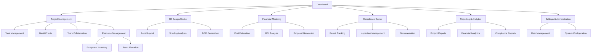

# NextGen Fusion Commercial Solar Platform - Product Requirements Document

## 1. Product Overview

NextGen Fusion is a comprehensive commercial solar platform that streamlines the entire solar project lifecycle from initial design through installation and maintenance. The platform serves solar installers, project managers, engineers, and compliance teams with integrated tools for design, project management, financial modeling, and regulatory compliance.

The platform addresses critical challenges in commercial solar deployment: complex project coordination, regulatory compliance across multiple jurisdictions, financial modeling accuracy, and real-time project tracking. Target market includes commercial solar installers, engineering firms, and project development companies managing portfolios worth $10M+ annually.

## 2. Core Features

### 2.1 User Roles

| Role | Registration Method | Core Permissions |
|------|---------------------|------------------|
| Project Manager | Email + company verification | Full project CRUD, team management, reporting |
| Solar Engineer | Invitation + certification verification | Design tools, technical calculations, BOM generation |
| Compliance Officer | Admin invitation + regulatory credentials | Compliance tracking, permit management, regulatory updates |
| Finance Analyst | Company admin invitation | Financial modeling, cost analysis, ROI calculations |
| Field Technician | Mobile app registration + supervisor approval | Task updates, photo uploads, progress reporting |
| System Administrator | Platform admin invitation | User management, system configuration, audit logs |

### 2.2 Feature Module

Our NextGen Fusion platform consists of the following main pages:

1. **Dashboard**: KPI overview, project status widgets, critical alerts, performance metrics
2. **Project Management**: Project creation, task tracking, Gantt charts, milestone management, team collaboration
3. **3D Design Studio**: Interactive solar panel layout, shading analysis, component selection, BOM generation
4. **Financial Modeling**: Cost estimation, financing options, ROI analysis, proposal generation
5. **Compliance Center**: Regulatory requirements, permit tracking, inspection scheduling, documentation
6. **Resource Management**: Equipment inventory, team allocation, scheduling, capacity planning
7. **Reporting & Analytics**: Performance dashboards, project analytics, financial reports, compliance status
8. **Settings & Administration**: User management, system configuration, integrations, audit logs

### 2.3 Page Details

| Page Name | Module Name | Feature Description |
|-----------|-------------|---------------------|
| Dashboard | KPI Overview | Display active projects count, revenue pipeline, completion rates, critical alerts |
| Dashboard | Project Status | Real-time project progress, upcoming milestones, overdue tasks, team workload |
| Dashboard | Performance Metrics | System efficiency, user activity, API response times, error rates |
| Project Management | Project CRUD | Create, read, update, delete projects with metadata, timelines, budgets |
| Project Management | Task Management | Task creation, assignment, status tracking, dependencies, priority levels |
| Project Management | Gantt Charts | Interactive timeline visualization, critical path analysis, resource allocation |
| Project Management | Team Collaboration | Comments, file sharing, notifications, activity feeds, @mentions |
| 3D Design Studio | Panel Layout | Drag-drop solar panel placement, automatic spacing, orientation optimization |
| 3D Design Studio | Shading Analysis | Real-time shadow calculations, seasonal analysis, performance impact assessment |
| 3D Design Studio | Component Library | Solar panels, inverters, mounting systems, electrical components with specifications |
| 3D Design Studio | BOM Generation | Automatic bill of materials, cost calculations, vendor integration |
| Financial Modeling | Cost Estimation | Labor, materials, permits, soft costs with regional adjustments |
| Financial Modeling | Financing Options | Loan, lease, PPA modeling with cash flow projections |
| Financial Modeling | ROI Analysis | Payback period, NPV, IRR calculations with sensitivity analysis |
| Financial Modeling | Proposal Generation | Professional proposals with financial projections, terms, conditions |
| Compliance Center | Regulatory Database | Jurisdiction-specific requirements, code updates, permit processes |
| Compliance Center | Permit Tracking | Application status, review timelines, approval notifications, renewal alerts |
| Compliance Center | Inspection Management | Schedule inspections, track results, manage corrections, final approvals |
| Compliance Center | Documentation | Store permits, certificates, inspection reports, compliance evidence |
| Resource Management | Equipment Inventory | Track panels, inverters, mounting hardware, tools, availability status |
| Resource Management | Team Allocation | Assign team members, track availability, skill matching, workload balancing |
| Resource Management | Scheduling | Project timelines, resource conflicts, capacity planning, optimization |
| Reporting & Analytics | Project Reports | Progress, budget variance, timeline analysis, risk assessment |
| Reporting & Analytics | Financial Analytics | Revenue tracking, cost analysis, profitability, cash flow projections |
| Reporting & Analytics | Compliance Reports | Permit status, inspection results, regulatory compliance scores |
| Settings | User Management | Add/remove users, role assignments, permissions, access control |
| Settings | System Configuration | API keys, integrations, notification preferences, data retention |
| Settings | Audit Logs | User activity tracking, system changes, security events, compliance trails |

## 3. Core Process

### Project Manager Flow
1. Create new commercial solar project with basic details (location, size, timeline)
2. Assign solar engineer for technical design and compliance officer for regulatory review
3. Monitor project progress through dashboard with real-time updates
4. Review and approve design proposals, financial models, and compliance documentation
5. Track project execution with Gantt charts, milestone tracking, and team collaboration
6. Generate client reports and manage project closure with final documentation

### Solar Engineer Flow
1. Access assigned project and review site requirements and constraints
2. Use 3D Design Studio to create optimal panel layout with shading analysis
3. Select appropriate components from integrated library with performance specifications
4. Generate detailed BOM with cost estimates and technical specifications
5. Collaborate with project manager on design iterations and client feedback
6. Provide technical support during installation and commissioning phases

### Compliance Officer Flow
1. Review project location and identify applicable regulatory requirements
2. Track permit applications and coordinate with local authorities
3. Schedule and manage inspections throughout project lifecycle
4. Maintain compliance documentation and evidence repository
5. Monitor regulatory changes and update project requirements accordingly
6. Generate compliance reports for stakeholders and audit purposes

## 4. User Interface Design

### 4.1 Design Style

**Color Palette:**
- Primary: Navy Blue (#1e3a8a) - Professional, trustworthy
- Secondary: Solar Orange (#f59e0b) - Energy, innovation
- Accent: Slate Gray (#64748b) - Modern, sophisticated
- Success: Green (#10b981) - Positive actions, completion
- Warning: Amber (#f59e0b) - Attention, caution
- Error: Red (#ef4444) - Critical issues, failures

**Typography:**
- Primary Font: Inter (clean, modern, highly readable)
- Headings: 24px, 20px, 18px, 16px (font-weight: 600)
- Body Text: 14px, 16px (font-weight: 400)
- Small Text: 12px (font-weight: 400)

**Button Styles:**
- Primary: Rounded corners (6px), solid navy background, white text
- Secondary: Outlined navy border, navy text, transparent background
- Tertiary: Text-only navy color, no background or border

**Layout Style:**
- Card-based design with subtle shadows and rounded corners
- Top navigation with breadcrumbs for deep navigation
- Sidebar navigation for main sections with collapsible sub-menus
- Grid-based responsive layout with 12-column system

**Icons & Imagery:**
- Heroicons for consistent iconography
- Solar-themed illustrations for empty states and onboarding
- High-contrast icons for accessibility compliance

### 4.2 Page Design Overview

| Page Name | Module Name | UI Elements |
|-----------|-------------|-------------|
| Dashboard | KPI Cards | Grid layout, metric cards with icons, color-coded status indicators, trend charts |
| Dashboard | Project Status | Table view with sortable columns, progress bars, status badges, action buttons |
| Dashboard | Quick Actions | Floating action button, modal dialogs, form validation, success notifications |
| Project Management | Project List | Data table with search, filters, pagination, bulk actions, export functionality |
| Project Management | Gantt Chart | Interactive timeline, drag-drop tasks, dependency lines, zoom controls |
| Project Management | Task Board | Kanban-style columns, draggable cards, assignee avatars, due date indicators |
| 3D Design Studio | Canvas Area | WebGL 3D viewport, toolbar overlay, property panels, layer controls |
| 3D Design Studio | Component Library | Searchable grid, category filters, drag-drop interaction, preview thumbnails |
| 3D Design Studio | Properties Panel | Collapsible sections, numeric inputs, dropdown selectors, real-time updates |
| Financial Modeling | Calculator Interface | Form-based inputs, real-time calculations, chart visualizations, export options |
| Financial Modeling | Results Dashboard | Summary cards, detailed tables, interactive charts, scenario comparisons |
| Compliance Center | Requirements Matrix | Expandable tree view, status indicators, document links, progress tracking |
| Compliance Center | Document Viewer | PDF viewer, annotation tools, version history, approval workflows |
| Resource Management | Calendar View | Monthly/weekly views, drag-drop scheduling, conflict indicators, availability overlay |
| Resource Management | Inventory Grid | Searchable table, stock levels, location tracking, reorder alerts |
| Reporting | Chart Dashboard | Interactive charts, filter controls, date range selectors, export functionality |
| Settings | Configuration Forms | Tabbed interface, form validation, save indicators, reset options |

### 4.3 Responsiveness

The platform is designed desktop-first with mobile-adaptive breakpoints:
- Desktop: 1200px+ (full feature set)
- Tablet: 768px-1199px (condensed navigation, stacked layouts)
- Mobile: <768px (bottom navigation, simplified views, touch-optimized)

Touch interaction optimization includes:
- Minimum 44px touch targets
- Swipe gestures for navigation
- Pull-to-refresh functionality
- Haptic feedback for mobile devices
- Offline capability for field operations