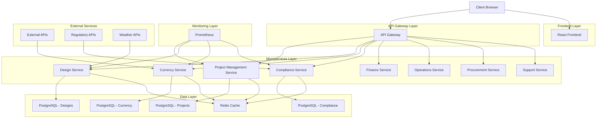
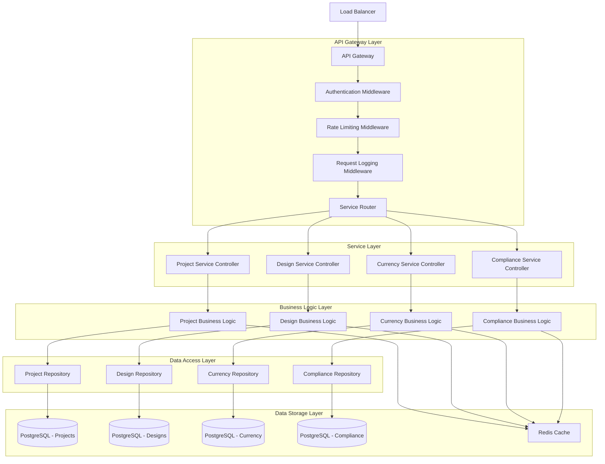
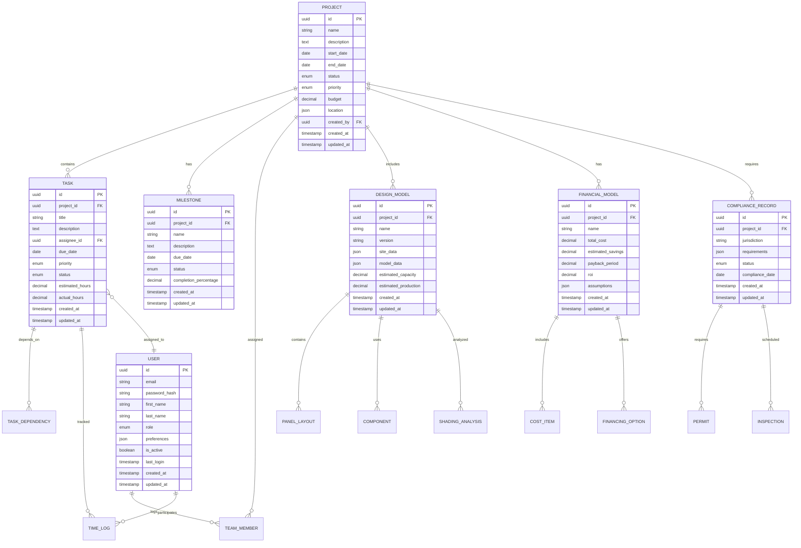

# NextGen Fusion Commercial Solar Platform - Technical Architecture Document

## 1. Architecture Design



## 2. Technology Description

**Frontend:**
- React@18 + TypeScript@5 + Vite@5
- Tailwind CSS@3 + Headless UI
- Zustand for state management
- React Query for API state
- Three.js for 3D visualization
- Chart.js for data visualization

**Backend Services:**
- FastAPI@0.104+ (Python 3.11+)
- SQLAlchemy@2.0+ with Alembic migrations
- Redis@7+ for caching and sessions
- Prometheus@2.45+ for metrics
- Pydantic@2+ for data validation

**Infrastructure:**
- PostgreSQL@15+ (primary database)
- Redis@7+ (cache and message broker)
- Docker + Docker Compose
- Kubernetes for production
- GitHub Actions for CI/CD

**Monitoring & Observability:**
- Prometheus + Grafana
- Structured JSON logging
- OpenTelemetry for distributed tracing
- Sentry for error tracking

## 3. Route Definitions

### Frontend Routes

| Route | Purpose | Authentication Required |
|-------|---------|------------------------|
| / | Landing page and authentication | No |
| /dashboard | Main dashboard with KPIs and project overview | Yes |
| /projects | Project list and management | Yes |
| /projects/:id | Individual project details | Yes |
| /projects/:id/tasks | Project task management | Yes |
| /projects/:id/gantt | Gantt chart view | Yes |
| /design | 3D design studio landing | Yes |
| /design/:projectId | Project-specific design workspace | Yes |
| /finance | Financial modeling dashboard | Yes |
| /finance/:projectId | Project financial analysis | Yes |
| /compliance | Compliance center dashboard | Yes |
| /compliance/:jurisdiction | Jurisdiction-specific requirements | Yes |
| /resources | Resource management dashboard | Yes |
| /resources/inventory | Equipment inventory management | Yes |
| /resources/team | Team allocation and scheduling | Yes |
| /reports | Reporting and analytics dashboard | Yes |
| /settings | User and system settings | Yes |
| /admin | Administrative functions | Admin only |

## 4. API Definitions

### 4.1 Project Management Service API

**Base URL:** `/api/v1/projects`

#### Project Operations

```
GET /api/v1/projects
```
Request:
| Param Name | Param Type | Required | Description |
|------------|------------|----------|-------------|
| page | integer | false | Page number (default: 1) |
| limit | integer | false | Items per page (default: 20) |
| status | string | false | Filter by project status |
| search | string | false | Search in name/description |

Response:
| Param Name | Param Type | Description |
|------------|------------|-------------|
| projects | array | List of project objects |
| total | integer | Total number of projects |
| page | integer | Current page number |
| pages | integer | Total number of pages |

```
POST /api/v1/projects
```
Request:
| Param Name | Param Type | Required | Description |
|------------|------------|----------|-------------|
| name | string | true | Project name |
| description | string | false | Project description |
| start_date | string | true | Start date (ISO 8601) |
| end_date | string | true | End date (ISO 8601) |
| status | string | true | Project status (planning, active, completed) |
| priority | string | true | Priority level (low, medium, high, critical) |
| budget | number | false | Project budget |
| location | object | false | Project location details |

Response:
| Param Name | Param Type | Description |
|------------|------------|-------------|
| id | string | Project UUID |
| name | string | Project name |
| status | string | Current status |
| created_at | string | Creation timestamp |

#### Task Operations

```
GET /api/v1/projects/{project_id}/tasks
```

```
POST /api/v1/projects/{project_id}/tasks
```
Request:
| Param Name | Param Type | Required | Description |
|------------|------------|----------|-------------|
| title | string | true | Task title |
| description | string | false | Task description |
| assignee_id | string | false | Assigned user ID |
| due_date | string | false | Due date (ISO 8601) |
| priority | string | true | Task priority |
| status | string | true | Task status |
| estimated_hours | number | false | Estimated work hours |
| dependencies | array | false | List of dependent task IDs |

#### Critical Path Analysis

```
GET /api/v1/projects/{project_id}/critical-path
```
Response:
| Param Name | Param Type | Description |
|------------|------------|-------------|
| critical_tasks | array | Tasks on critical path |
| total_duration | number | Project duration in days |
| slack_time | object | Slack time for non-critical tasks |
| calculated_at | string | Calculation timestamp |

### 4.2 Design Service API

**Base URL:** `/api/v1/design`

#### 3D Model Operations

```
GET /api/v1/design/projects/{project_id}/models
```

```
POST /api/v1/design/projects/{project_id}/models
```
Request:
| Param Name | Param Type | Required | Description |
|------------|------------|----------|-------------|
| name | string | true | Model name |
| site_data | object | true | Site dimensions and constraints |
| panel_layout | array | true | Solar panel positions |
| components | array | true | Selected components |

#### Shading Analysis

```
POST /api/v1/design/shading-analysis
```
Request:
| Param Name | Param Type | Required | Description |
|------------|------------|----------|-------------|
| latitude | number | true | Site latitude |
| longitude | number | true | Site longitude |
| panel_positions | array | true | Panel coordinates |
| obstacles | array | false | Shading obstacles |
| analysis_date | string | false | Specific date for analysis |

Response:
| Param Name | Param Type | Description |
|------------|------------|-------------|
| shading_report | object | Detailed shading analysis |
| energy_loss | number | Percentage energy loss |
| recommendations | array | Optimization suggestions |

### 4.3 Currency Service API

**Base URL:** `/api/v1/currency`

```
GET /api/v1/currency/rates
```
Request:
| Param Name | Param Type | Required | Description |
|------------|------------|----------|-------------|
| base | string | false | Base currency (default: USD) |
| symbols | string | false | Comma-separated target currencies |

Response:
| Param Name | Param Type | Description |
|------------|------------|-------------|
| base | string | Base currency code |
| rates | object | Exchange rates |
| timestamp | string | Rate timestamp |

```
POST /api/v1/currency/convert
```
Request:
| Param Name | Param Type | Required | Description |
|------------|------------|----------|-------------|
| amount | number | true | Amount to convert |
| from | string | true | Source currency |
| to | string | true | Target currency |

### 4.4 Compliance Service API

**Base URL:** `/api/v1/compliance`

```
GET /api/v1/compliance/requirements/{jurisdiction}
```
Response:
| Param Name | Param Type | Description |
|------------|------------|-------------|
| jurisdiction | string | Jurisdiction code |
| requirements | array | List of compliance requirements |
| permits | array | Required permits |
| inspections | array | Required inspections |
| updated_at | string | Last update timestamp |

```
POST /api/v1/compliance/permits
```
Request:
| Param Name | Param Type | Required | Description |
|------------|------------|----------|-------------|
| project_id | string | true | Associated project ID |
| permit_type | string | true | Type of permit |
| jurisdiction | string | true | Issuing jurisdiction |
| application_data | object | true | Permit application details |

## 5. Server Architecture Diagram



## 6. Data Model

### 6.1 Data Model Definition



### 6.2 Data Definition Language

#### Projects Table
```sql
-- Create projects table
CREATE TABLE projects (
    id UUID PRIMARY KEY DEFAULT gen_random_uuid(),
    name VARCHAR(255) NOT NULL,
    description TEXT,
    start_date DATE NOT NULL,
    end_date DATE NOT NULL,
    status VARCHAR(20) DEFAULT 'planning' CHECK (status IN ('planning', 'active', 'on_hold', 'completed', 'cancelled')),
    priority VARCHAR(20) DEFAULT 'medium' CHECK (priority IN ('low', 'medium', 'high', 'critical')),
    budget DECIMAL(15,2),
    location JSONB,
    created_by UUID NOT NULL,
    created_at TIMESTAMP WITH TIME ZONE DEFAULT NOW(),
    updated_at TIMESTAMP WITH TIME ZONE DEFAULT NOW()
);

-- Create indexes
CREATE INDEX idx_projects_status ON projects(status);
CREATE INDEX idx_projects_priority ON projects(priority);
CREATE INDEX idx_projects_created_by ON projects(created_by);
CREATE INDEX idx_projects_dates ON projects(start_date, end_date);
CREATE INDEX idx_projects_location ON projects USING GIN(location);
```

#### Tasks Table
```sql
-- Create tasks table
CREATE TABLE tasks (
    id UUID PRIMARY KEY DEFAULT gen_random_uuid(),
    project_id UUID NOT NULL REFERENCES projects(id) ON DELETE CASCADE,
    title VARCHAR(255) NOT NULL,
    description TEXT,
    assignee_id UUID,
    due_date DATE,
    priority VARCHAR(20) DEFAULT 'medium' CHECK (priority IN ('low', 'medium', 'high', 'critical')),
    status VARCHAR(20) DEFAULT 'todo' CHECK (status IN ('todo', 'in_progress', 'review', 'completed', 'cancelled')),
    estimated_hours DECIMAL(8,2),
    actual_hours DECIMAL(8,2) DEFAULT 0,
    created_at TIMESTAMP WITH TIME ZONE DEFAULT NOW(),
    updated_at TIMESTAMP WITH TIME ZONE DEFAULT NOW()
);

-- Create indexes
CREATE INDEX idx_tasks_project_id ON tasks(project_id);
CREATE INDEX idx_tasks_assignee_id ON tasks(assignee_id);
CREATE INDEX idx_tasks_status ON tasks(status);
CREATE INDEX idx_tasks_due_date ON tasks(due_date);
CREATE INDEX idx_tasks_priority ON tasks(priority);
```

#### Task Dependencies Table
```sql
-- Create task dependencies table
CREATE TABLE task_dependencies (
    id UUID PRIMARY KEY DEFAULT gen_random_uuid(),
    task_id UUID NOT NULL REFERENCES tasks(id) ON DELETE CASCADE,
    depends_on_task_id UUID NOT NULL REFERENCES tasks(id) ON DELETE CASCADE,
    dependency_type VARCHAR(20) DEFAULT 'finish_to_start' CHECK (dependency_type IN ('finish_to_start', 'start_to_start', 'finish_to_finish', 'start_to_finish')),
    lag_days INTEGER DEFAULT 0,
    created_at TIMESTAMP WITH TIME ZONE DEFAULT NOW(),
    UNIQUE(task_id, depends_on_task_id)
);

-- Create indexes
CREATE INDEX idx_task_dependencies_task_id ON task_dependencies(task_id);
CREATE INDEX idx_task_dependencies_depends_on ON task_dependencies(depends_on_task_id);
```

#### Users Table
```sql
-- Create users table
CREATE TABLE users (
    id UUID PRIMARY KEY DEFAULT gen_random_uuid(),
    email VARCHAR(255) UNIQUE NOT NULL,
    password_hash VARCHAR(255) NOT NULL,
    first_name VARCHAR(100) NOT NULL,
    last_name VARCHAR(100) NOT NULL,
    role VARCHAR(50) DEFAULT 'user' CHECK (role IN ('admin', 'project_manager', 'engineer', 'compliance_officer', 'finance_analyst', 'technician', 'user')),
    preferences JSONB DEFAULT '{}',
    is_active BOOLEAN DEFAULT true,
    last_login TIMESTAMP WITH TIME ZONE,
    created_at TIMESTAMP WITH TIME ZONE DEFAULT NOW(),
    updated_at TIMESTAMP WITH TIME ZONE DEFAULT NOW()
);

-- Create indexes
CREATE INDEX idx_users_email ON users(email);
CREATE INDEX idx_users_role ON users(role);
CREATE INDEX idx_users_is_active ON users(is_active);
```

#### Design Models Table
```sql
-- Create design_models table
CREATE TABLE design_models (
    id UUID PRIMARY KEY DEFAULT gen_random_uuid(),
    project_id UUID NOT NULL REFERENCES projects(id) ON DELETE CASCADE,
    name VARCHAR(255) NOT NULL,
    version VARCHAR(50) DEFAULT '1.0',
    site_data JSONB NOT NULL,
    model_data JSONB NOT NULL,
    estimated_capacity DECIMAL(10,2),
    estimated_production DECIMAL(12,2),
    created_at TIMESTAMP WITH TIME ZONE DEFAULT NOW(),
    updated_at TIMESTAMP WITH TIME ZONE DEFAULT NOW()
);

-- Create indexes
CREATE INDEX idx_design_models_project_id ON design_models(project_id);
CREATE INDEX idx_design_models_name ON design_models(name);
CREATE INDEX idx_design_models_site_data ON design_models USING GIN(site_data);
```

#### Initial Data
```sql
-- Insert default admin user
INSERT INTO users (email, password_hash, first_name, last_name, role) VALUES
('admin@nextgenfusion.com', '$2b$12$LQv3c1yqBWVHxkd0LHAkCOYz6TtxMQJqhN8/LewdBPj/RK.s5uO9G', 'System', 'Administrator', 'admin');

-- Insert sample project statuses and priorities
INSERT INTO projects (name, description, start_date, end_date, status, priority, budget, created_by) VALUES
('Alpha Solar Installation', 'Commercial rooftop installation for Alpha Corp', '2024-02-01', '2024-05-01', 'planning', 'high', 250000.00, (SELECT id FROM users WHERE email = 'admin@nextgenfusion.com')),
('Beta Energy Center', 'Ground-mount solar farm for Beta Industries', '2024-03-15', '2024-08-15', 'planning', 'critical', 1500000.00, (SELECT id FROM users WHERE email = 'admin@nextgenfusion.com'));
```