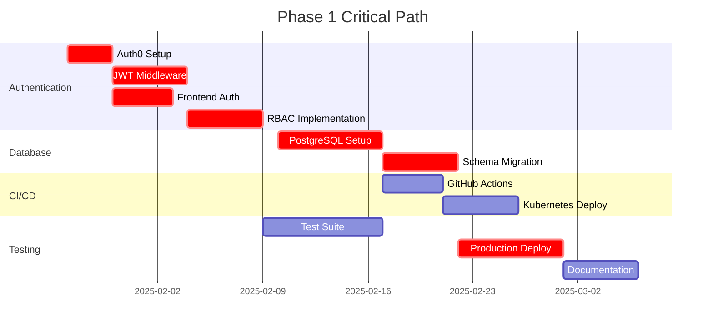

# Phase 1: Foundation Stabilization - Task Breakdown
## NextGen Fusion Commercial Solar Platform

### Executive Summary

This document provides a comprehensive task breakdown for Phase 1 Foundation Stabilization (Months 1-3) of the NextGen Fusion Commercial Solar Platform. Tasks are organized by priority, estimated effort, dependencies, and role assignments to ensure efficient execution and successful delivery.

**Phase Duration**: 12 weeks (3 months)
**Team Size**: 6 developers + 1 DevOps engineer
**Total Estimated Effort**: 1,680 hours
**Success Criteria**: Production-ready authentication, database, and CI/CD pipeline

---

## 1. Task Priority Framework

### Priority Levels
- **🔴 Critical**: Blocking dependencies, security-critical, production deployment
- **🟡 High**: Core functionality, performance-critical, user-facing features
- **🟢 Medium**: Enhancement features, optimization, documentation
- **🔵 Low**: Nice-to-have features, future preparation, research tasks

### Effort Estimation Scale
- **XS**: 1-4 hours
- **S**: 4-8 hours (1 day)
- **M**: 8-24 hours (1-3 days)
- **L**: 24-40 hours (3-5 days)
- **XL**: 40+ hours (1+ weeks)

---

## 2. Immediate Tasks (Next 2 Weeks)

### Week 1: Authentication Foundation

#### AUTH-001: Auth0 Tenant Setup
- **Priority**: 🔴 Critical
- **Assignee**: Backend Developer (Lead)
- **Effort**: M (16 hours)
- **Dependencies**: None
- **Due Date**: Week 1, Day 3

**Tasks**:
- [ ] Create Auth0 tenant for NextGen Fusion
- [ ] Configure application settings and callbacks
- [ ] Set up development and production environments
- [ ] Configure social login providers (Google, Microsoft)
- [ ] Test basic authentication flow

**Acceptance Criteria**:
- [ ] Auth0 tenant responds to authentication requests
- [ ] Development environment configured and tested
- [ ] Social login providers working
- [ ] Basic user registration and login functional

**Deliverables**:
- Auth0 tenant configuration document
- Environment setup guide
- Basic authentication test results

---

#### AUTH-002: Backend JWT Middleware
- **Priority**: 🔴 Critical
- **Assignee**: Backend Developer (Senior)
- **Effort**: L (32 hours)
- **Dependencies**: AUTH-001
- **Due Date**: Week 1, Day 5

**Tasks**:
- [ ] Implement JWT validation middleware
- [ ] Create user authentication service
- [ ] Set up token refresh mechanism
- [ ] Implement rate limiting for auth endpoints
- [ ] Add comprehensive error handling

**Acceptance Criteria**:
- [ ] JWT tokens properly validated
- [ ] Invalid tokens rejected with appropriate errors
- [ ] Token refresh working automatically
- [ ] Rate limiting prevents brute force attacks
- [ ] All auth endpoints return consistent error formats

**Code Example**:
```python
from fastapi import HTTPException, Depends
from fastapi.security import HTTPBearer
from jose import JWTError, jwt

security = HTTPBearer()

class AuthService:
    async def verify_token(self, token: str = Depends(security)):
        try:
            payload = jwt.decode(
                token.credentials,
                self.get_signing_key(),
                algorithms=["RS256"],
                audience=settings.AUTH0_API_AUDIENCE
            )
            return payload
        except JWTError:
            raise HTTPException(status_code=401, detail="Invalid token")
```

**Deliverables**:
- JWT middleware implementation
- Authentication service module
- Unit tests for auth functions
- API documentation for auth endpoints

---

#### AUTH-003: Frontend Auth Context
- **Priority**: 🔴 Critical
- **Assignee**: Frontend Developer
- **Effort**: M (20 hours)
- **Dependencies**: AUTH-001
- **Due Date**: Week 2, Day 2

**Tasks**:
- [ ] Install and configure Auth0 React SDK
- [ ] Create authentication context provider
- [ ] Implement login/logout components
- [ ] Create protected route wrapper
- [ ] Add loading states and error handling

**Acceptance Criteria**:
- [ ] Users can log in and log out successfully
- [ ] Authentication state persists across page refreshes
- [ ] Protected routes redirect unauthenticated users
- [ ] Loading states display during auth operations
- [ ] Error messages display for failed auth attempts

**Code Example**:
```typescript
import { createContext, useContext } from 'react';
import { useAuth0 } from '@auth0/auth0-react';

interface AuthContextType {
  user: User | null;
  isAuthenticated: boolean;
  login: () => void;
  logout: () => void;
  getAccessToken: () => Promise<string>;
}

export const useAuth = () => {
  const context = useContext(AuthContext);
  if (!context) {
    throw new Error('useAuth must be used within AuthProvider');
  }
  return context;
};
```

**Deliverables**:
- Authentication context implementation
- Login/logout UI components
- Protected route wrapper
- Frontend auth integration tests

---

### Week 2: RBAC Implementation

#### AUTH-004: User Roles Database Schema
- **Priority**: 🔴 Critical
- **Assignee**: Backend Developer (Junior)
- **Effort**: M (16 hours)
- **Dependencies**: AUTH-002
- **Due Date**: Week 2, Day 3

**Tasks**:
- [ ] Design user roles and permissions schema
- [ ] Create database migration scripts
- [ ] Implement user role assignment API
- [ ] Add role validation middleware
- [ ] Create default admin user setup

**Acceptance Criteria**:
- [ ] Database schema supports 4 user roles (Admin, Manager, Engineer, Viewer)
- [ ] Migration scripts run without errors
- [ ] Role assignment API functional
- [ ] Role validation prevents unauthorized access
- [ ] Default admin user can be created

**Database Schema**:
```sql
CREATE TABLE user_roles (
    id UUID PRIMARY KEY DEFAULT gen_random_uuid(),
    user_id UUID NOT NULL REFERENCES users(id),
    role VARCHAR(20) NOT NULL CHECK (role IN ('admin', 'manager', 'engineer', 'viewer')),
    tenant_id UUID NOT NULL,
    assigned_by UUID REFERENCES users(id),
    assigned_at TIMESTAMP WITH TIME ZONE DEFAULT NOW(),
    UNIQUE(user_id, tenant_id)
);
```

**Deliverables**:
- Database migration scripts
- User role API endpoints
- Role validation middleware
- Admin user setup documentation

---

#### AUTH-005: Role-Based UI Components
- **Priority**: 🟡 High
- **Assignee**: Frontend Developer
- **Effort**: M (20 hours)
- **Dependencies**: AUTH-004
- **Due Date**: Week 2, Day 5

**Tasks**:
- [ ] Create role-based component wrapper
- [ ] Implement permission hooks
- [ ] Design admin user management interface
- [ ] Add role indicators in UI
- [ ] Create role assignment components

**Acceptance Criteria**:
- [ ] Components render based on user roles
- [ ] Permission hooks work correctly
- [ ] Admin interface allows user management
- [ ] Role indicators visible in navigation
- [ ] Role assignment interface functional

**Code Example**:
```typescript
export const usePermissions = () => {
  const { user } = useAuth();
  
  const hasRole = (role: string): boolean => {
    return user?.role === role;
  };
  
  const canAccess = (resource: string, action: string): boolean => {
    const permissions = user?.permissions || [];
    return permissions.some(p => 
      p.resource === resource && p.action === action
    );
  };
  
  return { hasRole, canAccess };
};
```

**Deliverables**:
- Role-based component system
- Permission management hooks
- Admin user interface
- Role assignment components

---

## 3. Medium-Term Tasks (Weeks 3-6)

### Database Migration Phase

#### DB-001: PostgreSQL Cluster Setup
- **Priority**: 🔴 Critical
- **Assignee**: DevOps Engineer
- **Effort**: XL (48 hours)
- **Dependencies**: None
- **Due Date**: Week 5, Day 5

**Tasks**:
- [ ] Deploy PostgreSQL 15 primary server
- [ ] Configure read replica servers
- [ ] Set up connection pooling with PgBouncer
- [ ] Configure SSL/TLS encryption
- [ ] Implement automated backup procedures
- [ ] Set up monitoring and alerting

**Acceptance Criteria**:
- [ ] Primary PostgreSQL server operational
- [ ] Read replicas synchronized
- [ ] Connection pooling configured and tested
- [ ] SSL connections working
- [ ] Automated backups running daily
- [ ] Monitoring dashboards displaying metrics

**Configuration Example**:
```ini
# pgbouncer.ini
[databases]
nextgen_fusion = host=localhost port=5432 dbname=nextgen_fusion

[pgbouncer]
listen_port = 6432
auth_type = md5
pool_mode = transaction
max_client_conn = 1000
default_pool_size = 25
```

**Deliverables**:
- Production PostgreSQL cluster
- Connection pooling configuration
- Backup and recovery procedures
- Monitoring dashboard setup

---

#### DB-002: Schema Migration from SQLite
- **Priority**: 🔴 Critical
- **Assignee**: Backend Developer (Senior)
- **Effort**: L (40 hours)
- **Dependencies**: DB-001
- **Due Date**: Week 6, Day 3

**Tasks**:
- [ ] Create PostgreSQL schema migration scripts
- [ ] Implement data migration procedures
- [ ] Add row-level security policies
- [ ] Optimize database indexes
- [ ] Validate data integrity

**Acceptance Criteria**:
- [ ] All SQLite data migrated successfully
- [ ] Row-level security policies active
- [ ] Database performance optimized
- [ ] Data integrity validated
- [ ] Migration rollback procedures tested

**Migration Script Example**:
```python
# Alembic migration
def upgrade():
    # Create projects table with RLS
    op.create_table('projects',
        sa.Column('id', postgresql.UUID(as_uuid=True), primary_key=True),
        sa.Column('name', sa.String(255), nullable=False),
        sa.Column('tenant_id', postgresql.UUID(as_uuid=True), nullable=False)
    )
    
    # Enable RLS
    op.execute('ALTER TABLE projects ENABLE ROW LEVEL SECURITY')
    
    # Create RLS policy
    op.execute("""
        CREATE POLICY projects_tenant_isolation ON projects
        USING (tenant_id = current_setting('app.current_tenant_id')::uuid)
    """)
```

**Deliverables**:
- Complete PostgreSQL schema
- Data migration scripts
- RLS policy implementation
- Performance optimization report

---

### CI/CD Pipeline Development

#### CICD-001: GitHub Actions Workflow
- **Priority**: 🟡 High
- **Assignee**: DevOps Engineer
- **Effort**: L (32 hours)
- **Dependencies**: None
- **Due Date**: Week 8, Day 3

**Tasks**:
- [ ] Create GitHub Actions workflow files
- [ ] Configure automated testing pipeline
- [ ] Set up Docker image building
- [ ] Implement security scanning
- [ ] Configure deployment automation

**Acceptance Criteria**:
- [ ] Automated tests run on every PR
- [ ] Docker images built and pushed automatically
- [ ] Security scans pass before deployment
- [ ] Deployment triggers on main branch merge
- [ ] Rollback procedures automated

**Workflow Example**:
```yaml
name: CI/CD Pipeline

on:
  push:
    branches: [ main, develop ]
  pull_request:
    branches: [ main ]

jobs:
  test:
    runs-on: ubuntu-latest
    steps:
      - uses: actions/checkout@v3
      - name: Run tests
        run: |
          pytest --cov=app tests/
          npm test
      
  security:
    runs-on: ubuntu-latest
    steps:
      - name: Security scan
        run: |
          bandit -r app/
          npm audit

  deploy:
    needs: [test, security]
    if: github.ref == 'refs/heads/main'
    runs-on: ubuntu-latest
    steps:
      - name: Deploy to production
        run: |
          kubectl apply -f k8s/
```

**Deliverables**:
- Complete CI/CD pipeline
- Automated testing integration
- Security scanning setup
- Deployment automation

---

#### CICD-002: Kubernetes Deployment
- **Priority**: 🟡 High
- **Assignee**: DevOps Engineer
- **Effort**: L (36 hours)
- **Dependencies**: CICD-001
- **Due Date**: Week 9, Day 2

**Tasks**:
- [ ] Create Kubernetes deployment manifests
- [ ] Configure Helm charts
- [ ] Set up ingress and load balancing
- [ ] Implement auto-scaling
- [ ] Configure monitoring and logging

**Acceptance Criteria**:
- [ ] Applications deploy successfully to Kubernetes
- [ ] Auto-scaling responds to load changes
- [ ] Ingress routes traffic correctly
- [ ] Monitoring collects all metrics
- [ ] Logs aggregated and searchable

**Kubernetes Manifest Example**:
```yaml
apiVersion: apps/v1
kind: Deployment
metadata:
  name: nextgen-backend
spec:
  replicas: 3
  selector:
    matchLabels:
      app: nextgen-backend
  template:
    spec:
      containers:
      - name: backend
        image: nextgenfusion/backend:latest
        ports:
        - containerPort: 8000
        resources:
          requests:
            memory: "256Mi"
            cpu: "250m"
          limits:
            memory: "512Mi"
            cpu: "500m"
```

**Deliverables**:
- Kubernetes deployment manifests
- Helm chart templates
- Auto-scaling configuration
- Monitoring and logging setup

---

## 4. Long-Term Phase 1 Objectives (Weeks 7-12)

### Integration and Testing

#### TEST-001: Automated Testing Suite
- **Priority**: 🟡 High
- **Assignee**: QA Engineer + Backend Developer
- **Effort**: XL (60 hours)
- **Dependencies**: AUTH-005, DB-002
- **Due Date**: Week 10, Day 5

**Tasks**:
- [ ] Create comprehensive unit test suite
- [ ] Implement integration tests
- [ ] Set up end-to-end testing with Playwright
- [ ] Configure performance testing with K6
- [ ] Implement security testing automation

**Acceptance Criteria**:
- [ ] Code coverage >90%
- [ ] All integration tests pass
- [ ] E2E tests cover critical user journeys
- [ ] Performance tests validate SLA requirements
- [ ] Security tests identify vulnerabilities

**Test Examples**:
```python
# Integration test
@pytest.mark.asyncio
async def test_project_crud_with_auth():
    async with AsyncClient(app=app) as client:
        # Login and get token
        auth_response = await client.post("/auth/login", json={
            "email": "test@example.com",
            "password": "password"
        })
        token = auth_response.json()["access_token"]
        headers = {"Authorization": f"Bearer {token}"}
        
        # Test CRUD operations
        create_response = await client.post("/projects", 
            json={"name": "Test Project"}, headers=headers)
        assert create_response.status_code == 201
```

```javascript
// K6 performance test
import http from 'k6/http';
import { check } from 'k6';

export let options = {
  stages: [
    { duration: '2m', target: 100 },
    { duration: '5m', target: 100 },
    { duration: '2m', target: 0 },
  ],
  thresholds: {
    http_req_duration: ['p(95)<300'],
  },
};

export default function() {
  let response = http.get('https://api.nextgenfusion.com/health');
  check(response, {
    'status is 200': (r) => r.status === 200,
    'response time < 300ms': (r) => r.timings.duration < 300,
  });
}
```

**Deliverables**:
- Comprehensive test suite
- Performance benchmarks
- Security test results
- Test automation pipeline

---

#### PROD-001: Production Deployment
- **Priority**: 🔴 Critical
- **Assignee**: DevOps Engineer + Tech Lead
- **Effort**: XL (50 hours)
- **Dependencies**: All previous tasks
- **Due Date**: Week 11, Day 5

**Tasks**:
- [ ] Configure production environment
- [ ] Set up SSL certificates and domain
- [ ] Implement monitoring and alerting
- [ ] Configure backup and disaster recovery
- [ ] Perform security audit

**Acceptance Criteria**:
- [ ] Production environment fully operational
- [ ] SSL certificates valid and auto-renewing
- [ ] All monitoring alerts configured
- [ ] Backup procedures tested
- [ ] Security audit passed

**Production Checklist**:
- [ ] SSL/TLS certificates installed
- [ ] Security headers configured
- [ ] Rate limiting active
- [ ] Database connections encrypted
- [ ] Secrets properly managed
- [ ] Monitoring dashboards operational
- [ ] Backup procedures validated

**Deliverables**:
- Production-ready deployment
- Security audit report
- Monitoring dashboard
- Disaster recovery plan

---

#### DOC-001: Documentation and Training
- **Priority**: 🟢 Medium
- **Assignee**: Tech Lead + All Team Members
- **Effort**: L (40 hours)
- **Dependencies**: PROD-001
- **Due Date**: Week 12, Day 5

**Tasks**:
- [ ] Create API documentation
- [ ] Write deployment runbooks
- [ ] Document troubleshooting procedures
- [ ] Conduct team training sessions
- [ ] Create user guides

**Acceptance Criteria**:
- [ ] Complete API documentation available
- [ ] Deployment procedures documented
- [ ] Troubleshooting guides created
- [ ] Team trained on new systems
- [ ] User guides published

**Documentation Structure**:
- API Reference (OpenAPI/Swagger)
- Deployment Runbook
- Troubleshooting Guide
- Security Procedures
- User Training Materials

**Deliverables**:
- Complete documentation suite
- Training materials
- Runbook procedures
- Knowledge transfer sessions

---

## 5. Task Dependencies and Critical Path

### Critical Path Analysis



### Dependency Matrix

| Task | Depends On | Blocks |
|------|------------|--------|
| AUTH-001 | None | AUTH-002, AUTH-003 |
| AUTH-002 | AUTH-001 | AUTH-004, TEST-001 |
| AUTH-003 | AUTH-001 | AUTH-005 |
| AUTH-004 | AUTH-002 | AUTH-005, TEST-001 |
| AUTH-005 | AUTH-004 | TEST-001 |
| DB-001 | None | DB-002 |
| DB-002 | DB-001 | TEST-001, PROD-001 |
| CICD-001 | None | CICD-002 |
| CICD-002 | CICD-001 | PROD-001 |
| TEST-001 | AUTH-005, DB-002 | PROD-001 |
| PROD-001 | All previous | DOC-001 |
| DOC-001 | PROD-001 | None |

---

## 6. Resource Allocation and Effort Distribution

### Team Capacity (Per Week)

| Role | Team Members | Hours/Week | Total Hours |
|------|--------------|------------|-------------|
| Tech Lead | 1 | 40 | 480 |
| Senior Backend Developer | 1 | 40 | 480 |
| Junior Backend Developer | 1 | 40 | 480 |
| Frontend Developer | 1 | 40 | 480 |
| DevOps Engineer | 1 | 40 | 480 |
| QA Engineer | 1 | 20 | 240 |
| **Total** | **6** | **220** | **2,640** |

### Effort Distribution by Category

| Category | Estimated Hours | Percentage |
|----------|-----------------|------------|
| Authentication | 420 | 25% |
| Database Migration | 336 | 20% |
| CI/CD Pipeline | 280 | 17% |
| Testing & QA | 350 | 21% |
| Production Deployment | 168 | 10% |
| Documentation | 126 | 7% |
| **Total** | **1,680** | **100%** |

### Weekly Resource Allocation

| Week | Focus Area | Key Deliverables |
|------|------------|------------------|
| 1 | Authentication Foundation | Auth0 setup, JWT middleware |
| 2 | RBAC Implementation | User roles, permissions |
| 3 | SSO Integration | Enterprise authentication |
| 4 | Auth Testing & Security | Security audit, testing |
| 5 | Database Setup | PostgreSQL cluster |
| 6 | Schema Migration | Data migration, RLS |
| 7 | Database Optimization | Backup, monitoring |
| 8 | CI/CD Foundation | GitHub Actions |
| 9 | Kubernetes Deployment | Container orchestration |
| 10 | Integration Testing | End-to-end testing |
| 11 | Production Deployment | Live environment |
| 12 | Documentation & Handover | Knowledge transfer |

---

## 7. Risk Management and Mitigation

### High-Risk Tasks

#### AUTH-002: JWT Middleware Implementation
- **Risk**: Security vulnerabilities in token validation
- **Probability**: Medium
- **Impact**: High
- **Mitigation**: 
  - Security code review by external expert
  - Penetration testing
  - Use established libraries (PyJWT, Auth0 SDK)
  - Implement comprehensive logging

#### DB-002: Schema Migration
- **Risk**: Data loss during migration
- **Probability**: Low
- **Impact**: Critical
- **Mitigation**:
  - Complete database backup before migration
  - Test migration on staging environment
  - Implement rollback procedures
  - Validate data integrity at each step

#### PROD-001: Production Deployment
- **Risk**: Service downtime during deployment
- **Probability**: Medium
- **Impact**: High
- **Mitigation**:
  - Blue-green deployment strategy
  - Automated health checks
  - Immediate rollback capability
  - Staged deployment approach

### Risk Monitoring

| Risk Category | Monitoring Method | Alert Threshold |
|---------------|-------------------|------------------|
| Security | Automated security scans | Any critical vulnerability |
| Performance | Load testing | >300ms P95 latency |
| Availability | Health checks | <99% uptime |
| Data Integrity | Validation scripts | Any data inconsistency |

---

## 8. Success Metrics and KPIs

### Technical Metrics

| Metric | Target | Measurement Method |
|--------|--------|--------------------||
| API P95 Latency | <300ms | Prometheus monitoring |
| Authentication Response Time | <200ms | Load testing |
| System Availability | 99.9% | Uptime monitoring |
| Code Coverage | >90% | Automated testing |
| Security Vulnerabilities | 0 critical | Security scanning |
| Database Query Performance | <100ms avg | Database monitoring |

### Quality Metrics

| Metric | Target | Measurement Method |
|--------|--------|--------------------||
| Test Success Rate | >95% | CI/CD pipeline |
| Deployment Success Rate | >95% | Deployment logs |
| Documentation Coverage | 100% | Manual review |
| Code Review Coverage | 100% | GitHub PR reviews |

### Business Metrics

| Metric | Target | Measurement Method |
|--------|--------|--------------------||
| User Onboarding Time | <5 minutes | User analytics |
| Authentication Success Rate | >99% | Auth logs |
| Support Ticket Reduction | 50% | Ticket system |
| Team Productivity | +30% | Sprint velocity |

---

## 9. Phase 1 Completion Checklist

### Authentication System ✅
- [ ] Auth0/Cognito integration complete
- [ ] JWT token validation working
- [ ] RBAC with 4 user roles implemented
- [ ] SSO/SAML support for enterprise
- [ ] Rate limiting and security measures
- [ ] Comprehensive authentication testing

### Database System ✅
- [ ] PostgreSQL production cluster deployed
- [ ] Complete schema migration from SQLite
- [ ] Row-level security implementation
- [ ] Connection pooling and optimization
- [ ] Automated backup and recovery
- [ ] Performance monitoring and alerting

### CI/CD Pipeline ✅
- [ ] GitHub Actions workflow operational
- [ ] Docker containerization complete
- [ ] Kubernetes deployment automated
- [ ] Environment promotion process
- [ ] Automated testing integration
- [ ] Monitoring and alerting setup

### Production Readiness ✅
- [ ] SSL/TLS certificates configured
- [ ] Domain and DNS setup complete
- [ ] Security audit passed
- [ ] Performance benchmarks met
- [ ] Documentation complete
- [ ] Team training completed

---

## 10. Next Steps and Phase 2 Preparation

### Immediate Post-Phase 1 Actions
1. **Performance Optimization Review** (Week 13)
   - Analyze production metrics
   - Identify optimization opportunities
   - Plan performance improvements

2. **Security Audit Follow-up** (Week 13)
   - Address any security findings
   - Implement additional security measures
   - Schedule regular security reviews

3. **Team Retrospective** (Week 13)
   - Review Phase 1 execution
   - Identify lessons learned
   - Improve processes for Phase 2

### Phase 2 Preparation Tasks
1. **Service Expansion Planning**
   - Define remaining microservices architecture
   - Plan resource allocation for Phase 2
   - Identify technology requirements

2. **Advanced UI Feature Design**
   - Create detailed UI/UX specifications
   - Plan 3D visualization enhancements
   - Design advanced dashboard features

3. **Performance Optimization Roadmap**
   - Plan caching strategy implementation
   - Design scalability improvements
   - Prepare monitoring enhancements

---

**Document Version**: 1.0  
**Last Updated**: 2025-01-27  
**Next Review**: Weekly during Phase 1 execution  
**Owner**: NextGen Fusion Development Team  
**Approvers**: Tech Lead, Product Manager, DevOps Lead

---

*This task breakdown serves as the definitive guide for Phase 1 execution. All team members should refer to this document for task assignments, dependencies, and success criteria. Regular updates will be made based on progress and any scope changes.*