# NextGen Fusion Commercial Solar Platform - Architecture Documentation

## System Overview

The NextGen Fusion Commercial Solar Platform is built as a modern, microservices-based application designed for scalability, maintainability, and global deployment. The architecture follows cloud-native principles with API-first design and modular service composition.

## Validated System Architecture

### High-Level Architecture Diagram

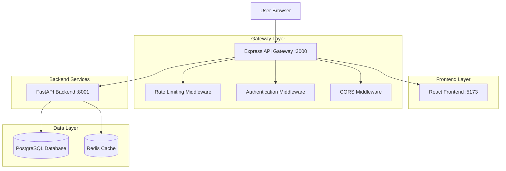

### Service Communication Flow

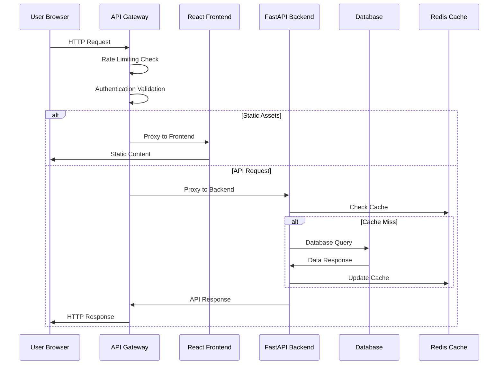

## Component Architecture

### Frontend Architecture (React + TypeScript)

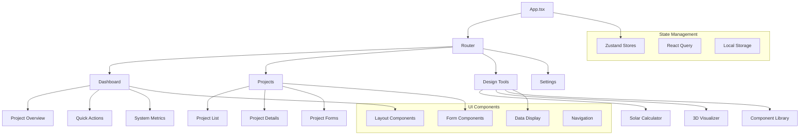

### Backend Architecture (FastAPI + SQLAlchemy)

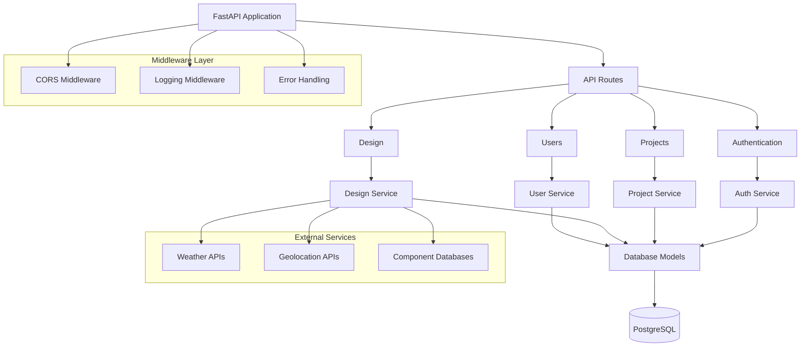

## Data Architecture

### Database Schema Overview

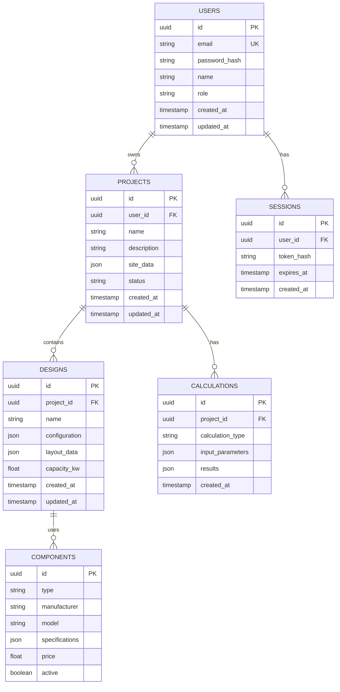

## Authentication & Authorization Flow

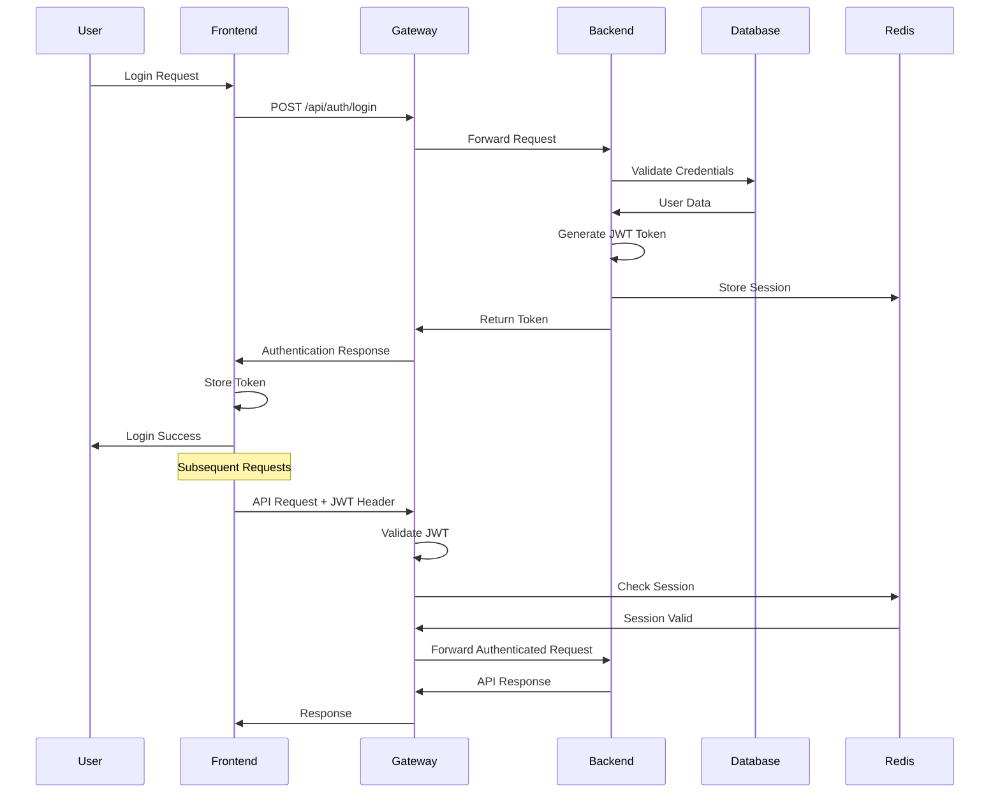

## Deployment Architecture

### Development Environment

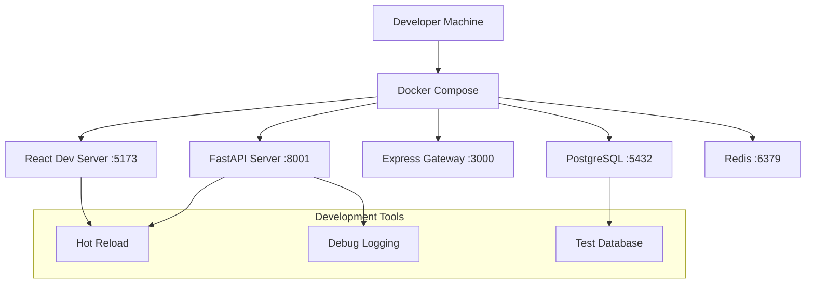

### Production Environment (Planned)

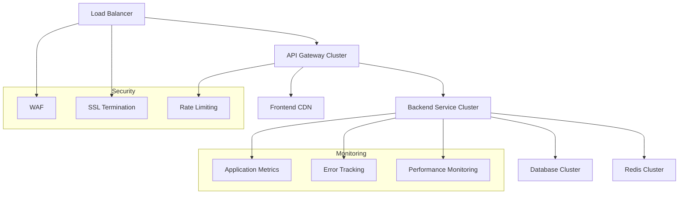

## API Design Patterns

### RESTful API Structure

```
/api/v1/
├── auth/
│   ├── POST /login
│   ├── POST /register
│   ├── POST /refresh
│   └── GET /profile
├── projects/
│   ├── GET /
│   ├── POST /
│   ├── GET /{id}
│   ├── PUT /{id}
│   └── DELETE /{id}
├── designs/
│   ├── GET /projects/{project_id}/designs
│   ├── POST /projects/{project_id}/designs
│   ├── GET /{id}
│   ├── PUT /{id}
│   └── DELETE /{id}
├── calculations/
│   ├── POST /solar-sizing
│   ├── POST /financial-analysis
│   └── POST /performance-simulation
└── components/
    ├── GET /panels
    ├── GET /inverters
    └── GET /batteries
```

### Error Handling Pattern

```json
{
  "error": {
    "code": "VALIDATION_ERROR",
    "message": "Invalid input parameters",
    "details": {
      "field": "capacity_kw",
      "issue": "Must be greater than 0"
    },
    "timestamp": "2025-01-09T10:30:00Z",
    "request_id": "req_123456789"
  }
}
```

## Performance Considerations

### Caching Strategy

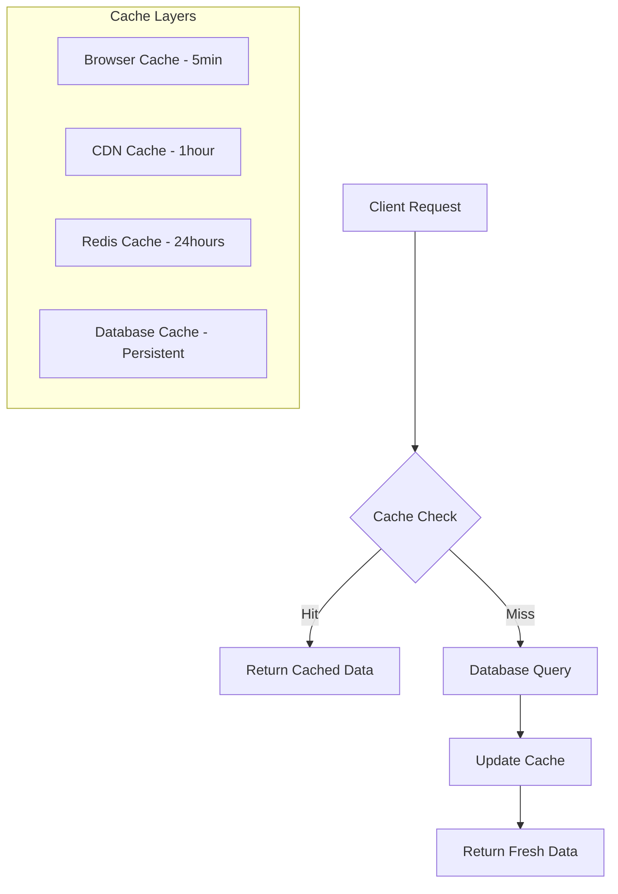

### Database Optimization

- **Indexing Strategy:**
  - Primary keys: UUID with B-tree indexes
  - Foreign keys: Composite indexes for joins
  - Search fields: GIN indexes for JSON columns
  - Temporal queries: Indexes on created_at/updated_at

- **Query Optimization:**
  - Use of prepared statements
  - Connection pooling (max 20 connections)
  - Read replicas for reporting queries
  - Pagination for large result sets

## Security Architecture

### Security Layers

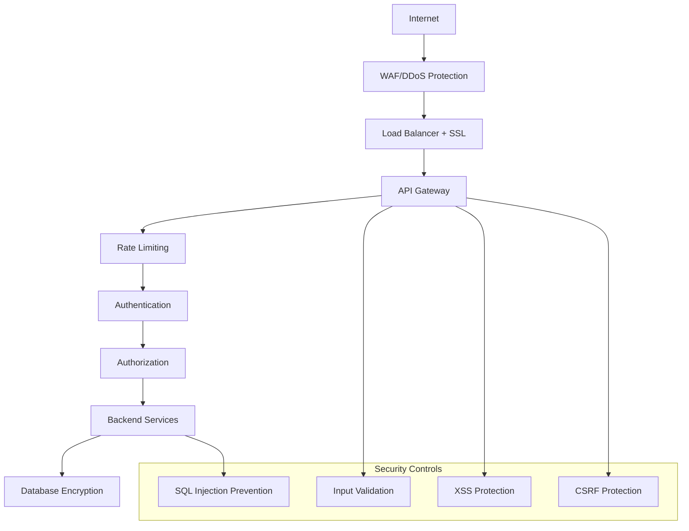

### Data Protection

- **Encryption at Rest:** AES-256 for sensitive data
- **Encryption in Transit:** TLS 1.3 for all communications
- **Key Management:** Separate key rotation schedule
- **PII Handling:** Tokenization for sensitive user data

## Monitoring & Observability

### Metrics Collection

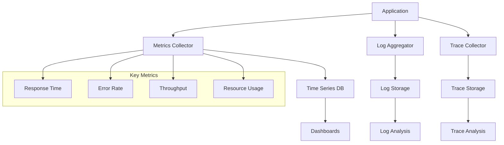

### Health Checks

- **Application Health:** `/health` endpoint with dependency checks
- **Database Health:** Connection pool status and query performance
- **Cache Health:** Redis connectivity and memory usage
- **External Services:** API availability and response times

## Scalability Considerations

### Horizontal Scaling

- **Stateless Services:** All services designed for horizontal scaling
- **Database Sharding:** Partition by user_id for large datasets
- **Cache Distribution:** Redis cluster for high availability
- **CDN Integration:** Global content distribution

### Vertical Scaling

- **Resource Monitoring:** CPU, memory, and I/O utilization
- **Auto-scaling Triggers:** Based on request volume and response times
- **Database Optimization:** Query performance and index tuning

## Technology Stack Summary

### Frontend
- **Framework:** React 18 with TypeScript
- **Build Tool:** Vite for fast development and building
- **Styling:** Tailwind CSS for utility-first styling
- **State Management:** Zustand + React Query
- **Testing:** Vitest + React Testing Library

### Backend
- **Framework:** FastAPI with Python 3.11+
- **Database:** PostgreSQL 15+ with SQLAlchemy ORM
- **Cache:** Redis 7+ for session and data caching
- **Authentication:** JWT tokens with refresh mechanism
- **Testing:** Pytest with async support

### Infrastructure
- **Gateway:** Express.js with TypeScript
- **Containerization:** Docker with multi-stage builds
- **Orchestration:** Docker Compose (dev), Kubernetes (prod)
- **CI/CD:** GitHub Actions with automated testing
- **Monitoring:** OpenTelemetry with Prometheus/Grafana

This architecture provides a solid foundation for the NextGen Fusion Commercial Solar Platform, ensuring scalability, maintainability, and security while supporting rapid development and deployment cycles.